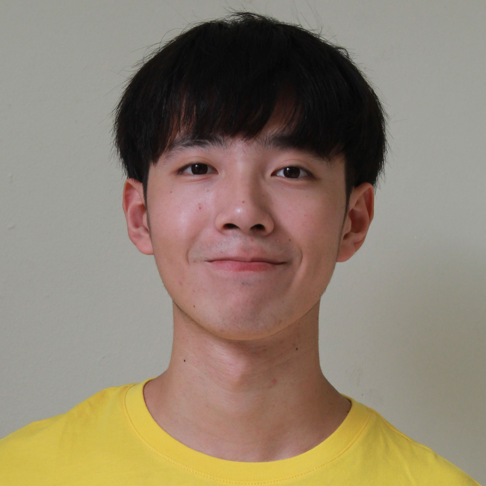
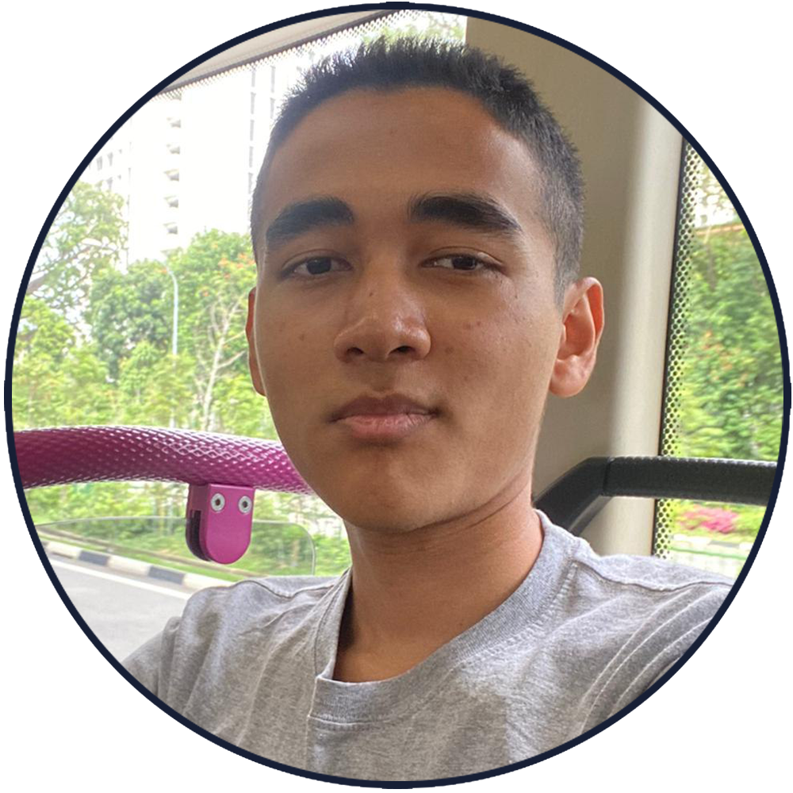
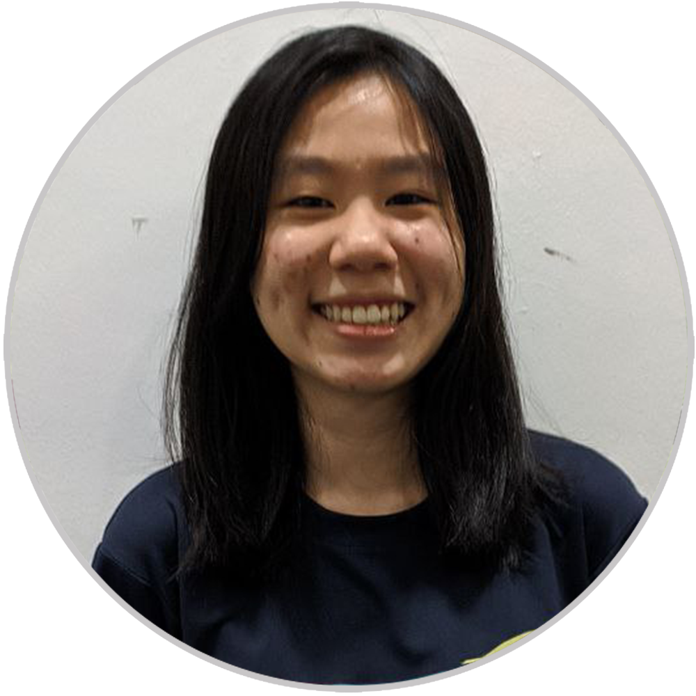
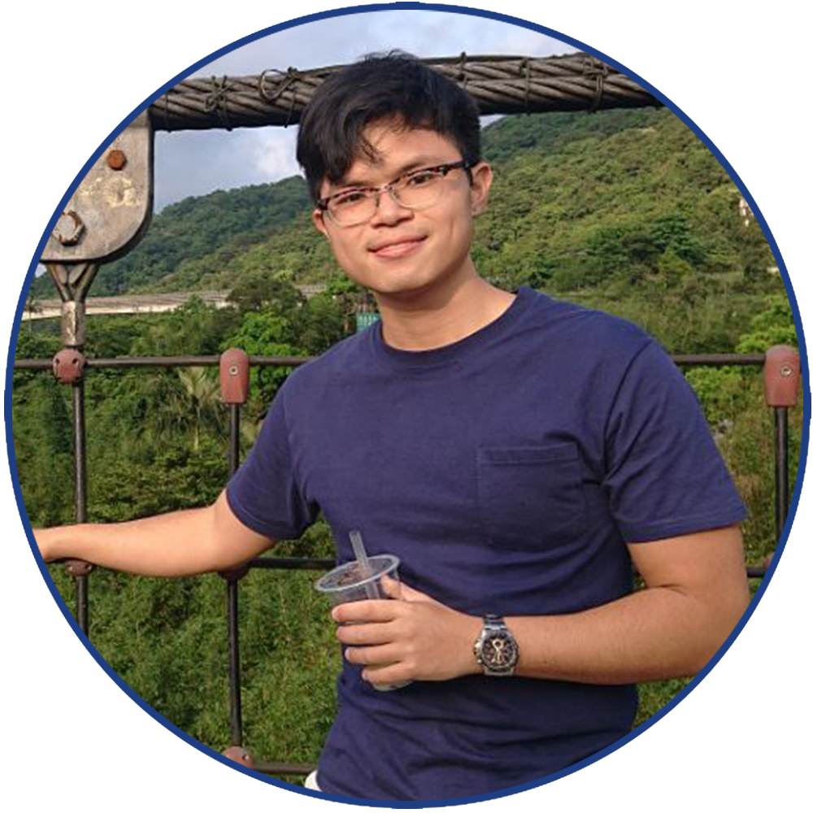
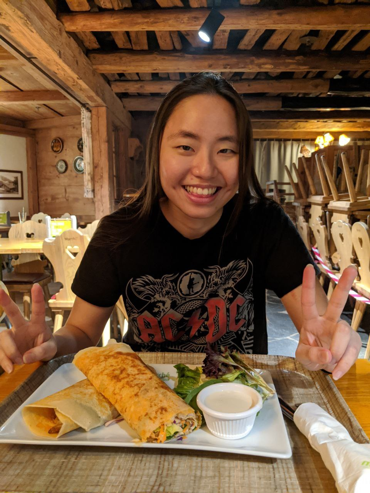

We are [Team](https://github.com/AY2021S1-CS2103T-W12-3/tp) Baymax.

We are a team based in the [School of Computing, National University of Singapore](http://www.comp.nus.edu.sg).

## Project team

### Jianhan

[[github](http://github.com/jianhandev)]
[[portfolio](team/jianhandev.md)]

* Role: Team Leader
* Responsibilities: Integration, Git Expert
* Features: Calendar
* Components: UI, Logic

---
### Thuta

[[github](http://github.com/thutahw)]
[[portfolio](team/thutahw.md)]

* Role: Developer
* Responsibilities: Code Quality, UML Expert
* Features: Patient Information Management
* Components: Common, Storage

---
### Kaitlyn

[[github](http://github.com/kaitlynng)]
[[portfolio](team/kaitlynng.md)]

* Role: Developer
* Responsibilities: Testing, Documentation
* Features: Calendar
* Components: Common, Storage

---
### Reuben

[[github](http://github.com/theyellowfellow)]
[[portfolio](team/theyellowfellow.md)]

* Role: Developer
* Responsibilities: Deliverables & Deadlines, Scheduling & Tracking
* Features: Appointment Management
* Components: UI, Model

---
### Hui Ling

[[github](http://github.com/porkeypine)]
[[portfolio](team/porkeypine.md)]

* Role: Developer
* Responsibilities: Documentation, IntelliJ Expert
* Features: Appointment Management
* Components: Model, Logic

---
