## Table of Contents
1. [Introduction](#1-introduction) 
2. [Setting up](#2-setting-up-getting-started) 
3. [Design](#3-design) 
&nbsp;&nbsp;&nbsp;&nbsp;&nbsp;&nbsp;3.1. [Architecture](#31-architecture) 
&nbsp;&nbsp;&nbsp;&nbsp;&nbsp;&nbsp;3.2. [UI Component](#32-ui-component) 
&nbsp;&nbsp;&nbsp;&nbsp;&nbsp;&nbsp;3.3. [Logic Component](#33-logic-component) 
&nbsp;&nbsp;&nbsp;&nbsp;&nbsp;&nbsp;3.4. [Model Component](#34-model-component) 
&nbsp;&nbsp;&nbsp;&nbsp;&nbsp;&nbsp;3.5. [Storage Component](#35-storage-component) 
&nbsp;&nbsp;&nbsp;&nbsp;&nbsp;&nbsp;3.6. [Storage Component](#36-common-classes) 
4. [Implementation](#4-implementation) 
&nbsp;&nbsp;&nbsp;&nbsp;&nbsp;&nbsp;4.1 [List Managers](#41-list-managers) 
&nbsp;&nbsp;&nbsp;&nbsp;&nbsp;&nbsp;4.2 [Patient Manager](#42-patient-management-features) 
&nbsp;&nbsp;&nbsp;&nbsp;&nbsp;&nbsp;4.3 [Apointment Manager](#43-appointment-manager) 
&nbsp;&nbsp;&nbsp;&nbsp;&nbsp;&nbsp;4.4 [Calendar Feature](#44-calendar-feature) 
5. [Documentation](#5-documentation) 
6. [Testing](#6-testing) 
7. [Dev Ops](#7-dev-ops) 
[Appendix A: Product Scope](#appendix-a-product-scope) 
[Appendix B: User Stories](#appendix-b-user-stories) 
[Appendix C: Use Cases](#appendix-c-use-cases) 
[Appendix D: Non-functional Requirements](#appendix-d-non-functional-requirements) 
[Appendix E: Glossary](#appendix-e-glossary) 
[Appendix F: Instructions for Manual Testing](#appendix-f-instructions-for-manual-testing) 
--------------------------------------------------------------------------------------------------------------------
## **1. Introduction**

Baymax is a desktop appointment manager made for clinic receptionists. It focuses on the Command Line Interface (CLI) while providing users with a simple and intuitive Graphical User Interface (GUI). Thus, the main interaction with Baymax will be done through user text-based commands.

Baymax allows receptionists to keep track of patients and appointments in a single, integrated platform.

The purpose of this Developer Guide is to help you understand the design and implementation of Baymax, so that you can become a contributor to this project as well.

## **2. Setting up, getting started**

Refer to the guide [_Setting up and getting started_](SettingUp.md).

--------------------------------------------------------------------------------------------------------------------

## **3. Design**

In this section, you will learn about the general design and structure of the Baymax application. This section explains how each component in Baymax works individually. Baymax is created with the Object-Oriented Programming Paradigm in mind, and follows the Facade Pattern and Command Pattern in software design.

### **3.1 Architecture**

The ***Architecture Diagram*** given above explains the high-level design of the App. Given below is a quick overview of each component.

 
Figure 1. Architecture Diagram of Baymax

:bulb: **Tip:** The `.puml` files used to create diagrams in this document can be found in the [diagrams](https://github.com/AY2021S1-CS2103T-W12-3/tp/tree/master/docs/diagrams/) folder. Refer to the [_PlantUML Tutorial_ at se-edu/guides](https://se-education.org/guides/tutorials/plantUml.html) to learn how to create and edit diagrams.

The following table provides a quick overview of each component of Baymax. More details about each individual component can be found in the following subsections.

| Component | Description
| --------- | ------------------------------------------
| `Main`    | Has two classes called Main and MainApp.   It is responsible for:  1. At App launch: Initializes the components in the correct sequence, and connects them up with each other.  2. At shut down: Shuts down the components and cleanup resources where necessary.
| `Commons` | Represents a collection of classes used by multiple other components.   It also contains the LogCenter component. The LogCenter component plays an important role at the architectural level and is used by many classes to write log messages to the App’s log file.
| `UI`      | Handles the UI of the App.
| `Logic`   | Executes commands.
| `Model`   | Holds the data of the App in memory.
| `Storage` | Reads data from, and writes data to, the hard disk.

Each of the four components,

* defines its *API* in an `interface` with the same name as the Component.
* exposes its functionality using a concrete `{Component Name}Manager` class (which implements the corresponding API `interface` mentioned in the previous point.

For example, the `Logic` component (see the class diagram given below) defines its API in the `Logic.java` interface and exposes its functionality using the `LogicManager.java` class which implements the `Logic` interface.

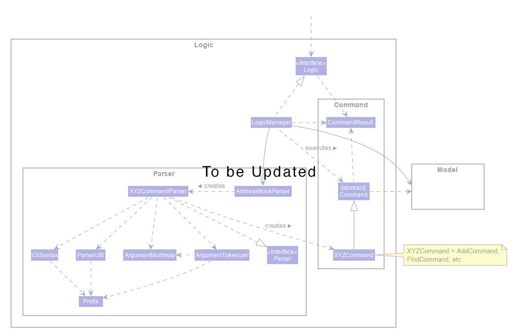 
Figure 2. Class Diagram of the Logic Component

**How the architecture components interact with each other**

The *Sequence Diagram* below shows how the components interact with each other for the scenario where the user issues the command `deletepatient 1`.

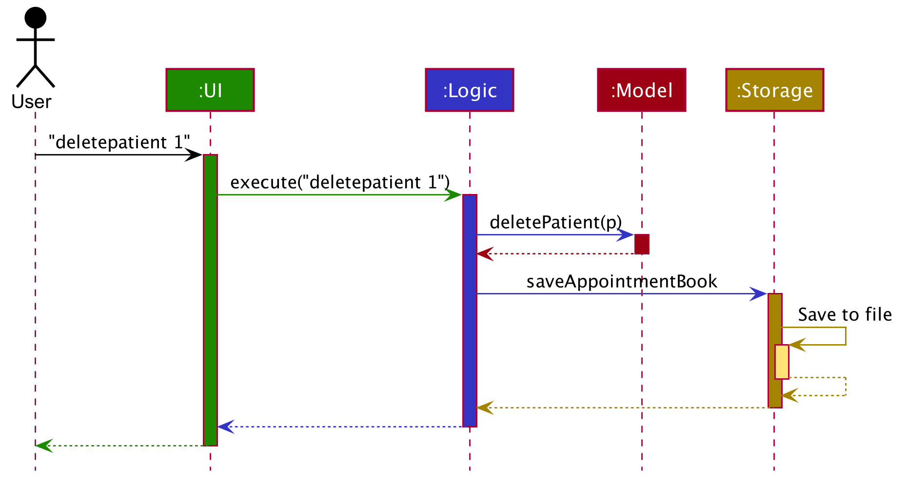
Figure 3. Architecture Sequence Diagram

The sections below give more details of each component.

### 3.2. UI component
(Contributed by Li Jianhan)

This segment will explain the structure and responsibilities of the `UI` component.

#### 3.2.1. Structure
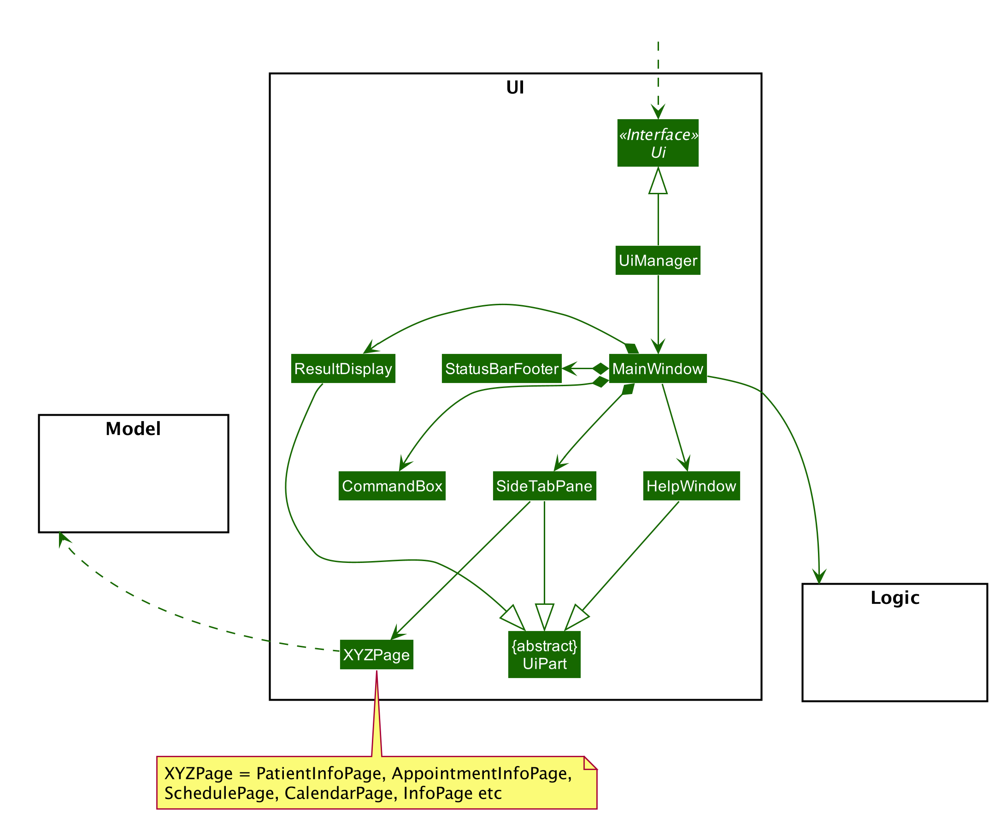 
Figure 4. Structure of the UI component

**API** :
[`Ui.java`](https://github.com/AY2021S1-CS2103T-W12-3/tp/tree/master/src/main/java/team/baymax/ui/Ui.java)

The `UI` component uses JavaFx UI framework. The layout of these UI parts are defined in matching `.fxml` files that are in the `src/main/resources/view` folder.

The UI consists of a `MainWindow` that is made up of parts such as the `CommandBox` and `SideTabPane` as shown in the *Class Diagram* above. All these, including the `MainWindow`, inherit from the abstract `UiPart` class.

The `SideTabPane` class creates `XYZPage` corresponding to each tab in the GUI. Each tab will display information on different features of Baymax. The `XYZPage` is a generic name given to the following elements:
- Dashboard
- PatientInfoPage
- AppointmentInfoPage
- CalendarPage
- SchedulePage
- InfoPage

Each of these classes (except InfoPage) displays data from the `Model` to the user.
For example, The PatientInfoPage and AppointmentInfoPage display lists of patients and appointments respectively. Hence they contain `XYZListPanel` (shown in the diagram below), which in turn contains a collection of `XYZCard` that displays each data field in the Patient and Appointment class.

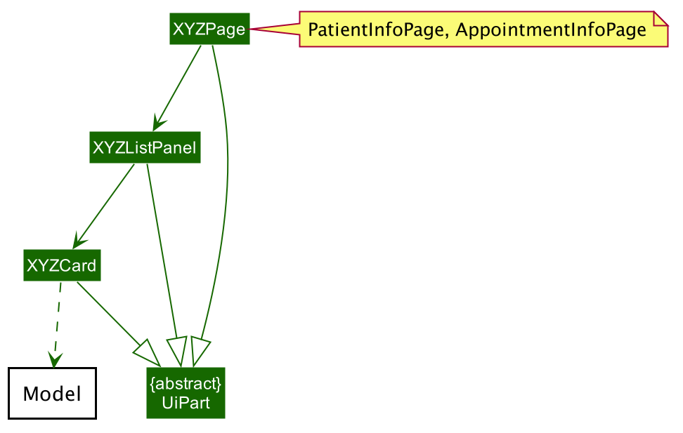 

#### 3.2.2. Responsibilities

The `UI` component,

* Executes user commands using the `Logic` component.
* Listens for changes to `Model` data so that the UI can be updated with the modified data.

### 3.3. Logic component

This segment will explain the structure and responsibilities of the Logic component.

#### 3.3.1 Structure

 
Figure 5. Structure of the Logic Component

**API** :
[`Logic.java`](https://github.com/AY2021S1-CS2103T-W12-3/tp/tree/master/src/main/java/team/baymax/logic/Logic.java)

1. `Logic` uses the `AppointmentBookParser` class to parse the user command.
2. This results in a `Command` object which is executed by the `LogicManager`.
3. The command execution can affect the `Model` (e.g. adding an appointment, which is executed by the `ModelManager`, calling on AppointmentManager).
4. The result of the command execution is encapsulated as a `CommandResult` object which is passed back to the `Ui`.
5. In addition, the `CommandResult` object can also instruct the `Ui` to perform certain actions, such as displaying help to the user and jumping to relevant tabs.

#### 3.3.2 Responsibilities

Given below is the Sequence Diagram for interactions within the `Logic` component for the `execute("cancel 1")` API call.

 
Figure 6. Delete Appointment Sequence Diagram

:information_source: **Note:** The lifeline for `DeleteCommandParser` should end at the destroy marker (X) but due to a limitation of PlantUML, the lifeline reaches the end of diagram.

### 3.4. Model component
(Contributed by Kaitlyn Ng & Reuben Teng)

This segment will explain the structure and responsibilities of the Model component.

#### 3.4.1. Structure
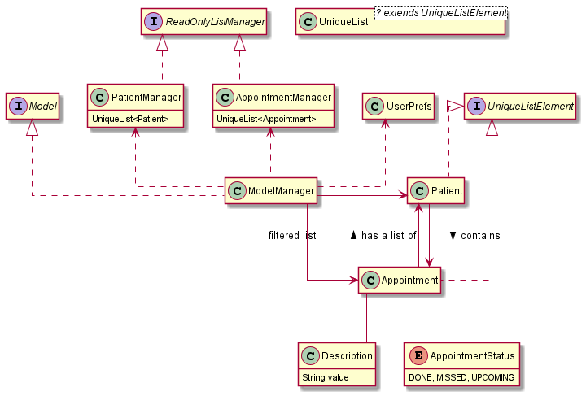
Figure 7. Structure of the Model Component

**API** : [`Model.java`](https://github.com/AY2021S1-CS2103T-W12-3/tp/tree/master/src/main/java/team/baymax/model/Model.java)

The `Model` component contains `ListManager`s that handle two main types of data in Baymax, `Patient` and `Appointment`. 
Each type of data is handled by a separate `ListManager` (`PatientManager` and `AppointmentManager`). A `ModelManager` facade class then exposes the methods 
that enable other components to perform getting, setting, searching and editing functions on the different 
types of data.

Apart from `ListManager`s, the `Model` component also contains a `CalendarManager` that manages an `AppointmentCalendar`. The `CalendarManager` supports operations on the `AppointmentCalendar` such as getting and setting the `year`, `month` and `day`. 

The `Model` component also contains

* a `UserPref` object that represents the user’s preferences.
* unmodifiable `ObservableList` objects for each type of data that can be 'observed' e.g. the UI can be bound to this 
  list so that the UI automatically updates when the data in the list change. 
  
The `Model` component does not depend on any of the other three components.

#### 3.4.2. Responsibilities

The `Model` component,

* Stores different types of data in memory when Baymax is running
* Represents data in `ObservableList` to automatically update the GUI when there is a change

### 3.5. Storage component

This segment will explain the structure and responsibilities of the Storage component.

#### 3.5.1. Structure
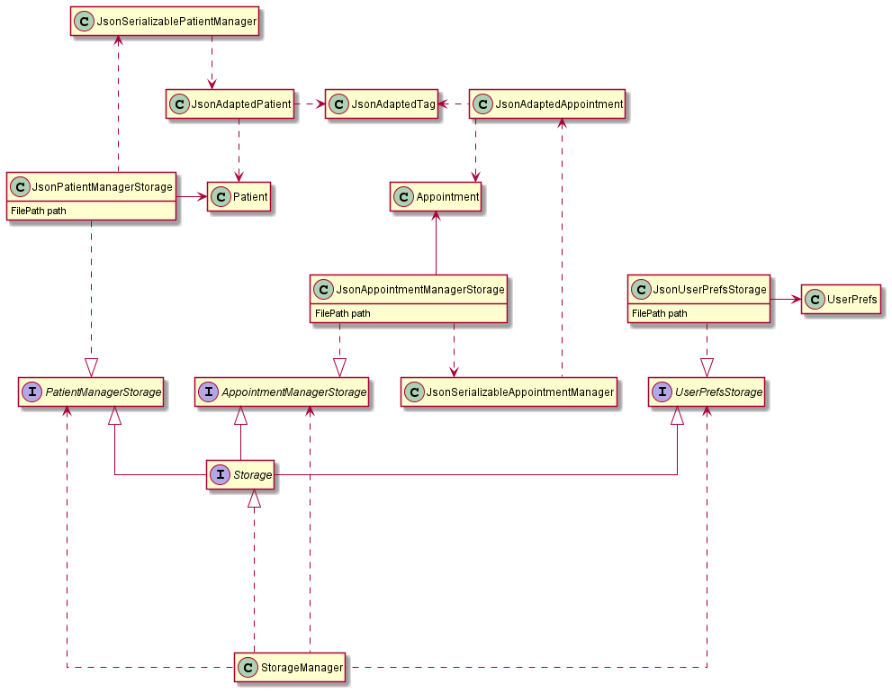
Figure 8. Structure of the Storage Component

**API** : [`Storage.java`](https://github.com/AY2021S1-CS2103T-W12-3/tp/tree/master/src/main/java/team/baymax/storage/Storage.java)

The `Storage` component contains interfaces for `Patient` data (`PatientManagerStorage`) and 
`Appointment` data (`AppointmentManagerStorage`) which defines methods for reading and saving the `Model` components
to memory. This allows for multiple different implementations of storage to store the data in different formats, e.g. 
json, csv, plaintext. A facade class `StorageManager` is used to expose these reading and writing methods.

The `JsonPatientManagerStorage` and `JsonAppointmentManagerStorage` are specific implementations of 
`PatientManagerStorage` and `AppointmentManagerStorage` that saves the `Patient` and `Appointment` data to 
json files. The path to these files are obtained from the `UserPref` object. 

#### 3.5.2. Responsibilities

The `Storage` component,
* can save `UserPref` objects in json format.
* can parse a json file in the correct format to get a `UserPref` object.  
* can save `Patient` and `Appointment` data in json format. 
* can parse a json file in the correct format to get a `PatientManager` or `AppointmentManager` object.

### 3.6. Common classes

Classes used by multiple components are in the `team.baymax.commons` package.

--------------------------------------------------------------------------------------------------------------------

## **4. Implementation**

This section describes some noteworthy details on how certain features are implemented.

### **4.1 List Managers**
(Contributed by Kaitlyn Ng)

List Managers allow the Baymax application to handle lists of the different types of data in the application, 
namely `Patient` and `Appointment`. `ListManager` defines methods for Create, Read, Update and Delete (CRUD) operations 
that are common to all the types of data, and needed to manage the lists of data effectively. 

#### 4.1.1 Rationale
The separation of `Patient` and `Appointment` data into separate ListManagers allow for a common software architecture 
between data types. Lists of data within the application can thus be handled more efficiently, and other types of data 
can be added to extend the application with minimal modification to the code.

#### 4.1.2. Current Implementation

Each `ListManager`contains a `UniqueList` which is a generic class that stores all the data items in a list and
and maintains the uniqueness of the data objects in the list while doing so. This ensures that in every `UniqueList`, 
there is only one of each object. The `UniqueList` class is a generic class that can only contain data items that 
extend the `UniqueListElement` interface, which ensures data items contain the necessary comparison functions for 
`UniqueList` to maintain uniqueness. 

Each ListManager implements the `ReadOnlyListManager` interface. This interface has the `getReadOnlyList()` method 
which returns an `ObservableList` of data items, to be monitored by the GUI.

An example of a the `ListManager` implementation is shown below using the `PatientManager` class, that manages a
`UniqueList` of `Patient`s. A similar structure is implemented for the `AppointmentManager` class, that manages a 
`UniqueList` of `Appointment`s.

 
Figure 8. Structure of PatientManager

**API** : [`PatientManager.java`](https://github.com/AY2021S1-CS2103T-W12-3/tp/blob/master/src/main/java/team/baymax/model/modelmanagers/PatientManager.java)

#### 4.1.3. Design Consideration
**Aspect: Separation into distinct list managers for each type of data.**

|                                                                | Pros                                                                                                                                                                                                                                                                                                      | Cons                                                                                                                                              |
|----------------------------------------------------------------|-----------------------------------------------------------------------------------------------------------------------------------------------------------------------------------------------------------------------------------------------------------------------------------------------------------|---------------------------------------------------------------------------------------------------------------------------------------------------|
| Option 1 (Current Choice): Split into separate lists (Current)                  | Increases modularity of the code by separating it into distinct sections to handle data whose  operations do not often require interaction  between them.    Allows for more straightforward implementations in other components by ensuring each data type is handled with the class architecture. | A lot of boilerplate code for implementing  the list managers as separate classes  but with similar functionalities                               |
| Option 2: Store all the information in a single  `DataManager` | Easier to implement, as only one manager class is needed.                                                                                                                                                                                                                                                 | Violates the Separation of Concerns principle, making it difficult to implement future extensions without significant change to other components. |
  
 Reason for choosing Option 1:

Sound design principles are key to ensuring that the program is bug-free, easily testable and easily extendable in the 
future. Option 1 increases modularity of the code to create more opportunities for module upgrade, reuse and
 independent development for each data type, limiting the amount of change needed to other components when there are
changes in the `Model`. This will save time in the long run and reduce the possibility of introducing breaking bugs due
to unnecessary dependencies between data types.

**Aspect 2: Extract common CRUD operations with a generic class**

|                                                                                                                                                                                                                                                  | Pros                                                                                                                                                                           | Cons                                                                                                                   |
|--------------------------------------------------------------------------------------------------------------------------------------------------------------------------------------------------------------------------------------------------|--------------------------------------------------------------------------------------------------------------------------------------------------------------------------------|------------------------------------------------------------------------------------------------------------------------|
| Option 1 (Current Choice): Extract common CRUD functionalities of the `ListManager`s into a single `UniqueList` class. The `ListManager`s will store data items in the `UniqueList` generic class and build on top of the generic CRUD operations from the class. | Reduces amount of repeated code as all the lists of data essentially perform the same functions.                                                                               | Generics can be harder to comprehend, thus making it harder for other programmers to understand and use the component. |
| Option 2: Do not extract any common functionalities                                                                                                                                                                                              | Easier for programmers to work on each code related to each data item completely separately, and implement methods specific to the data item in a more straightforward manner. | Violates the Don't Repeat Yourself principle as there will be a lot of repeated CRUD operations.                       |

 Reason for choosing Option 1:

Following the Don't Repeat Yourself design principle will allow for more abstraction and less duplication in the code,
which facilitates future extensions and reduce effort in maintenance and testing by reducing repeated code. 

### **4.2. Patient Management Features**

(Contributed by Thuta Htun Wai)

Baymax allows the user to manage patient information. A user can only deal with a single patient at any time. i.e. Only
a single patient's information can be managed at one time. A user can:

* Add a new patient
* Delete an existing patient
* Edit a patient's details
* Add a remark to a patient
* List all the patients in the system
* Find a patient by using a keyword from his/her name

#### 4.2.1. Rationale

The Patient Management Features are included in Baymax because it is one of the core features of the application.
If the user wants to keep track of the patient's information, he/she has to record the details
of the patient and be able to look up a patient in the system easily.

#### 4.2.2. Current Implementation

The `patient` package in the `Model` component contains the necessary information related to a patient.
The current implementation of the Patient Management Features allows the user to keep track of a list of patients in the appointment book.

In this section, we will outline the `findpatient` command from the Patient Management Features which is summarised by the Activity Diagram in Figure 9 below.

The parameters of the `findpatient` command are keywords in the patient's name that the user wants to search for. 
E.g. `findpatient alex` will search and list all patients whose name has the word `alex`. 

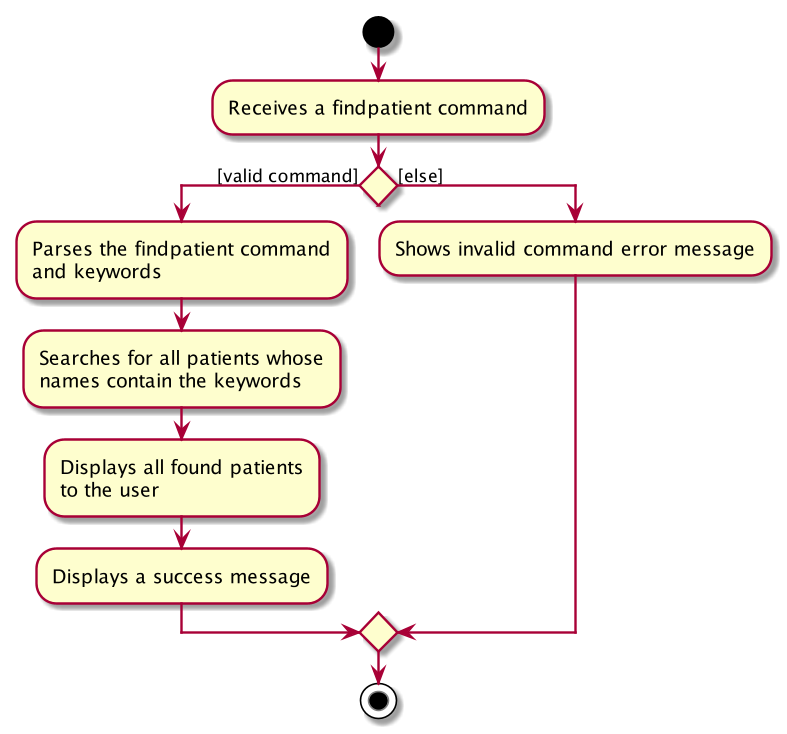 
Figure 9. Workflow of a `findpatient` command

When the user enters the `findpatient` command to search for a patient, the user input command undergoes the same command parsing as described in [Section 3.3, “Logic component”](#33-logic-component).
During the parsing, a predicate is created. This predicate checks if a given Patient contains the user input keywords. The `FindPatientCommand` will then receive this predicate when it is created.

The following steps will describe the execution of the `FindPatientCommand` in detail, assuming that no error is encountered.

1. When the `execute()` method of the `FindActivityCommand` is called, the `ModelManager`’s `updateFilteredPatientList()` method is called.
2. The `ModelManager` then proceeds to call the `setPredicate()` method of the `FilteredList<Patient>`.
3. The `FilteredList<Patient>` will then update its filtered list of patients to contain only patients that fulfil the given predicate.
4. The Ui component will detect this change and update the GUI.
5. If the above steps are all successful, the `FindPatientCommand` will then create a CommandResult object and return the result.

The *Sequence Diagram* below summarises the aforementioned steps.

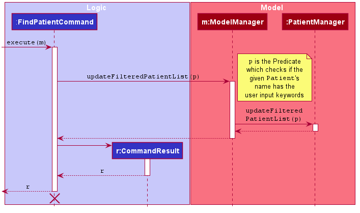 
Figure . Execution of the `FindPatientCommand`

**Note**:

1. The lifeline for the `FindPatientCommand` should end at the destroy mark (X). However, due to a limitation of PlantUML, the lifeline reaches the end of the diagram.
2. This sequence diagram does not take into consideration the possible exceptions which might occur during the `FindPatientCommand` execution.

The following table shows the commands related to managing a patient's details. 

| Command | Purpose
| --------- | ------------------------------------------
| `addpatient` | Adds a new patient.
| `deletepatient` | Deletes a patient.
| `listpatients` | Lists all patients.
| `editpatient` | Edits a patient's details.
| `findpatient` | Finds a patient with the given keyword in his/her name.
| `remark` | Adds/Edits the remark of a patient.

#### 4.2.3. Design Consideration

**Aspect: Find matching names using substrings (E.g. ale) vs using exact words (E.g. alex)**

|                                               | Pros                                                             | Cons                                                                                                                                        |
|-----------------------------------------------|------------------------------------------------------------------|---------------------------------------------------------------------------------------------------------------------------------------------|
| Option 1 (Current Choice): Match by substring | Shorter keywords to type, therefore increases user typing speed. | Lower accuracy. The filtered list is longer and takes longer time to find the patient you are looking for.                                  |
| Option 2: Match by the exact word             | Higher accuracy.                                                 | Longer names are harder for the user to find the exact match. It is also difficult for the user to remember and type out the exact keyword. |

 Reason for choosing Option 1:

* Option 1 is more flexible for the user. If the user wants higher accuracy, he/she can type longer keywords to filter out more patients. 
 
**Aspect: Whether the Patient class should contain a list of Appointments**

|                                                                                   | Pros                                                                                                                                                                                            | Cons                                                                                                                                                                                                                                                                                                                  |
|-----------------------------------------------------------------------------------|-------------------------------------------------------------------------------------------------------------------------------------------------------------------------------------------------|-----------------------------------------------------------------------------------------------------------------------------------------------------------------------------------------------------------------------------------------------------------------------------------------------------------------------|
| Option 1 (Current Choice): Patient class does not contain a list of Appointments. | Avoids cyclic dependency since the Appointment class already contains a Patient.     Reduces overhead from having to update 2 lists (1 from ModelManager and 1 from the Patient class)  . | More tedious to find a list of appointments belonging to a specific patient and there is more overhead from  having to filter the appointment list by a predicate.                                                                                                                                                    |
| Option 2: Patient class will contain a list of Appointments.                      | A list of appointment belonging to a specific patient can be directly retrieved from the patient object  which is faster than having the extra step to filter the list.                         | Cyclic dependency is present. (Patient and Appointment depend on each other).     Whenever any update is made to the list of appointments, such as adding a new appointment or editing an appointment, extra overhead is incurred from processing both the lists inside the ModelManager and the Patient class. |

 Reason for choosing Option 1:

* Option 1 follows good coding principles by avoiding cyclic dependency.

* When the list of appointments increase in size, Option 1 performs better because Baymax involves a lot of "update/set"
operations such as marking an appointment as done/missed and adding/editing an appointment.

### **4.3 Appointment Manager**
(Contributed by Shi Hui Ling & Reuben Teng)

Scheduling, viewing, and otherwise dealing with appointments is a key feature area for Baymax. `AppointmentManager` maintains a `UniqueList` of all `Appointment`s in the app, and executes the logic of most appointment commands. 

`AppointmentManager` contains the methods necessary to operate on the `UniqueList` of `Appointment`s. These include:
 1. Adding an appointment
 2. Editing an appointment
 3. Deleting an appointment
 4. Finding a specific appointment by `Patient` and `DateTime`
 5. Sorting the list of appointments
 
These methods are used by the `AppointmentCommand` classes to execute their logic.

The *Object Diagram* below summarises the interactions between AppointmentManager and Appointments.

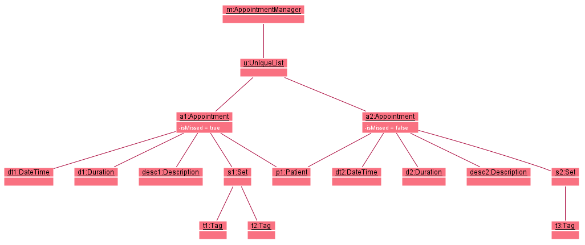 
Figure . Object diagram of `AppointmentManager`

#### 4.3.1 Rationale

The `AppointmentManager` class contains a summary of all the "back-end" logic of appointment commands on the app's `UniqueList` of `Appointment`s. This follows the SRP, as everything related to the execution of appointment commands can be found here. This also forces the customising of code to fit exactly the purposes needed for appointment commands, even if the methods simply call a `UniqueList` method that fulfills the exact purpose.

#### 4.3.2. Current Implementation

Makes use of many methods from `UniqueList`, e.g. `add`, `setElement`, `remove`, `sort`.

#### 4.3.3. Design Consideration

**Aspect 1: `cancel` Command** 
 
For this command, we only required the specifying of `DateTime` of the appointment, and we allowed specifying the `Patient` by `name`, `nric`, or `index` (in the currently displayed list). This is to ensure that receptionists can opt for either a more intuitive way to specify a `Patient` (by `name` or `index`) or a quicker and more "guaranteed correct" way (by `nric`).

Additionally, we only require matching of `DateTime` and `Patient` of appointment as no two appointments should have those two fields exactly the same. By reducing the number of arguments needed for the command, we make the command more succinct and easy to use for receptionists. It is also easier implementation-wise.

**Aspect 2: `nric` field**

To ensure that `Appointment`s are json serialisable for `Storage` in the same way as `Patient`s, all fields of the `Appointment` class have to be serialisable. To achieve this, an `nric` field is added to each `Patient` to uniquely identify patients currently stored in the system. When serialising an `Appointment`, the patient field stores the `nric` string of the patient instead, and when reading an `Appointment` from memory a lookup is performed on the existing list of patients before a valid `Appointment` object is created containing an existing Patient object.

**Aspect 3: Marking of Appointment `status` attribute**

Automated the marking of an `Appointment` as `DONE` after the deadline has passed, and giving receptionists the ability to mark `Appointment`s as missed.

|                                                                                                                                                                                                                       | Pros                                                                                                     | Cons                                                                                                |
|-----------------------------------------------------------------------------------------------------------------------------------------------------------------------------------------------------------------------|----------------------------------------------------------------------------------------------------------|-----------------------------------------------------------------------------------------------------|
| Option 1: Periodically check the `Datetime` of an `Appointment` that is still marked  `UPCOMING` against the current `Datetime`, marking it as `DONE` if the current  `Datetime` is after that of the `Appointment` . | Keeps stored data perpetually up-to-date.                                                                | Constant comparision become computationally intensive when there are many  `UPCOMING` appointments. |
| Option 2 (Current Choice): Check `Datetime` of `Appointment` against current `Datetime`  only when `getStatus()` method is called.                                                                                    | Computation is performed when the value of  `status` is needed, resulting in reduced computational cost. | Architecture becomes less intuitive as `status` is no longer stored.                                |

 Reason for choosing Option 2:

While the architecture might become less intuitive, computing `status` only when needed is much more efficient.

**Aspect 4: Backdated `Appointment`s**

To provide flexibility for users, `Appointment`s beforSe the current `Datetime` can be added to Baymax. They are marked as `DONE` automatically, but receptionist will be able to change the status to `MISSED` as well.

Such appointments are marked `DONE` automatically as it is assumed that it is more important for receptionists to know what `Appointment`s patients have gone for, and thus it is more likely for them to be backdated.

### **4.4 Calendar Feature**
(Contributed by Li Jianhan & Kaitlyn Ng)

Baymax allows the user to manage appointments using a built-in calendar.
The calendar brings greater convenience to the user by showing them what days are available in a month.
It is also coupled with a schedule view that can be accessed by entering the `day` command, which shows the user
all appointments on the chosen day, laid out chronologically on a timeline.

#### 4.4.1 Rationale

The Calendar feature is included in Baymax because it offers greater convenience in terms of viewing and adding
appointments. The calendar view and schedule view offer a quick Month and Day overview of all the appointments
respectively, such that the user can quickly tell at a glance which days or timings are booked and which are free.

The Calendar feature also helps to shorten commands by allowing the user to only specify
the time of appointments, as the date can be inferred from the calendar. For example, in the Calendar 
Manager, a user can set a custom year, month and day. This influences the execution of the `addappt` command shown 
in the sequence diagram below. In this example, suppose the user has set year to 2020, 
month to February and day to 1, he can directly enter an `addappt` command that adds an appointment to 1, 
February, 2020 without having to enter a date into the command fields. This makes the command shorter, more convenient
and more user-friendly.

Below is an example of the sequence diagram when the user executes an AddAppointment command without specifying a date.
The diagram illustrates how the CalendarManager is used to automatically set the date of the appointment.

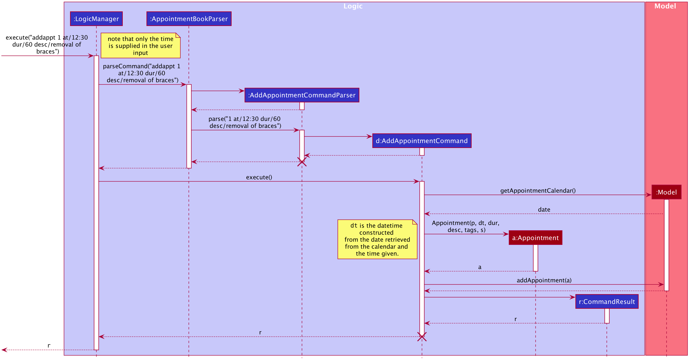 
Figure X. Execution of an AddAppointment command with the help of CalendarManager

#### 4.4.2. Current Implementation
The `CalendarManager` class in the `Model` component contains an `AppointmentCalendar` object, storing the currently set 
year, month and day. Note that the year, month and day attributes may not necessarily be storing the 
present year, month and day. When a user sets the year, month and day, the `Logic` Component parses the user input and
constructs a YearCommand, MonthCommand and DayCommand respectively. Upon execution, the `ModelManager` calls upon the
`CalendarManager` to update the year, month and day within the `AppointmentCalendar`.

The following sequence diagram illustrates how the `Logic` component interacts with the `ModelManager` to influence the
`year` value in the `AppointmentCalendar` managed by the `CalendarManager`.

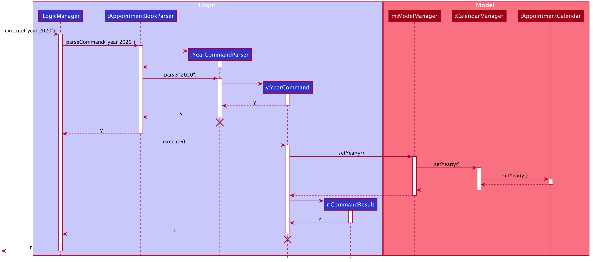 
Figure X. Sequence Diagram for Switching to a Particular Year in the Calendar

#### 4.4.3. Design Consideration

**Aspect:** The necessity of an AppointmentCalendar class in the model

|                                                                                                     | Pros                                                                                                                                                                                                                                                                                                                                                                                                                                                                                                 | Cons                                                                                                                                                                                                                                       |
|-----------------------------------------------------------------------------------------------------|------------------------------------------------------------------------------------------------------------------------------------------------------------------------------------------------------------------------------------------------------------------------------------------------------------------------------------------------------------------------------------------------------------------------------------------------------------------------------------------------------|--------------------------------------------------------------------------------------------------------------------------------------------------------------------------------------------------------------------------------------------|
| Option 1 (Current Choice): New AppointmentCalendar class in the model to store the day, month, year | Allows for greater modularity. Whenever the Logic component requests for the day/month/year, the ModelManager can directly pass it a single AppointmentCalendar object,  making it more extensible at it does not overcomplicate the CalendarManager class.    By hiding the year, month and day in the AppointmentCalendar class, it adheres to the OOP principle of Encapsulation, as the CalendarManager only needs to be aware of the AppointmentCalendar object and not what it contains. | Harder to implement (a new class is needed).                                                                                                                                                                                               |
| Option 2: Store the day, month and year directly inside the CalendarManager                         | Simpler to implement.                                                                                                                                                                                                                                                                                                                                                                                                                                                                                | More cumbersome to pass around three objects (Year, Month and Day) compared to a single AppointmentCalendar object.  If more features were to be implemented in the CalendarManager, it will quickly clutter up the CalendarManager class. |

 Reason for choosing Option 1: 

* Option 1 follows good coding principles by adhering to the principle of encapsulation.

* As two UI views (`ScheduleView` and `CalendarView`) depend on the `AppointmentCalendar`, abstracting the contents of 
  the Calendar out into an `AppointmentCalendar` class that is managed by the `CalendarManager` makes more intuitive
  sense, as the UI views can now just observe for changes to the `AppointmentCalendar` by the manager and update the
  views accordingly.

--------------------------------------------------------------------------------------------------------------------

## **5. Documentation**

* [Documentation guide](Documentation.md)
* [Configuration guide](Configuration.md)

--------------------------------------------------------------------------------------------------------------------

## **6. Testing**
* [Testing guide](Testing.md)
* [Logging guide](Logging.md)
## **7. Dev Ops**
* [DevOps guide](DevOps.md)

## **Appendix A: Product scope**

(Contributed by Thuta Htun Wai)

**Target user profile**:

* needs to manage significant number of patients and appointments
* wants to keep track of patients and appointments efficiently
* wants to look up patients and/or appointments easily by using matching words
* wants to look at current and past appointments through a calendar view
* prefers desktop apps over other types
* can type fast
* prefers typing to mouse interactions
* is reasonably comfortable using *CLI* apps

**Value proposition**:
* A handy tool for clinic staff, especially the receptionists, to deal with a large amount of patient information and their appointments.
* Baymax can manage patient information and appointments better than a typical mouse driven medical appointment management app.

## **Appendix B: User stories**
(Contributed by Kaitlyn Ng)

Priorities: High (must have) - `* * *`, Medium (nice to have) - `* *`, Low (unlikely to have) - `*`

| Priority | As a …​                                    | I want to …​                     | So that I can…​                                                        |
| -------- | ------------------------------------------ | ------------------------------ | ----------------------------------------------------------- |
| `* * *`  | forgetful receptionist of a clinic         | display all available commands | refer to the list of commands when I forget them            |
| `* * *`  | receptionist of a clinic                   | add a new patient              |                                                             |
| `* * *`  | receptionist of a clinic                   | list out all patients          |                                                             |
| `* * *`  | receptionist of a clinic                   | update a patient's contact information after they change it | contact them if needed         |
| `* * *`  | receptionist of a clinic                   | find a patient by their name  |  easily view their information when needed          |
| `* * *`  | receptionist of a clinic                   | delete a patient               | remove accidentally-added patients         |
| `* * *`  | receptionist of a clinic                   | add an appointment for a patient |                                                           |
| `* * *`  | receptionist of a clinic                   | list all appointments of a patient | track patient's medical progress, check how long ago the patient's previous appointment was, check for future appointments etc. |
| `* * *`  | receptionist of a clinic                   | delete an existing appointment | remove cancelled appointments                               |
| `* * *`    | receptionist of a clinic                   | list all the appointments of the clinic | have a detailed view of all the appointments in any period I want to look at |
| `* *`    | receptionist of a clinic                   | mark an appointment as missed | keep track of which appointments did not occur due to various circumstances, and possibly arrange for other appointments in its place |
| `* *`    | receptionist of a busy clinic              | display an overview of the availability status of each day in a month | quickly advise patients on when they can book an appointment |
| `* *`    | receptionist of a clinic with busy patients | change an appointment's date and time | accommodate for last-minute changes in the patient's schedule |
| `* *`    | receptionist of a clinic using the app for the first time | clear all current patient data | get rid of sample/experimental data I used for exploring the app |
| `* *`    | receptionist of a clinic                   | view the schedule for a particular day | check the availability of the clinic on that day to arrange for other appointments, or to check what time the appointments for the current day are |
| `* *`      | careless receptionist in the clinic          | backdate an appointment         | add in appointments that I accidentally missed out        |
| `*`      | receptionist of a clinic using the app for the first time | see sample data in the app | visualise how the app looks like when it is in use and interact with existing data |
| `*`    | receptionist of a clinic                   | display the coming appointments in the next n days | gauge the business of the clinic in the next few days |
| `*`      | receptionist of a patient-centric clinic     | add preferred but currently unavailable slots for patient's appointments | give patients their more preferred slot if it becomes available |
| `*`      | careless receptionist in the clinic          | undo whatever I just did     | correct accidental changes (especially deletions)      |

## **Appendix C: Use cases**
(Contributed by Li Jianhan and Shi Hui Ling)

For all use cases below, unless specified otherwise,

- **System:** Baymax
- **Actor:** User (Clinic Receptionist)

#### Patient Profile Management

> **Use case 1: Add a patient**

**MSS**

1. User requests to add a patient
2. Baymax adds the patient
3. Baymax displays a success message with details of the patient added
4. Baymax saves the changes

    Use case ends. 

**Extensions**

* 1a. Missing information for a field, e.g. Nric, Phone
    * 1a1. Baymax displays an invalid command message that details all the fields needed for the command
    Use case ends.

> **Use case 2: Edit a patient’s information**

**MSS**

1. User requests to edit a patient
2. Baymax edits the patient's information
3. Baymax displays the edited patient with details
4. Baymax saves the changes

    Use case ends.

**Extensions**

* 1a. Patient does not exist
	* 1a1. Baymax displays an invalid input message
    Use case ends.

* 1b. No fields specified for editing
    * 1b1. Baymax displays an "at least one field must be specified" invalid input message
    Use case ends.

> **Use case 3: Delete a patient**

**MSS**

1. User requests to delete a patient
2. Baymax deletes the patient 
3. Baymax displays success message with details of patient deleted
4. Baymax saves the changes

    Use case ends.

**Extensions**

* 1a. Patient does not exist
	* 1a1. Baymax displays an invalid input message
    Use case ends.
    
> **Use case 4: Find patient(s) by name**

**MSS**

1. User requests to find patient by name
2. Baymax finds all patients that contain the search string in their name
3. Baymax displays a success message of how many matching patients are found (may be zero)
and a list of all these patients with their details 

    Use case ends.
    
> **Use case 5: List all patients**

**MSS**

1. User requests to list all patients to view
2. Baymax displays a success message and a list of all patients in the system

    Use case ends.

#### Appointment Management

> **Use case 6: Add an appointment**

**MSS**

1. User requests to add an appointment to a patient
2. Baymax adds the appointment
3. Baymax displays a success message with details of the appointment added
4. Baymax saves the changes

    Use case ends. 

**Extensions**

* 1a. Patient does not exist
    * 1a1. Baymax displays an invalid input message
    Use case ends.

* 1b. Missing information for a field, e.g. Duration, Description
    * 1a1. Baymax displays an invalid command message that details the fields needed for the command
    Use case ends.

> **Use case 7: List all appointments of a patient**

**MSS**

1. User requests to list all appointments of a particular patient
2. Baymax displays a success message and filters the display list to show all appointments of the patient

    Use case ends.

**Extensions**

*1a. Patient specified does not exist
    * 1a1. Baymax displays an invalid input message specific to how the patient was specified 
    (by Name, Nric, or Index in the list)
    Use case ends.

> **Use case 8: Mark an appointment as missed**

**MSS**

1. User requests to mark a certain appointment as missed
2. Baymax displays a success message and filters the display list to 
show only the appointment that has just been marked as missed
3. Baymax saves the changes

    Use case ends.
    
**Extensions**

*1a. Appointment specified does not exist
    *1a1. Baymax displays an invalid input message
    Use case ends.

> **Use case 9: Mark an appointment as done**

Similar to `Use case 8: Mark an appointment as missed` except there is a **precondition**.

**Precondition:** Appointment has already past (i.e. the date and time is past current date and time). 

> **Use case 10: Edit an appointment**

Similar to `Use case 2: Edit a patient's information` except for an appointment instead of a patient

> **Use case 11: Cancel an appointment**

Similar to `Use case 3: Delete a patient` except for an appointment instead of a patient

> **Use case 12: Find appointment(s) by keyword**

Similar to `Use case 4: Find patient(s) by name` except Baymax finds all appointments that contain 
the search string in their remark or tags. 

> **Use case 13: List all appointments**

Similar to `Use case 5: List all patients` except for appointments instead of patients.

#### Calendar

> **Use case 14: View appointment schedule on a particular day**

**MSS**

1. User requests to view the calendar of a particular year
2. Baymax calendar switches to the stipulated year
3. User requests to view the calendar of a particular month
4. Baymax calendar switches to the stipulated month in the given year
5. User requests to view the calendar of a particular day
6. Baymax switches to a schedule / timetable view of all the appointments on the given day

    Use case ends.
    
**Extensions**

*1a. Year specified is beyond the limits allowed by Baymax
    *1a1. Baymax displays an invalid input message specifying the allowed input
    Use case ends.
*3a. Month specified is not a valid month (e.g. 13)
    *1a1. Baymax displays an invalid input message specifying the allowed input
    Use case ends.
*5a. Day specified is not a valid day in the month (e.g. 30 when in February)
    *1a1. Baymax displays an invalid input message specifying the allowed input
    Use case ends.

## **Appendix D: Non-Functional Requirements**
(Contributed by Shi Hui Ling)

**Technical Environment**
* Application should work on any mainstream OS as long as it has Java 11 or above installed.
* Application should work without requiring an installer.
* Application should not depend on a remote server or other remote resources.
* Application should work without an online connection.
* Application should work on both 32-bit and 64-bit environments.

**Performance**
* Application should be able to save and load 200 patients’ worth of data without any noticeable delay in performance.
* Application should respond within 2 seconds to all commands.

**Quality**
* A user with above-average typing speed for regular English text should be able to accomplish most of the tasks faster by typing commands than using the mouse.
* Application should be easy to use for a new user when following the User Guide or `help` instructions.
* Application should have a user-friendly graphical user interface and display.

**Data**
* Application data should load correctly on any mainstream OS given the data file is transferred properly.
* Application data should never be lost or removed except when user explicitly deletes something.

**Project Scope**
* Application is not required to handle detailed medical information about patients.
* Application is not required to handle the printing of patient profiles or saving them in a user-friendly manner (only displaying).
* Application is not required to handle multiple users.

**Process**
* The project is expected to adhere to a schedule that delivers a feature set every two weeks.

**Extensibility & Documentation**
* Application should be easily extended by developers looking to improve or expand it.
* Application should be well-documented such that new developers can be on-boarded quickly just by reading through documentation.

## **Appendix E: Glossary**
(Contributed by Reuben Teng)

#### *UI*
* Abbreviation for User Interface, representing the point of human-computer interaction and communication.

#### *API*
* Abbreviation for Application Programming Interface. It defines interactions between multiple software intermediaries.

#### *OOP*
* Abbreviation Object-Oriented Programming, in which programmers organise software design around data (objects), rather than functions and logic.

#### *CLI*
* Abbreviation for Command Line Interface, referring to an interface which accepts user inputs and commands in the form of text.

#### *MSS*
* Abbreviation for Main Success Scenario, describing the most straightforward interaction for a given use case, which assumes that nothing goes wrong.

#### *OS*
* Abbreviation Operating System, referring to mainstream Operating Systems Windows, Linux, OS-X.

#### *json*
* Short for JavaScript Object Notation, referring to a memory-cheap format for storing and transporting data.

#### *csv*
* Abbreviation for Comma-Separated Values, referring to a plain text file with a list of data, which each value within the data separated by a comma.

#### *Private contact detail*
* A contact detail that is not meant to be shared with others.

#### *Boilerplate code*
* Code that is reused without significant changes. Usually a sign of poor coding practices.

#### *Separation of Concerns principle*
* Principle of separating code into different sections, with each section handling a different concern. This allows for
  a more modular approach to implementation, with changes to one section not affecting another.
  
#### *Generics*
* Generic classes, interfaces and methods are used to allow programmers to perform similar operations on multiple data types.
--------------------------------------------------------------------------------------------------------------------

## **Appendix F: Instructions for manual testing**
(Contributed by Kaitlyn Ng and Li Jianhan)

Given below are instructions to test the app manually.

:information_source: **Note:** These instructions only provide a starting point for testers to work on;
testers are expected to do more *exploratory* testing.

### F.1. Launch and shutdown

1. Initial launch

   1. Download the jar file and copy into an empty folder

   1. Double-click the jar file Expected: Shows the GUI with a set of sample contacts. The window size may not be optimum.

1. Saving window preferences

   1. Resize the window to an optimum size. Move the window to a different location. Close the window.

   1. Re-launch the app by double-clicking the jar file. 
       Expected: The most recent window size and location is retained.

### F.2. Adding Data
#### F.2.1. Adding Patient
1. Add a new patient to Baymax
    1. Prerequisites: Arguments are valid and compulsory parameters are provided. The Patient added must not be a duplicate of existing Patient.
    1. Test case: `addpatient nric/S9771234F name/John Doe phone/98765432 gender/M tag/asthmatic tag/LTP` 
        Expected: Adds a patient with the name `John Doe`, NRIC `S9771234F`, phone number `98765432`, gender `M` (for male) and tags of `asthmatic` and `LTP`.
    1. Test case: `addpatient name/Bob Tan` 
        Expected: No patient is added. Error details shown in feedback display.
    1. Other incorrect commands to try: `addpatient nric/S9765436F`, `addpatient phone/123`, `addpatient tag/test` 
        Expected: Similar to previous test case.
        
#### F.2.1. Adding Appointment
1. Add a new appointment to Baymax
    1. Prerequisites: Arguments are valid and compulsory parameters are provided. The Appointment added must not be the same as existing Appointment.
    1. Test case: `addappt 1 on/20-11-2020 12:30 dur/60 desc/Monthly health checkup tag/Xray` 
        Expected: Adds an appointment to the first patient in the displayed list of patients with datetime of `20-11-2020 12:30`, duration of `60` minutes, description `Monthly health checkup` and tag `Xray`.
    1. Test case: `addappt desc/health checkup` 
        Expected: No appointment is added. Error details shown in feedback display.
    1. Other incorrect commands to try: `addappt duration/60`, `addappt on/2020-11-12 10:00`, `addappt tag/test` 
        Expected: Similar to previous test case. 

### F.3. Editing Data
#### F.3.1. Editing Patient
1. Edits a current Patient in Baymax
    1. Prerequisites: Arguments are valid, compulsory parameters are provided and patient must exist in the patient list. The Patient edited must not have the same NRIC as another patient. Multiple patients in the list.
    1. Test case: `editpatient 1 phone/91017265` 
        Expected: Edits the phone number of the first patient in the displayed patient list to `91017265`.
    1. Test case: `editpatient 1` 
        Expected: No patient is edited. Error details shown in feedback display.
    1. Other incorrect commands to try: `editpatient 1 name/@#James`, `editpatient 1 phone/12`, `editpatient 1 gender/mal` 
        Expected: No Patient is edited. Error details shown in feedback display.

#### F.3.2 Editing Appointment
1. Edits a current Appointment in Baymax
    1. Prerequisites: Arguments are valid, compulsory parameters are provided and appointment must exist in the appointment list. The datetime of the Appointment edited must not collide with the datetime of another appointment belonging to the same patient. Multiple appointments in the list.
    1. Test case: `editappt 1 on/16-11-2020 11:00 dur/45` 
        Expected: Edits the first appointment in the displayed appointment list with datetime `16-11-2020 11:00` and duration of `45` minutes.
    1. Other incorrect commands to try: `editappt 1 on/2020-10-10`, `editappt 1 dur/1600`

### F.4. Deleting Data

#### F.4.1. Deleting Patient
1. Deleting a patient while all patients are being shown
   1. Prerequisites: List all patients using the `listpatients` command. Multiple patients in the list.
   1. Test case: `deletepatient 1` 
      Expected: First patient is deleted from the list. Details of the deleted patient shown in the status message.
   1. Test case: `deletepatient 0` 
      Expected: No patient is deleted. Error details shown in the status message.
   1. Other incorrect delete commands to try: `deletepatient`, `deletepatient x`, `...` (where x is larger than the list size) 
      Expected: Similar to previous.
      
#### F.4.2. Deleting Appointment
1. Deleting an appointment while all appointments are being shown
   1. Prerequisites: List all appointments using the `listappts` command. Multiple appointments in the list.
   1. Test case: `cancel 1` 
      Expected: First appointment is deleted from the list. Details of the deleted appointment shown in the status message.
   1. Test case: `cancel 0` 
      Expected: No appointment is deleted. Error details shown in the status message.
   1. Other incorrect delete commands to try: `cancel`, `cancel x`, `...` (where x is larger than the list size) 
      Expected: Similar to previous.

### Saving data

1. Saving patient data
    1. Prerequisites: Perform one of the tests for adding, deleting or editing patient data above.
    1. Close the application. Open the application again.
       Expected: Patients listed in the application should be updated to reflect the latest change made.

2. Saving appointment data
    1. Prerequisites: Perform one of the tests for adding, deleting or editing appointment data above.
    1. Close the application. Open the application again.
       Expected: Appointments listed in the application should be updated to reflect the latest change made.
       
2. Dealing with missing/corrupted data files 
   1. Test case: Delete `patients.json` and `appointments.json` files in the Baymax application in `/data` folder. Start up the application as usual.
      Expected: Baymax application is populated with sample data.
   1. Test case: Open `patients.json` or `appointments.json` and corrupt the file by adding gibberish text or deleting part of the file to destroy the json formatting.
    Expected: Baymax application is populated with sample data.
