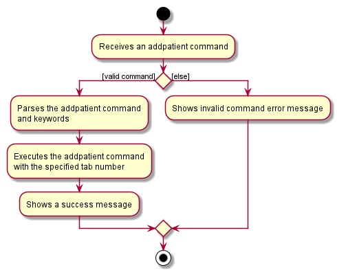

# Baymax - Developer Guide
## Table of Contents
[1. Introduction](#1-introduction) 
[2. Setting up](#2-setting-up-getting-started) 
[3. Design](#3-design) 
&nbsp;&nbsp;&nbsp;&nbsp;&nbsp;&nbsp;[3.1. Architecture](#31-architecture) 
&nbsp;&nbsp;&nbsp;&nbsp;&nbsp;&nbsp;[3.2. UI Component](#32-ui-component) 
&nbsp;&nbsp;&nbsp;&nbsp;&nbsp;&nbsp;[3.3. Logic Component](#33-logic-component) 
&nbsp;&nbsp;&nbsp;&nbsp;&nbsp;&nbsp;[3.4. Model Component](#34-model-component) 
&nbsp;&nbsp;&nbsp;&nbsp;&nbsp;&nbsp;[3.5. Storage Component](#35-storage-component) 
&nbsp;&nbsp;&nbsp;&nbsp;&nbsp;&nbsp;[3.6. Storage Component](#36-common-classes) 
[4. Implementation](#4-implementation) 
&nbsp;&nbsp;&nbsp;&nbsp;&nbsp;&nbsp;[4.1 List Managers](#41-list-managers) 
&nbsp;&nbsp;&nbsp;&nbsp;&nbsp;&nbsp;[4.2 Patient Manager](#42-patient-manager) 
&nbsp;&nbsp;&nbsp;&nbsp;&nbsp;&nbsp;[4.3 Apointment Manager](#43-appointment-manager) 
&nbsp;&nbsp;&nbsp;&nbsp;&nbsp;&nbsp;[4.4 Calendar Feature](#44-calendar-feature) 
[5. Documentation](#5-documentation) 
[6. Testing](#6-testing) 
[7. Dev Ops](#7-dev-ops) 
[Appendix A: Product Scope](#appendix-a-product-scope) 
[Appendix B: User Stories](#appendix-b-user-stories) 
[Appendix C: Use Cases](#appendix-c-use-cases) 
[Appendix D: Non-functional Requirements](#appendix-d-non-functional-requirements) 
[Appendix E: Glossary](#appendix-e-glossary) 
[Appendix F: Instructions for Manual Testing](#appendix-f-instructions-for-manual-testing) 
--------------------------------------------------------------------------------------------------------------------
## **1. Introduction**

Baymax is a desktop appointment manager made for clinic receptionists. It focuses on the Command Line Interface (CLI) while providing users with a simple and intuitive Graphical User Interface (GUI). Thus, the main interaction with Baymax will be done through user text-based commands.

Baymax allows receptionists to keep track of patients and appointments in a single, integrated platform.

The purpose of this Developer Guide is to help you understand the design and implementation of Baymax, so that you can become a contributor to this project as well.

## **2. Setting up, getting started**

Refer to the guide [_Setting up and getting started_](SettingUp.md).

--------------------------------------------------------------------------------------------------------------------

## **3. Design**

In this section, you will learn about the general design and structure of the Baymax application. This section explains how each component in Baymax works individually. Baymax is created with the Object-Oriented Programming Paradigm in mind, and follows the Facade Pattern and Command Pattern in software design.

### **3.1. Architecture**

The ***Architecture Diagram*** given above explains the high-level design of the App. Given below is a quick overview of each component.

 
Figure 1. Architecture Diagram of Baymax

:bulb: **Tip:** The `.puml` files used to create diagrams in this document can be found in the [diagrams](https://github.com/se-edu/addressbook-level3/tree/master/docs/diagrams/) folder. Refer to the [_PlantUML Tutorial_ at se-edu/guides](https://se-education.org/guides/tutorials/plantUml.html) to learn how to create and edit diagrams.

The following table provides a quick overview of each component of Baymax. More details about each individual component can be found in the following subsections.

| Component | Description
| --------- | ------------------------------------------
| `Main`    | Has two classes called Main and MainApp.   It is responsible for:  1. At App launch: Initializes the components in the correct sequence, and connects them up with each other.  2. At shut down: Shuts down the components and cleanup resources where necessary.
| `Commons` | Represents a collection of classes used by multiple other components.   It also contains the LogCenter component. The LogCenter component plays an important role at the architectural level and is used by many classes to write log messages to the App’s log file.
| `UI`      | Handles the UI of the App.
| `Logic`   | Executes commands.
| `Model`   | Holds the data of the App in memory.
| `Storage` | Reads data from, and writes data to, the hard disk.

Each of the four components,

* defines its *API* in an `interface` with the same name as the Component.
* exposes its functionality using a concrete `{Component Name}Manager` class (which implements the corresponding API `interface` mentioned in the previous point.

For example, the `Logic` component (see the class diagram given below) defines its API in the `Logic.java` interface and exposes its functionality using the `LogicManager.java` class which implements the `Logic` interface.

 
Figure 2. Class Diagram of the Logic Component

**How the architecture components interact with each other**

The *Sequence Diagram* below shows how the components interact with each other for the scenario where the user issues the command `deleteappt 1`.

Figure 3. Architecture Sequence Diagram  

The sections below give more details of each component.

### 3.2. UI component
(Contributed by Li Jianhan)

This segment will explain the structure and responsibilities of the `UI` component.

#### 3.2.1. Structure
 
Figure 4. Structure of the UI component

**API** :
[`Ui.java`](https://github.com/se-edu/addressbook-level3/tree/master/src/main/java/seedu/address/ui/Ui.java)

The `UI` component uses JavaFx UI framework. The layout of these UI parts are defined in matching `.fxml` files that are in the `src/main/resources/view` folder.

The UI consists of a `MainWindow` that is made up of parts such as the `CommandBox`, `SideTabPane` as shown in the *Class Diagram* above. All these, including the `MainWindow`, inherit from the abstract `UiPart` class.

The `Page` is an abstract class that represents a page corresponding to each tab in the GUI. Each tab will display information on different features of Baymax. The following classes inherit from the `Page` abstract class:
- Dashboard
- PatientInfoPage
- AppointmentInfoPage
- CalendarPage
- InfoPage

#### 3.2.2. Responsibilities

The `UI` component,

* Executes user commands using the `Logic` component.
* Listens for changes to `Model` data so that the UI can be updated with the modified data.

### 3.3. Logic component

 
Figure 5. Structure of the Logic Component

**API** :
[`Logic.java`](https://github.com/se-edu/addressbook-level3/tree/master/src/main/java/seedu/address/logic/Logic.java)

1. `Logic` uses the `AppointmentBookParser` class to parse the user command.
1. This results in a `Command` object which is executed by the `LogicManager`.
1. The command execution can affect the `Model` (e.g. adding a patient), which is executed by the `ModelManager` which calls `PatientManager` and `AppointmentManager`.
1. The result of the command execution is encapsulated as a `CommandResult` object which is passed back to the `Ui`.
1. In addition, the `CommandResult` object can also instruct the `Ui` to perform certain actions, such as displaying help to the user.

Given below is the Sequence Diagram for interactions within the `Logic` component for the `execute("deleteappt 1")` API call.

 
Figure 6. Delete Appointment Sequence Diagram

:information_source: **Note:** The lifeline for `DeleteCommandParser` should end at the destroy marker (X) but due to a limitation of PlantUML, the lifeline reaches the end of diagram.

### 3.4. Model component

This segment will explain the structure and responsibilities of the Model component.

#### 3.4.1. Structure

Figure 7. Structure of the Model Component

**API** : [`Model.java`](https://github.com/se-edu/addressbook-level3/tree/master/src/main/java/seedu/address/model/Model.java)

The `Model`component contains `ListManager`s that handle two main types of data in Baymax, `Patient` and `Appointment`. 
Each type of data is handled by a separate `ListManager` (to give `PatientManager` and `AppointmentManager`), and a 
`ModelManager` facade class exposes the methods 
that enable other components to perform getting, setting, searching and editing functions on the different 
types of data.

The `Model` component also contains

* a `UserPref` object that represents the user’s preferences.
* unmodifiable `ObservableList` objects for each type of data that can be 'observed' e.g. the UI can be bound to this 
  list so that the UI automatically updates when the data in the list change. 
  
The `Model` component does not depend on any of the other three components.

#### 3.4.2. Responsibilities

The `Model` component,

* Stores different types of data in memory when Baymax is running
* Represents data in `ObservableList` to automatically update the GUI when there is a change

### 3.5. Storage component

This segment will explain the structure and responsibilities of the Storage component.

#### 3.5.1. Structure

Figure 8. Structure of the Storage Component

**API** : [`Storage.java`](https://github.com/se-edu/addressbook-level3/tree/master/src/main/java/seedu/address/storage/Storage.java)

The `Storage` component contains interfaces for `Patient` data (`PatientManagerStorage`) and 
`Appointment` data (`AppointmentManagerStorage`) which defines methods for reading and saving the `Model` components
to memory. This allows for multiple different implementations of storage to store the data in different formats, e.g. 
json, csv, plaintext. A facade class `StorageManager` is used to expose these reading and writing methods.

The `JsonPatientManagerStorage` and `JsonAppointmentManagerStorage` are specific implementations of 
`PatientManagerStorage` and `AppointmentManagerStorage` that saves the `Patient` and `Appointment` data to 
json files. The path to these files are obtained from the `UserPref` object. 

#### 3.5.2. Responsibilities

The `Storage` component,
* can save `UserPref` objects in json format.
* can parse a json file in the correct format to get a `UserPref` object.  
* can save `Patient` and `Appointment` data in json format. 
* can parse a json file in the correct format to get a `PatientManager` or `AppointmentManager` object.

### 3.6. Common classes

Classes used by multiple components are in the `seedu.addressbook.commons` package.

--------------------------------------------------------------------------------------------------------------------

## **4. Implementation**

This section describes some noteworthy details on how certain features are implemented.

### **4.1 List Managers**
(Contributed by Kaitlyn Ng)

List Managers allow the Baymax application to handle lists of the different types of data in the application, 
namely `Patient` and `Appointment`. `ListManager` defines methods for Create, Read, Update and Delete (CRUD) operations 
that are common to all the types of data, and needed to manage the lists of data effectively. 

#### 4.1.1 Rationale
The separation of `Patient` and `Appointment` data into separate ListManagers allow for a common software architecture 
between data types. Lists of data within the application can thus be handled more efficiently, and other types of data 
can be added to extend the application with minimal modification to the code.

#### 4.1.2. Current Implementation

Each `ListManager`contains a `UniqueList` which is a generic class that stores all the data items in a list and
and maintains the uniqueness of the data objects in the list while doing so. This ensures that in every `UniqueList`, 
there is only one of each object. The `UniqueList` class is a generic class that can only contain data items that 
extend the `UniqueListElement` interface, which ensures data items contain the necessary comparison functions for 
`UniqueList` to maintain uniqueness. 

Each ListManager implements the `ReadOnlyListManager` interface. This interface has the `getReadOnlyList()` method 
which returns an `ObservableList` of data items, to be monitored by the GUI.

#### 4.1.3. Design Consideration
**Aspect: Separation into distinct list managers for each type of data.**

Option 1: Split into separate lists (Current)

*Pros:*

* Increases modularity of the code by separating it into distinct sections to handle data whose operations do not
often require interaction between them.
  
* Allows for more straightforward implementations in other components by ensuring each data type is handled with the
class architecture.

*Cons:*
  
* A lot of boilerplate code for implementing the list managers as separate classes but with similar 
  functionalities
  
Option 2: Store all the information in a single `DataManager` 

*Pros:*

* Easier to implement, as only one manager class is needed.

*Cons:*

* Violates the Separation of Concerns principle, making it difficult to implement future extensions without
significant change to other components.
  
Reason for choosing Option 1:

Sound design principles are key to ensuring that the program is bug-free, easily testable and easily extendable in the 
future. Option 1 increases modularity of the code to create more opportunities for module upgrade, reuse and
independent development for each data type, limiting the amount of change needed to other components when there are
changes in the `Model`. This will save time in the long run and reduce the possibility of introducing breaking bugs due
to unnecessary dependencies between data types.

**Aspect: Extract common CRUD operations with a generic class**

Option 1: Extract common CRUD functionalities of the `ListManager`s into a
single `UniqueList` class. The `ListManager`s will store data items in the `UniqueList` generic class and build on top
of the generic CRUD operations from the class. 

* Pros: Reduces amount of repeated code as all the lists of data essentially perform the same functions.

* Cons: Generics can be harder to comprehend, thus making it harder for other programmers to understand and
use the component. 
  
Option 2: Do not extract any common functionalities

* Pros: Easier for programmers to work on each code related to each data item completely separately, and implement 
methods specific to the data item in a more straightforward manner.

* Cons: Violates the Don't Repeat Yourself principle as there will be a lot of repeated CRUD operations.

Reason for choosing Option 1:
Following the Don't Repeat Yourself design principle will allow for more abstraction and less duplication in the code,
which facilitates future extensions and reduce effort in maintenance and testing by reducing repeated code. 

### **4.2 Patient Manager**
(Contributed by Thuta Htun Wai)

Baymax allows the user to manage patient information. A user can only deal with a single patient at any time. i.e. Only
a single patient's information can be managed at one time. A user can:
* Add a new patient
* Delete an existing patient
* Edit a patient's details
* List all the patients in the system
* Find a patient by using a keyword from his/her name
* List all the appointments of a specific patient

#### 4.2.1 Rationale
The Patient Manager feature is included in Baymax because it is one of the core features of the application.
If the user wants to keep track of the patient's information, he/she has to record the details
of the patient and be able to look up a patient in the system easily.
#### 4.2.2. Current Implementation
The `patient` package in the `Model` component contains the necessary information related to a patient.  

When a user enters a valid command (Let's say the `addpatient` command), the parser classes parses the command word
and the arguments and then creates an `AddPatientCommand` object. When the `AddPatientCommand` is executed,
the new patient is added into the appointment book and a success message is printed in the results display box.  

The following diagram shows what happens when a user enters an `addpatient` command.

 
Figure 9. Workflow of an addpatient command

The following table shows the commands related to managing a patient's details. 

| Command | Purpose
| --------- | ------------------------------------------
| `addpatient` | Adds a patient to the appointment book.
| `deletepatient` | Deletes a patient.
| `listpatient` | Lists all patients.
| `editpatient` | Edits a patient's details.
| `findpatient` | Finds a patient with the given search string (name).
| `listpatientappts` | Lists all the appointments of a specific patient.

#### 4.2.3. Design Consideration
For all the commands except the `listpatientappts` command, the current implementation is the best we came up with in terms of following good coding principles and
making the user easily understand the commands.  

As for the `listpatientappts` command, we decided not to continue this functionality from the `listappt` command in the
 `appointment` package. This is because we feel that it is better to have a separate class and a separate command word to list all
 the appointments of a specific patient instead of adding a new prefix keyword after `listappt` i.e `listappt by/PATIENT INDEX`.
 
### **4.3 Appointment Manager**
(Contributed by Shi Hui Ling & Reuben Teng)

Scheduling, viewing, and otherwise dealing with appointments is a key feature area for Baymax. `AppointmentManager` maintains a `UniqueList` of all `Appointment`s in the app, and executes the logic of most appointment commands. 

`AppointmentManager` contains the methods necessary to operate on the `UniqueList` of `Appointment`s. These include:
 1. Adding an appointment
 2. Editing an appointment
 3. Deleting an appointment
 4. Finding a specific appointment by `Patient` and `DateTime`
 5. Sorting the list of appointments
 
These methods are used by the `AppointmentCommand` classes to execute their logic.

#### 4.3.1 Rationale

The `AppointmentManager` class contains a summary of all the "back-end" logic of appointment commands on the app's `UniqueList` of `Appointment`s. This follows the SRP, as everything related to the execution of appointment commands can be found here. This also forces the customising of code to fit exactly the purposes needed for appointment commands, even if the methods simply call a `UniqueList` method that fulfills the exact purpose.

#### 4.3.2. Current Implementation

Makes use of many methods from `UniqueList`, e.g. `add`, `setElement`, `remove`, `sort`.

#### 4.3.3. Design Consideration

**Aspect 1: `deleteappt` Command** 
 
For this command, we only required the specifying of `DateTime` of the appointment and we allowed specifying the `Patient` by `name`, `nric`, or `index` (in the currently displayed list). This is to ensure that receptionists can opt for either a more intuitive way to specify a `Patient` (by `name` or `index`) or a quicker and more "guaranteed correct" way (by `nric`).

Additionally, we only require matching of `DateTime` and `Patient` of appointment as no two appointments should have those two fields exactly the same. By paring down the command's arguments to the minimum possible, we make the command more succinct and easy to use for receptionists. It is also easier implementation-wise.

**Aspect 2: `nric` field**

To ensure that `Appointment`s are json serialisable for `Storage` in the same way as `Patient`s, all fields of the `Appointment` class have to be serialisable. To achieve this, an `nric` field is added to each `Patient` to uniquely identify patients currently stored in the system. When serialising an `Appointment`, the patient field stores the `nric` string of the patient instead, and when reading an `Appointment` from memory a lookup is performed on the existing list of patients before a valid `Appointment` object is created containing an existing Patient object.

### **4.3 Appointment Manager**
(Contributed by Shi Hui Ling & Reuben Teng)
Scheduling, viewing, and otherwise dealing with appointments is a key feature area for Baymax. `AppointmentManager` maintains a `UniqueList` of all `Appointment`s in the app, and executes the logic of most appointment commands. 

`AppointmentManager` contains the methods necessary to operate on the `UniqueList` of `Appointment`s. These include:
 1. Adding an appointment
 2. Editing an appointment
 3. Deleting an appointment
 4. Finding a specific appointment by `Patient` and `DateTime`
 5. Sorting the list of appointments
 
These methods are used by the `AppointmentCommand` classes to execute their logic.

#### 4.3.1 Rationale

The `AppointmentManager` class contains a summary of all the "back-end" logic of appointment commands on the app's `UniqueList` of `Appointment`s. This follows the SRP, as everything related to the execution of appointment commands can be found here. This also forces the customising of code to fit exactly the purposes needed for appointment commands, even if the methods simply call a `UniqueList` method that fulfills the exact purpose.

#### 4.3.2. Current Implementation

Makes use of many methods from `UniqueList`, e.g. `add`, `setElement`, `remove`, `sort`.

#### 4.3.3. Design Consideration

**Aspect 1: `deleteappt` Command** 
 
For this command, we only required the specifying of `DateTime` of the appointment and we allowed specifying the 
`Patient` by `name`, `nric`, or `index` (in the currently displayed list). This is to ensure that receptionists can opt 
for either a more intuitive way to specify a `Patient` (by `name` or `index`) or a quicker and more "guaranteed 
correct" way (by `nric`).

Additionally, we only require matching of `DateTime` and `Patient` of appointment as no two appointments should have 
those two fields exactly the same. By paring down the command's arguments to the minimum possible, we make the command 
more succinct and easy to use for receptionists. It is also easier implementation-wise.

**Aspect 2: `nric` field**

To ensure that `Appointment`s are json serialisable for `Storage` in the same way as `Patient`s, all fields of the 
`Appointment` class have to be serialisable. To achieve this, an `nric` field is added to each `Patient` to uniquely 
identify patients currently stored in the system. When serialising an `Appointment`, the patient field stores the 
`nric` string of the patient instead, and when reading an `Appointment` from memory a lookup is performed on the 
existing list of patients before a valid `Appointment` object is created containing an existing Patient object.

### **4.4 Calendar Feature**
(Contributed by Li Jianhan & Kaitlyn Ng)

Baymax allows the user to manage appointments using a built-in calendar.
The calendar brings greater convenience to the user by showing them what days are available in a month.
It is also coupled with a schedule view that can be accessed by entering the `day` command, which shows the user
all appointments on a chosen day, laid out chronologically on a timeline.

#### 4.4.1 Rationale

The Calendar feature is included in Baymax because it can shorten some commands by allowing the user to only specify
the time, as the date can be directly inferred from the calendar. For example, in the Calendar 
Manager, a user can set a custom year, month and day. This influences the execution of the `addappt` command shown 
in the sequence diagram below. In this example, suppose the user has set year to 2020, 
month to February and day to 1, he can directly enter an `addappt` command that adds an appointment to 1, 
February, 2020 without having to enter a date into the command fields. This makes the command shorter, more convenient
and more user-friendly.

 
Figure X. Workflow of an `addappt` with the use of date set in the calendar

#### 4.4.2. Current Implementation
The `CalendarManager` class in the `Model` component contains an `AppointmentCalendar` object, storing the currently set 
`year`, `month` and `day`. Note that the `year`, `month` and `day` attributes may not necessarily be storing the 
present year, month and day. Rather, it is dependent on what the user set them to be. 

#### 4.4.3. Design Consideration

--------------------------------------------------------------------------------------------------------------------

## **5. Documentation**

* [Documentation guide](Documentation.md)
* [Configuration guide](Configuration.md)

--------------------------------------------------------------------------------------------------------------------

## **6. Testing**
* [Testing guide](Testing.md)
* [Logging guide](Logging.md)
## **7. Dev Ops**
* [DevOps guide](DevOps.md)

## **Appendix A: Product scope**

(Contributed by Thuta Htun Wai)

**Target user profile**:

* needs to manage significant number of patients and appointments
* wants to keep track of patients and appointments efficiently
* wants to look up patients and/or appointments easily by using matching words
* wants to look at current and past appointments through a calendar view
* prefers desktop apps over other types
* can type fast
* prefers typing to mouse interactions
* is reasonably comfortable using [CLI](https://en.wikipedia.org/wiki/Command-line_interface) apps

**Value proposition**:
* A handy tool for clinic staff, especially the receptionists, to deal with a large amount of patient information and their appointments.
* Baymax can manage patient information and appointments better than a typical mouse driven medical appointment management app.

## **Appendix B: User stories**
(Contributed by Kaitlyn Ng)

Priorities: High (must have) - `* * *`, Medium (nice to have) - `* *`, Low (unlikely to have) - `*`

| Priority | As a …​                                    | I want to …​                     | So that I can…​                                                        |
| -------- | ------------------------------------------ | ------------------------------ | ----------------------------------------------------------- |
| `* * *`  | forgetful receptionist of a clinic         | display all available commands | refer to the list of commands when I forget them            |
| `* * *`  | receptionist of a clinic                   | add a new patient              |                                                             |
| `* * *`  | receptionist of a clinic                   | list out all patients          |                                                             |
| `* * *`  | receptionist of a clinic                   | add a patient's contact information | contact them if needed                                 |
| `* * *`  | receptionist of a clinic                   | add a patient's emergency contact information | contact the patient's family members in times of emergencies |
| `* * *`  | receptionist of a clinic                   | view a patient's profile       |                                                             |
| `* * *`  | receptionist of a clinic                   | delete a patient profile       |                                                             |
| `* * *`  | receptionist of a clinic                   | add an appointment for a patient |                                                           |
| `* * *`  | receptionist of a clinic                   | list a patient's appointment history | keep track of it in case of future reference (like to track patient's medical progress through frequency of appointments) |
| `* * *`  | receptionist of a clinic                   | list a patient's future appointments | remind them of the appointments that they have made   |
| `* * *`  | receptionist of a clinic                   | delete an existing appointment | remove cancelled appointments                               |
| `* *`    | busy receptionist of a clinic              | find patients by name          | quickly retrieve the patient's information given just the patient's name |
| `* *`    | receptionist of a busy clinic              | find patient by NRIC           | find patients using a unique ID if there are multiple patients with the same name |
| `* *`    | receptionist of a clinic using the app for the first time | clear all current patient data | get rid of sample/experimental data I used for exploring the app |
| `* *`    | receptionist of a clinic with busy patients | change a patient's appointment date | accommodate for last-minute changes in the patient's schedule |
| `* *`    | receptionist of a clinic                   | delete all existing appointments of a patient | change all of a patient's appointments in the case of recovery or a serious change in medical condition |
| `* *`    | receptionist of a clinic                   | mark an appointment as missed | keep track of which appointments did not occur due to various circumstances, and possibly arrange for other appointments in its place |
| `*`      | receptionist of a patient-centric clinic     | add preferred but currently unavailable slots for patient's appointments | give patients their more preferred slot if it is becomes available |
| `*`      | careless receptionist in the clinic          | undo appointment deletion       | restore appointments that I accidentally delete           |
| `*`      | careless receptionist in the clinic          | backdate an appointment         | add in appointments that I accidentally missed out        |
| `* *`    | receptionist of a clinic                   | view all the coming appointments in a particular year | have a gauge of the business of the clinic over that year |
| `* *`    | receptionist of a clinic                   | display daily availability status of a month |                                                |
| `* *`    | receptionist of a clinic                   | display the coming appointments in the next n days | gauge the business of the clinic in the next few days |
| `* *`    | receptionist of a clinic                   | display all the appointments on a particular day | check the availability of the clinic on that day to arrange for other appointments |
| `*`      | receptionist of a clinic using the app for the first time | see sample data in the app | visualise how the app looks like when it is in use and interact with existing data |

## **Appendix C: Use cases**
(Contributed by Li Jianhan and Shi Hui Ling)

For all use cases below, the **System** is `Baymax` and the **Actor** is the `user`, unless specified otherwise.

#### Patient Profile Management

> **Use case: Edit a patient’s profile**

**MSS**

1. User requests to displays the patient’s profile
2. Baymax displays the patient profile
3. User requests to edit the patient’s profile
4. Baymax saves the changes

    Use case ends.

**Extensions**

* 1a. Patient does not exist
	* 1a1. Baymax displays a not found message

    Use case ends

* 2a. The given user ID is invalid
	* 2a1. Baymax displays an error message

	Use case ends.  

> **Use case: Delete a patient’s profile**

**MSS**

1. User requests to display the patient’s profile
2. Baymax displays the patient's profile
3. User requests to delete the patient’s profile
4. Baymax deletes the patient profile

    Use case ends.

**Extensions**

* 1a. Patient does not exist
	* 1a1. Baymax displays a not found message

    Use case ends

* 2a. The given user ID is invalid
	* 2a1. Baymax displays an error message

	Use case ends.  

#### Appointment Management

> **Use case: Change the date of an appointment**

**MSS**

1. User requests to display an appointment
2. Baymax displays the requested appointment
3. User requests to change the date of appointment
4. Baymax changes the date of the appointment

    Use case ends.   

> **Use case: Delete an appointment on a particular day**

**MSS**
1. User requests to <ins>list out all appointments on a particular day</ins>
2. Baymax displays the appointments
3. User requests to delete the appointment
4. Baymax deletes the appointment

    Use case ends.   

#### Calendar

> **Use case: List all appointments on a particular day**

**MSS**

1. User requests to set the calendar to a particular year
2. Baymax calendar switches to the stipulated year
3. User requests to set the calendar to a particular month
4. Baymax calendar switches to the stipulated month in the given year
5. User requests to list all appointments on a given day in that month
6. Baymax displays a list of appointments on that given day

    Use case ends.   

> **Use case: List all appointments in the next *n* days**

**MSS**

1. User requests to set the calendar to a particular year
2. Baymax calendar switches to the stipulated year
3. User requests to set the calendar to a particular month
4. Baymax calendar switches to the stipulated month in the given year
5. User requests to list all appointments in the next 7 days
6. Baymax displays a list of appointments in the next 7 days

    Use case ends.   

*{More to be added}*

## **Appendix D: Non-Functional Requirements**
(Contributed by Shi Hui Ling)

**Technical Environment**
* Application should work on any mainstream OS as long as it has Java 11 or above installed.
* Application should work without requiring an installer.
* Application should not depend on a remote server or other remote resources.
* Application should work without an online connection.
* Application should work on both 32-bit and 64-bit environments.

**Performance**
* Application should be able to save and load 200 patients’ worth of data without any noticeable delay in performance.
* Application should respond within 2 seconds to all commands.

**Quality**
* A user with above-average typing speed for regular English text should be able to accomplish most of the tasks faster by typing commands than using the mouse.
* Application should be easy to use for a new user when following the User Guide or `help` instructions.
* Application should have a user-friendly graphical user interface and display.

**Data**
* Application data should load correctly on any mainstream OS given the data file is transferred properly.
* Application data should never be lost or removed except when user explicitly deletes something.

**Project Scope**
* Application is not required to handle detailed medical information about patients.
* Application is not required to handle the printing of patient profiles or saving them in a user-friendly manner (only displaying).
* Application is not required to handle multiple users.

**Process**
* The project is expected to adhere to a schedule that delivers a feature set every two weeks.

**Extensibility & Documentation**
* Application should be easily extended by developers looking to improve or expand it.
* Application should be well-documented such that new developers can be on-boarded quickly just by reading through documentation.

## **Appendix E: Glossary**
(Contributed by Reuben Teng)
#### *UI*
* Abbreviation for User Interface, representing the point of human-computer interaction and communication.

#### *API*
* Abbreviation for Application Programming Interface, which defines interactions between multiple software intermediaries.

#### *OOP*
* Abbreviation Object-Oriented Programming, in which programmers organise software design around data (objects), rather than functions and logic.

#### *CLI*
* Abbreviation for Command Line Interface, referring to an interface which accepts user inputs and commands in the form of text.

#### *MSS*
* Abbreviation for Main Success Scenario, describing the most straightforward interaction for a given use case, which assumes that nothing goes wrong.

#### *OS*
* Abbreviation Operating System, referring to mainstream Operating Systems Windows, Linux, OS-X.

#### *Private contact detail*
* A contact detail that is not meant to be shared with others.

#### *Boilerplate code*
* Code that is reused without significant changes. Usually a sign of poor coding practices.

#### *Separation of Concerns principle*
* Principle of separating code into different sections, with each section handling a different concern. This allows for
  a more modular approach to implementation, with changes to one section not affecting another.
--------------------------------------------------------------------------------------------------------------------

## **Appendix F: Instructions for manual testing**

Given below are instructions to test the app manually.

:information_source: **Note:** These instructions only provide a starting point for testers to work on;
testers are expected to do more *exploratory* testing.

### Launch and shutdown

1. Initial launch

   1. Download the jar file and copy into an empty folder

   1. Double-click the jar file Expected: Shows the GUI with a set of sample contacts. The window size may not be optimum.

1. Saving window preferences

   1. Resize the window to an optimum size. Move the window to a different location. Close the window.

   1. Re-launch the app by double-clicking the jar file. 
       Expected: The most recent window size and location is retained.

1. _{ more test cases …​ }_

### Deleting a patient

1. Deleting a patient while all patients are being shown

   1. Prerequisites: List all patients using the `listpatients` command. Multiple patients in the list.

   1. Test case: `deletepatient 1` 
      Expected: First contact is deleted from the list. Details of the deleted contact shown in the status message. Timestamp in the status bar is updated.

   1. Test case: `deletepatient 0` 
      Expected: No patient is deleted. Error details shown in the status message. Status bar remains the same.

   1. Other incorrect delete commands to try: `deletepatient`, `deletepatient x`, `...` (where x is larger than the list size) 
      Expected: Similar to previous.

1. _{ more test cases …​ }_

### Saving data

1. Dealing with missing/corrupted data files

   1. _{explain how to simulate a missing/corrupted file, and the expected behavior}_

1. _{ more test cases …​ }_
