## Table of Contents
1. [**Introduction**](#1-introduction) 
2. [**Quick Start**](#2-quick-start) 
3. [**About**](#3-about) 
    3.1. [Structure of this Document](#31-structure-of-this-document) 
    3.2. [Reading this Document](#32-reading-this-document) 
    &nbsp;&nbsp;&nbsp;&nbsp;&nbsp;&nbsp;3.2.1. [GUI Terminology](#321-gui-terminology) 
    &nbsp;&nbsp;&nbsp;&nbsp;&nbsp;&nbsp;3.2.2. [General Symbols](#322-general-symbols) 
    &nbsp;&nbsp;&nbsp;&nbsp;&nbsp;&nbsp;3.2.3. [Command Format & Syntax](#323-command-format--syntax) 
4. [**Navigating Between Tabs**](#4-navigating-between-tabs) 
5. [**Features**](#5-features) 
    5.1. [Patient Information Management](#51-patient-information-management) 
    &nbsp;&nbsp;&nbsp;&nbsp;&nbsp;&nbsp;5.1.1. [Add a new patient: `addpatient`](#511-add-a-new-patient-addpatient) 
    &nbsp;&nbsp;&nbsp;&nbsp;&nbsp;&nbsp;5.1.2. [List all patients: `listpatients`](#512-list-all-patients-listpatients) 
    &nbsp;&nbsp;&nbsp;&nbsp;&nbsp;&nbsp;5.1.3. [Delete a patient profile: `deletepatient`](#513-delete-a-patient-deletepatient) 
    &nbsp;&nbsp;&nbsp;&nbsp;&nbsp;&nbsp;5.1.4. [Edit a patient profile: `editpatient`](#514-edit-a-patients-information-editpatient) 
    &nbsp;&nbsp;&nbsp;&nbsp;&nbsp;&nbsp;5.1.5. [Find patient by name: `findpatient`](#515-find-patient-by-name-findpatient) 
    &nbsp;&nbsp;&nbsp;&nbsp;&nbsp;&nbsp;5.1.6. [Add a remark to a patient: `remark`](#516-add-a-remark-to-a-patient-remark) 
    5.2. [Appointment Management](#52-appointment-management) 
    &nbsp;&nbsp;&nbsp;&nbsp;&nbsp;&nbsp;5.2.1. [Add a new appointment: `addappt`](#521-add-a-new-appointment-addappt) 
    &nbsp;&nbsp;&nbsp;&nbsp;&nbsp;&nbsp;5.2.2. [List all appointments of a patient: `listapptsof`](#522-list-all-appointments-of-a-patient-listapptsof) 
    &nbsp;&nbsp;&nbsp;&nbsp;&nbsp;&nbsp;5.2.3. [List all appointments: `listappts`](#523-list-all-appointments-listappts) 
    &nbsp;&nbsp;&nbsp;&nbsp;&nbsp;&nbsp;5.2.4. [Edit an appointment: `editappt`](#524-edit-an-appointment-editappt) 
    &nbsp;&nbsp;&nbsp;&nbsp;&nbsp;&nbsp;5.2.5. [Cancel an appointment: `cancel`](#525-cancel-an-appointment-cancel) 
    &nbsp;&nbsp;&nbsp;&nbsp;&nbsp;&nbsp;5.2.6. [Mark an appointment as done: `done`](#526-mark-an-appointment-as-done-done) 
    &nbsp;&nbsp;&nbsp;&nbsp;&nbsp;&nbsp;5.2.7. [Mark an appointment as missed: `missed`](#527-mark-an-appointment-as-missed-missed) 
    &nbsp;&nbsp;&nbsp;&nbsp;&nbsp;&nbsp;5.2.8. [Find appointment by keyword: `findappt`](#528-find-appointment-by-keyword-findappt) 
    5.3. [Calendar](#53-calendar) 
    &nbsp;&nbsp;&nbsp;&nbsp;&nbsp;&nbsp;5.3.1. [Switch to a particular year: `year`](#531-switch-to-a-particular-year-year) 
    &nbsp;&nbsp;&nbsp;&nbsp;&nbsp;&nbsp;5.3.2. [Switch to a particular month: `month`](#532-switch-to-a-particular-month-month) 
    &nbsp;&nbsp;&nbsp;&nbsp;&nbsp;&nbsp;5.3.3. [Switch to a particular day: `day`](#533-switch-to-a-particular-day-day) 
    5.4. [Utilities](#54-utilities) 
    &nbsp;&nbsp;&nbsp;&nbsp;&nbsp;&nbsp;5.4.1. [View help : `help`](#541-view-help-help) 
    &nbsp;&nbsp;&nbsp;&nbsp;&nbsp;&nbsp;5.4.2. [Exit the program: `exit`](#542-exit-the-program--exit) 
    &nbsp;&nbsp;&nbsp;&nbsp;&nbsp;&nbsp;5.4.3. [Clear all data: `clear`](#543-clear-all-data-in-baymax-clear) 
    5.5. [Features coming soon in Version 2.0](#55-features-coming-in-version-20) 
    &nbsp;&nbsp;&nbsp;&nbsp;&nbsp;&nbsp;5.5.1. [Undo/Redo v2.0](#551-undoredo-v20) 
    &nbsp;&nbsp;&nbsp;&nbsp;&nbsp;&nbsp;5.5.2. [Display appointments within a period v2.0](#552-display-appointments-within-a-period-v20) 
6. [**FAQ**](#6-faq) 
7. [**Command Summary**](#7-command-summary) 
    7.1. [Patient Information Management Commands](#71-patient-information-management-commands) 
    7.2. [Appointment Management Commands](#72-appointment-management-commands) 
    7.3. [Calendar Commands](#73-calendar-commands) 
    7.4. [Utility Commands](#74-utility-commands) 

--------------------------------------------------------------------------------------------------------------------

## 1. Introduction
(Contributed by Li Jianhan & Shi Hui Ling)

Welcome to Baymax! Are you a healthcare professional looking for a reliable app to keep track of patients and
appointments? You have come to the right place!

Baymax is a Command Line Interface (CLI) focused desktop application that helps you to manage patient appointments using just
the keyboard itself, no fiddling with the mouse needed. The main features include:

1. Managing appointments
2. Managing patient information 
3. Calendar

With Baymax, you can manage appointments efficiently with our integrated Calendar tool. We have put a lot of effort into
designing our User Interface so that it feels as intuitive to first-time users as it can be. You will be amazed by what 
you can achieve with Baymax through a clean and simple User Interface. What are you waiting for? Head on to Section 2, “Quick Start”!

--------------------------------------------------------------------------------

## 2. Quick Start

1. Ensure you have Java `11` or above installed in your Computer.

2. Download the latest version of `baymax.jar` from [here](https://github.com/AY2021S1-CS2103T-W12-3/tp/releases).

3. Copy the file to the folder you want to use as the _home folder_ for your Baymax application.

4. Double-click the file to start the app. The GUI similar to the below should appear in a few seconds.
   This is the dashboard.
   
   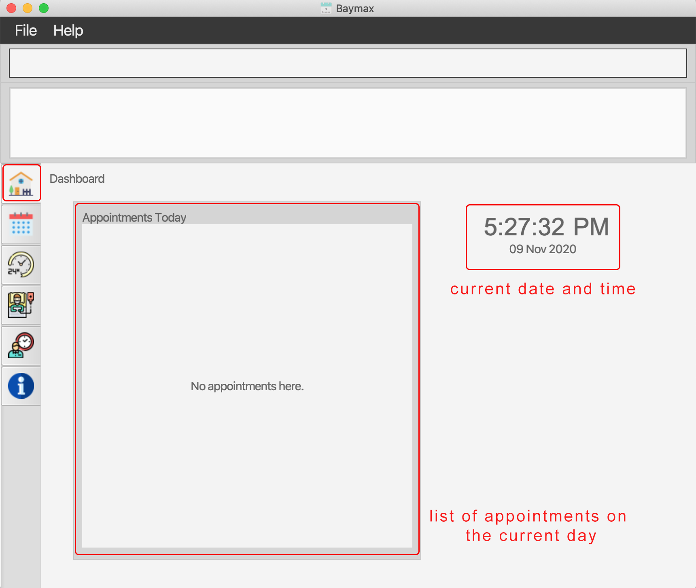 
   *Figure 2a1. Baymax Dashboard*

5. At the top of the screen, type in your commands in the command box and press Enter to execute it.
   Let us list all appointments. To do so, enter `listappts` into the command box. You should be brought to the appointment information page.
   Note how the app contains some sample data.
   
   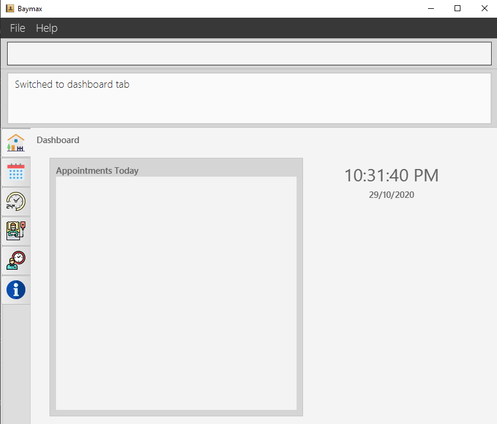 
      *Figure 2a2. Baymax Graphical User Interface*
   
   Tip: Typing **`help`** and pressing Enter will open up the help window, which allows you to learn more commands. 

6. Refer to the [Features](#5-features) below for details of each command.

--------------------------------------------------------------------------------------------------------------------

## 3. About
(Contributed by Li Jianhan, Thuta Htun Wai, Kaitlyn Ng, Reuben & Shi Hui Ling)

### 3.1. Structure of this Document
To give you the most amount of flexibility over what you can do with Baymax, we have provided a large set of features.
We have structured this User Guide in such a way that you can easily find what you need. In the next subsection,
*Section 3.2 Reading this Document*, you will find useful tips on using this document. All of Baymax's features and 
commands are documented in the following section, *Section 5 Features*. You can sift through these features
and commands easily by referring to the Table of Contents at the top of this User Guide, or to 
*Section 7 Summary of Commands*.

### 3.2. Reading this Document
This subsection familiarises you with all the technical terms, symbols and syntax that are used throughout this 
document, in order to make it easier for you to read the rest of the document. 

#### 3.2.1. GUI Terminology

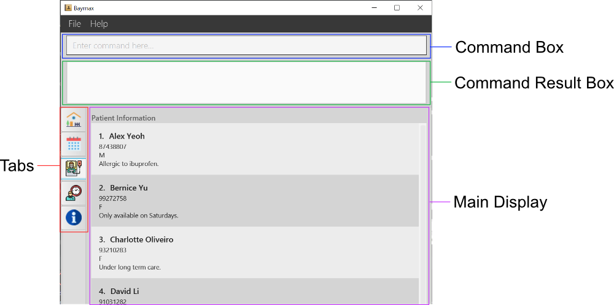 
*Figure 3.2.1a. GUI Components*

GUI Component | Description
--------------|--------------
Command Box   | Commands are entered here.
Command Result Box | Success and error messages of command executions are displayed here.
Tabs | Dashboard, Calendar, Schedule, Patient, Appointment, and Additional Information tabs can be accessed here. Note that the tabs are **not** clickable. See [here](#4-navigating-between-tabs) to find out how to navigate between tabs.
Main Display | Calendar views, Patient lists and Appointment lists are displayed here in their respective tabs.

#### 3.2.2. General Symbols

The table below explains the general symbols and syntax used throughout the document.

Symbol/Syntax    |  What does it mean?
---------------- | -------------------
<ins>underlined</ins> | Information that you need to pay special attention to, especially for the parameters.
`command`           | A grey highlight (called a code-block markup) indicates that this is a command that can be typed into the command box and executed by the application.
**Note:**        | Special notes/tips regarding that specific command/feature.
**Warning:**       | Notes prompting you to confirm that the command you are going to enter is really intended.

#### 3.2.3. Command Format & Syntax

You enter specific commands into the *Command box* of the GUI to use Baymax's features and perform tasks.

Most of the commands take the following format: 

`command_word prefix/PARAMETER`, e.g. `addpatient name/Alex Yeoh nric/S1234567A phone/98765432 gender/M`
* **Command_word:** word that specifies the task being performed, e.g. `addpatient`
* **Prefix:** word that specifies the parameter type being supplied, e.g. `name`, `nric`
* **PARAMETER:** information and details about various patients and appointments specified by you, e.g Alex Yeoh

**:information_source: Notes about the command format:** 

* Words in `UPPER_CASE` are the parameters to be **supplied** by you.

  E.g. `addpatient name/NAME`: can be used as `addpatient name/Alice Tan...`

* When the command requires time in HH:MM format, it follows the **24 Hour** System. 
 
  E.g. 01:00 means 1 a.m. and 13:00 means 1 p.m.

* Items in square brackets are **optional**.

  E.g. `name/NAME [r/REMARK]`: can be used as `name/Alice Tan r/No drug allergy` or as `name/Alice Tan`.

* Items with `…`​ after them can be used **multiple** times including zero times. 
  
  E.g. `[tag/TAG]…​`: can be used as ` ` (i.e. 0 times), `tag/braces`, `tag/braces tag/cleaning` etc.

* Parameters can be supplied in **any order**.

  E.g. `name/NAME phone/PHONE_NUMBER`: can also be used as `phone/PHONE_NUMBER name/NAME`.
  
* Compulsory parameters supplied more than once will be deemed **invalid**.
    
  E.g. Entering `addpatient name/John name/Jane nric/S1234567G phone/12345678 gender/F` where `name` is a compulsory field will give:
   
  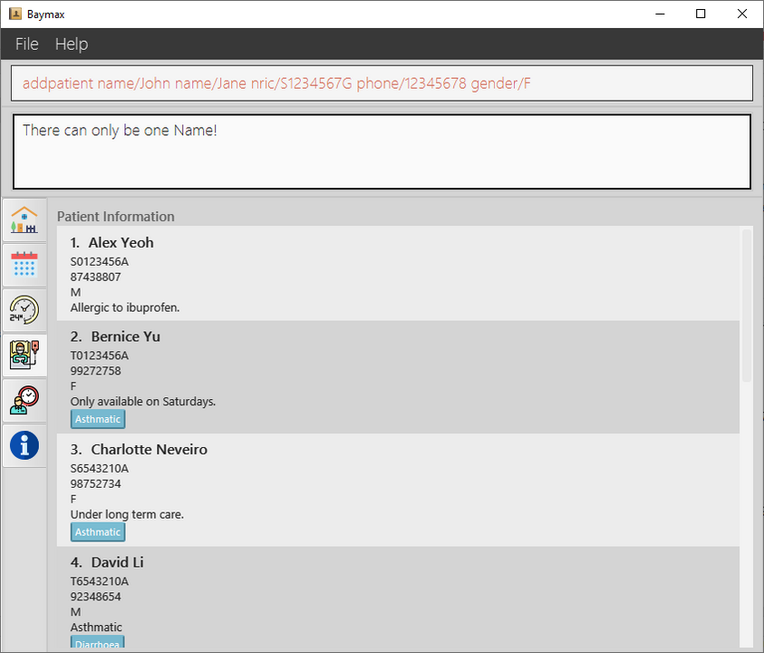 
  *Figure 3.2.3a. Multiple compulsory details are not accepted*

------------------------------------------------------------------------------------------

## 4. Navigating Between Tabs

You can use this command to switch between tabs by specifying the tab name.

**Format:** 
`TAB_NAME`

**Parameters:**

Parameter Name | Description
---------------|------------
TAB_NAME     | The name of the tab you want to switch to. 

TAB_NAME   | Tab that Baymax will switch to
-----------|----------------------------
dashboard  | Dashboard
calendar   | Calendar
schedule   | Schedule
patient    | Patients
appt       | Appointments
help       | Help/Additional Information

**Example:** 
1. Type `calendar` into the command box.
2. Press `Enter` on your keyboard

**Outcome:** 
1. The second tab, featuring the calendar page, will be displayed as shown in the image below. 

    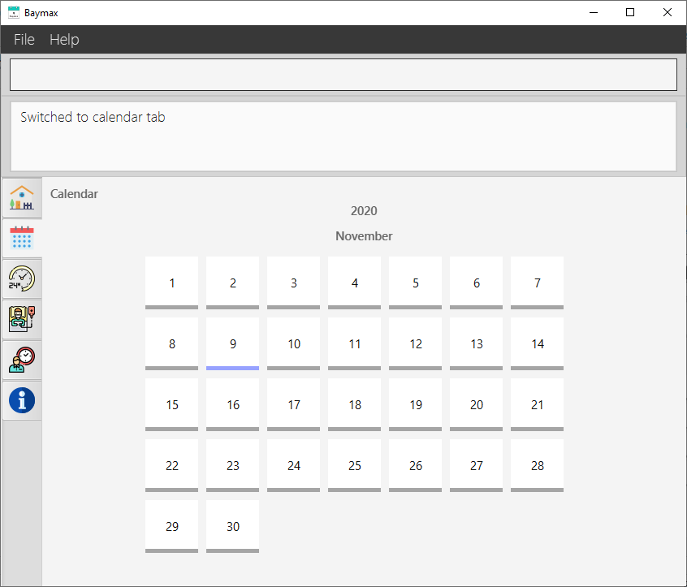 
    *Figure 4a. Changing to calendar tab*

-----------------------------------------------------------------------------------
## 5. Features
(Contributed by Thuta and Reuben)

### 5.1. Patient Information Management

This feature allows you to manage patient information. You can:

1. Add a new patient
2. List all patients
3. Delete a patient 
4. Edit a patient's details
5. Add a remark to a patient
6. Find patients by name

#### 5.1.1. Add a new patient: `addpatient`
You can use this command to add a new patient who has not yet been registered.

**Format:** 
`addpatient nric/NRIC name/NAME phone/PHONE gender/GENDER [r/REMARK] [tag/TAG]`

**Parameters:** 

Parameter Name | Description
---------------|------------
NRIC          | The nric of the patient. It must <ins>start with either 'S', 'T', 'F' or 'G' (all case-insensitive) and end with an alphabet (case-insensitive)</ins> and contain 7 numbers in between them. E.g. S1234567A, s1234567a
NAME          | The name of the patient. It must consist <ins>solely</ins> of alphanumerics (case-insensitive). E.g. Alice Tan, Alice1
PHONE         | The hand phone number that the patient wishes to be contacted by and it must be at least 3 digits long. It must consist <ins>solely</ins> of numbers. E.g. 91234567
GENDER        | The gender of the patient. In short, female is indicated by the letter ‘F’ and male is indicated by the letter ‘M’ (both case-insensitive). E.g M, m, F, f
REMARK        | Any remarks about the patient E.g. Only available on Mon / Tues. It can be any text -- alphanumerical, special characters etc. are allowed. A remark can be blank.
TAG           | The tag for the patient. It must only be <ins>alphanumerical</ins> and must not contain spaces or special characters. Can have multiple tags. E.g. Diabetic, Asthmatic

**Example:** 
1. Type `addpatient nric/S9772234F name/Jason Tan phone/98765432 gender/M tag/Asthmatic` into the command box.
2. Press `Enter` on your keyboard.

**Outcome:**

If the command is valid (i.e. the user keyed in the valid fields):
1. A success message will be displayed in the *Command Result* box as shown in Figure 5.1.1a.  
2. The patient with the information supplied by the parameters will be created and added to the system.

    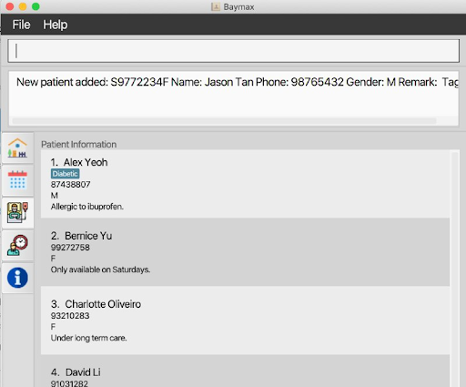 
    *Figure 5.1.1a. Adding a patient - success*

In the case where the command entered is invalid (e.g `NRIC` has 8 numbers in the middle):
1. An invalid command message will be displayed in the *Command Result* box, specifying which field was entered incorrectly.  

    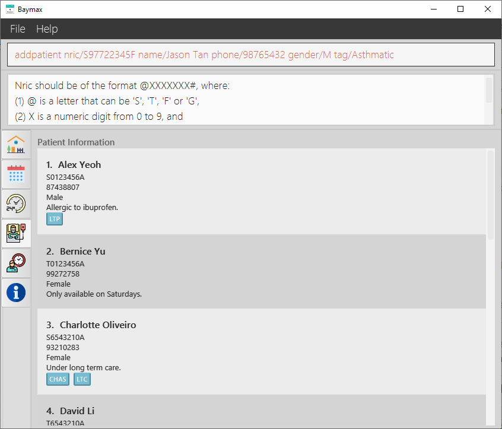 
    *Figure 5.1.1b. Adding a patient - failure*

**Note:**

When a patient is added successfully, the main display only shows the newly added patient so that you do not need to scroll
through the list to ensure that the new patient is added. 
If you wish to view the whole patient list again, you can use the `listpatients` command from [section 5.1.2](#512-list-all-patients-listpatients).    
    
#### 5.1.2. List all patients: `listpatients`
You can use this command to list all the patients in the system. The *Main Display* of the GUI will show
the list of patients with all their information: name, nric, contact number, gender, remark, tags, and appointments.

**Format:** 
`listpatients`

**Example:** 
1. Type `listpatients` into the command box.
2. Press `Enter` on your keyboard.

**Outcome:**

1. All the patients in the system will be listed as shown below.

    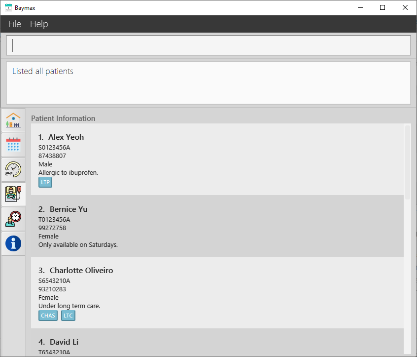 
    *Figure 5.1.2a. Listing all patients*

#### 5.1.3. Delete a patient: `deletepatient`
You can use this command to delete a patient’s profile by his or her `INDEX` in the displayed list. However, you will first need to use the `listpatients` command
to get the patient's `INDEX`.

**Note:** 

When you delete a patient, **all** the appointments associated with that patient will also be deleted.

**Format:** 
`deletepatient INDEX`

**Parameters:**

Parameter Name | Description
---------------|------------
INDEX     | The index of the patient in the most recently displayed list. It must be a <ins>positive</ins> integer.

**Example:** 
1. Type `deletepatient 8` into the command box.
2. Press `Enter` on your keyboard.

**Outcome:**

If the `INDEX` (i.e 8) is valid:
1. A success message will be displayed as shown below.
2. The patient at index 8 in the previously displayed list will be deleted.

    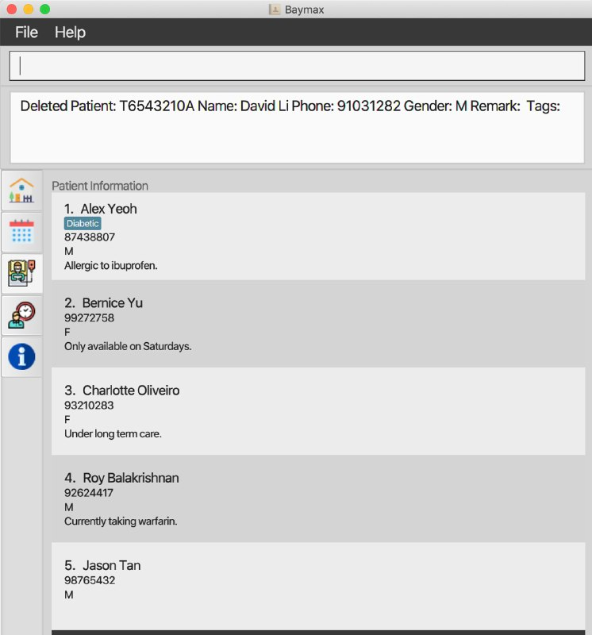 
    *Figure 5.1.3a. Deleting a patient - success*

In the case where the `INDEX` is invalid (E.g `deletepatient 11` is entered, but there are only 9 patients):
1. "**Invalid patient index**" message will be displayed as shown below.

    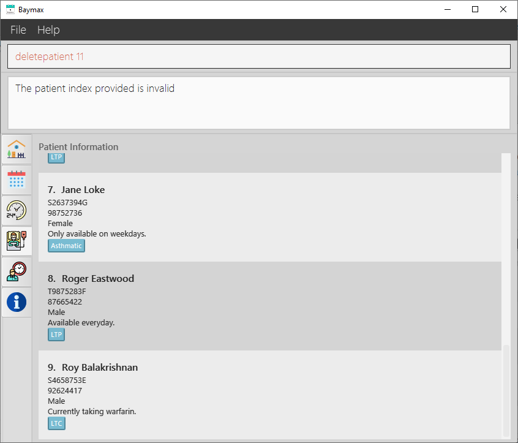 
    *Figure 5.1.3b. Deleting a patient - failure*
    
#### 5.1.4. Edit a patient's information: `editpatient`
You can use this command to edit a patient’s profile information. You can edit any field of a patient in any order. 
However, you will first need to use the `listpatients` command to find out the 
patient’s `INDEX` within the displayed list.

**Format:** 
`editpatient INDEX <at least 1 patient information parameter>`

Listed below are some examples of valid `editpatient` commands:
* `editpatient INDEX tag/TAG`
* `editpatient INDEX name/NAME`
* `editpatient INDEX nric/NRIC`
* `editpatient INDEX gender/GENDER`
* `editpatient INDEX phone/PHONE`
* `editpatient INDEX r/REMARK`
* You can also supply multiple parameters, e.g. `editpatient INDEX gender/GENDER name/NAME phone/PHONE`
* The parameter(s) supplied will directly replace the original one(s)

**Parameters:**

Parameter Name | Description
---------------|------------
INDEX     | The index of the patient in the most recently displayed list. It must be a <ins>positive</ins> integer.
NRIC    | The nric of the patient. It must <ins>start with either 'S', 'T', 'F' or 'G' (all case-insensitive) and end with an alphabet (case-insensitive)</ins> and contain 7 numbers in between them. E.g. S1234567A, s1234567a
NAME    | The name of the patient. It must consist <ins>solely</ins> of alphanumerics. E.g. Alice Tan, Alice1
PHONE   | The hand phone number which the patient wishes to be contacted by. It must consist <ins>solely</ins> of numbers and it must be at least 3 digits long. E.g. 91710012
GENDER  | The gender of the patient. In short, female is indicated by the letter ‘F’ and male is indicated by the letter ‘M’ <ins>(both case-insensitive)</ins>.
REMARK  | Any remarks about the patient. It can be any text -- alphanumerical, special characters etc. are allowed. E.g. Only available on Mon / Tues
TAG     | The tag for the patient. It must only be <ins>alphanumerical</ins> and must not contain spaces or special characters. Can have multiple tags. E.g. Diabetic

**Example:** 
1. Type `editpatient 2 tag/Asthmatic` into the command box.
2. Press `Enter` on your keyboard.

**Outcome:**

If the `INDEX` (i.e 2) is valid:
1. A success message will be displayed as shown below.
2. The tag of the patient at index 2 in the recent list will be edited.
    
    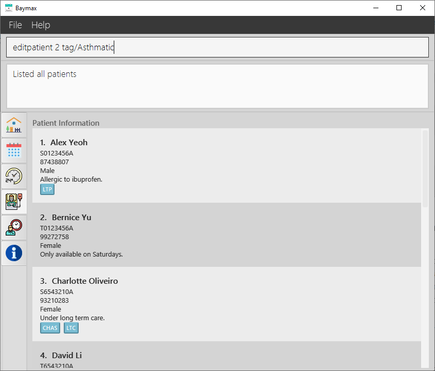 
    *Figure . Before editing a patient's tag*
    
     
    *Figure 5.1.4a. Editing a patient's information - success*
    
In the case where the field to be edited is absent (E.g `editpatient 3` is entered):

1. A message prompting the user to provide at least 1 field to edit will be displayed as shown below.

    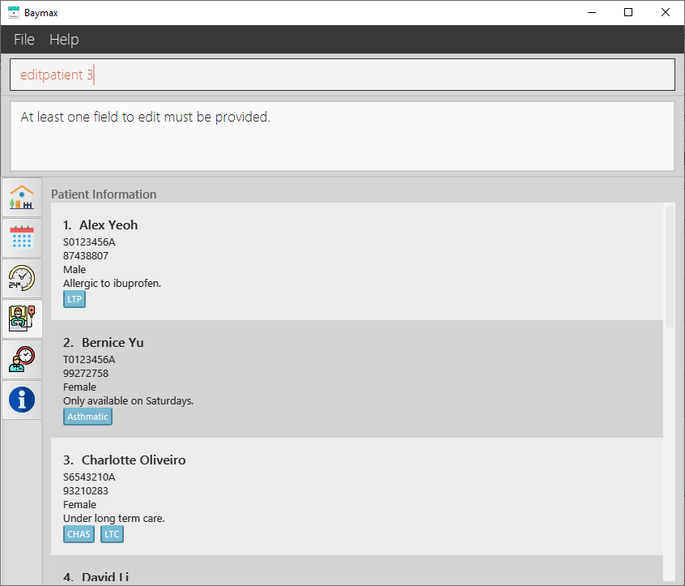 
    *Figure 5.1.4b. Editing a patient's information - failure*

**Note:** 

1. When the patient's information is edited successfully, the main display only shows the recently edited patient so that you do not need to scroll through the patient list to ensure that the patient's details are edited. 
If you wish to view the whole patient list again, you can use the `listpatients` command from [section 5.1.2](#512-list-all-patients-listpatients).

2. You can clear all the tags of the patient by entering ` editpatient INDEX tag/ `

#### 5.1.5. Find patient by name: `findpatient`
You can use this command to find a patient by entering a part of his name (or his full name). 
The search string for the name is case-insensitive.

**Format:** 
`findpatient NAME_KEYWORD`

**Parameters:**

Parameter Name | Description
---------------|------------
NAME_KEYWORD   | The name or keyword by which to search for the patient. It can be an incomplete part of the patient's name you are searching for. E.g. Alice

**Example:** 
1. Type `findpatient Alex` into the command box.
2. Press `Enter` on your keyboard.

**Outcome:**

1. If the patient is found, a success message will be displayed as shown below.

    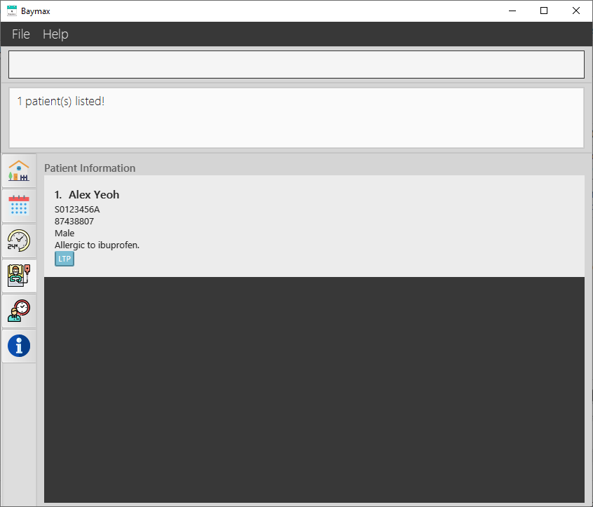 
    *Figure 5.1.5a. Finding a patient by name - success*
    
2. If patient is not found, then none will be displayed as shown below.
    
    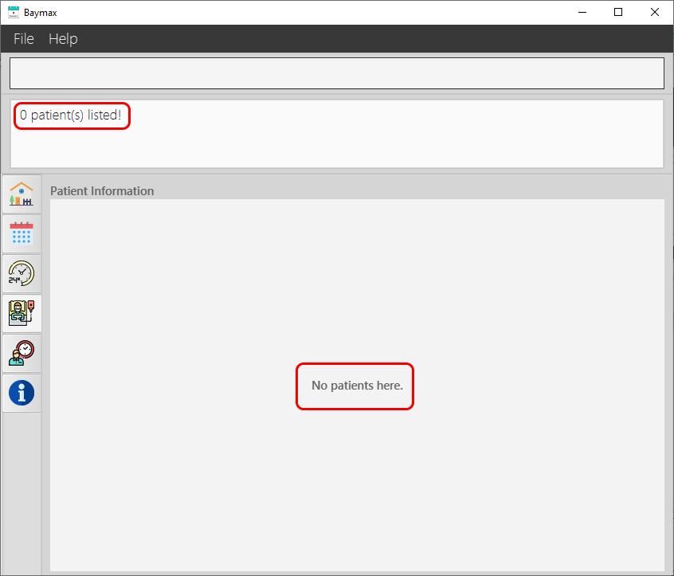 
    *Figure 5.1.5b. Finding a patient by name - failure*
    
#### 5.1.6. Add a remark to a patient: `remark`
You can use this command to add or replace a remark to a patient using their `INDEX` in the most recently displayed list.

**Format:** 
`remark INDEX r/REMARK`

**Parameters:**

Parameter Name | Description
---------------|------------
INDEX     | The index of the patient in the most recently displayed list. It must be a <ins>positive</ins> integer.
REMARK         | The remark to be added to the patient.

**Example:** 
1. Type `remark 6 r/Allergic to penicillin` into the command box.
2. Press `Enter` on your keyboard.

**Outcome:**

1. If the INDEX entered is valid, a success message will be displayed as shown below.
    
    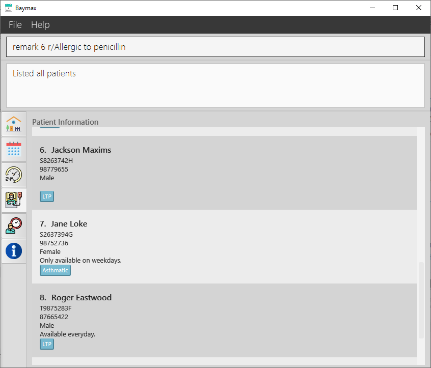 
    *Figure 5.1.6a. Before adding a remark to a patient.*
    
     
    *Figure 5.1.6b. Adding a remark to a patient - success*
    
2. If the INDEX entered is invalid (either beyond the list or negative), an error message will be displayed as shown below.
    
    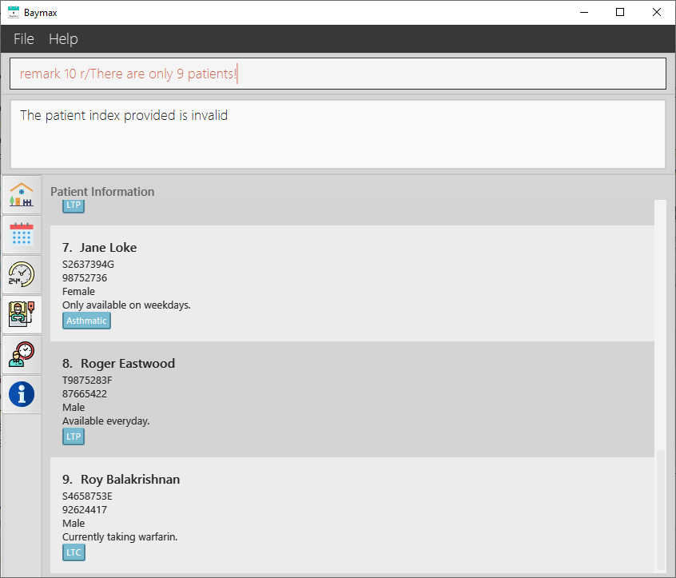 
    *Figure 5.1.6c. Adding a remark to a patient - failure*

**Note:**

1. When a remark is added to a patient successfully, the main display only shows the patient with the edited remark so that you do not need to scroll through the patient list to ensure that the new remark is added to that patient. 
If you wish to view the whole patient list again, you can use the `listpatients` command from [section 5.1.2](#512-list-all-patients-listpatients).

2. Each patient can only have one remark. Using this command when a patient already has a remark will
**replace** the existing remark with the new one entered.

3. Entering only `remark INDEX` will **remove** the current remark of the patient at that `INDEX`.

----------------------------------------------------------------------------------

### 5.2. Appointment Management

This feature allows you to manage the appointments of all patients. You can:

1. Add a new appointment
2. List all the appointments
3. List all the appointments of a patient
4. Cancel an appointment
5. Edit an appointment's details
6. Mark an appointment as done
7. Mark an appointment as missed
8. Find an appointment by keyword

**Note:**

The current version of Baymax does **not** allow undoing/redoing. The next version (v2.0) will support undoing so that users
can recover from accidentally marking an appointment as missed/done.

#### 5.2.1. Add a new appointment: `addappt`
You can use this command to add a new appointment for a patient.

**Parameters:**

Parameter Name | Description
---------------|------------
INDEX     | The index of the patient in the most recently displayed list. It must be a <ins>positive</ins> integer.
DATETIME       | The date followed by the time of the appointment. It must be in <ins>DD-MM-YYYY HH:MM</ins> format. E.g. 20-01-2020 15:00
TIME           | The time of the appointment. It must be in <ins>HH:MM</ins> format. E.g. 15:00. The date will be inferred from the date set in the calendar (see Section 5.3).
DESCRIPTION    | The description of the appointment. It can be <ins>any text</ins> -- alphanumerical, special characters etc. are allowed. E.g. Wrist fracture check-up #3
TAG            | The tag related to the appointment. It must only be <ins>alphanumerical</ins> and must not contain spaces or special characters. Can have multiple tags. E.g. Xray
NRIC           | The nric of the patient. It must <ins>start with either 'S', 'T', 'F' or 'G' and end with an alphabet </ins> and contain 7 numbers in between E.g. S1234567A, s1234567a. This field is case-insensitive.
DURATION       | The <ins>integer</ins> duration of the appointment in minutes, not spanning more than <ins>one</ins> day and must <ins>not</ins> extend the appointment to the next day.

**Format:** 
`addappt INDEX on/DATETIME dur/DURATION desc/DESCRIPTION [tag/TAG]` 
`addappt nric/NRIC on/DATETIME dur/DURATION desc/DESCRIPTION [tag/TAG]` 
`addappt INDEX at/TIME dur/DURATION desc/DESCRIPTION [tag/TAG]` 
`addappt nric/NRIC at/TIME dur/DURATION desc/DESCRIPTION [tag/TAG]` 

**Example:** 
1. Type `addappt 1 on/11-11-2020 12:30 dur/60 desc/Removal of braces. tag/Dental` into the command box.
2. Press `Enter` on your keyboard.

**Outcome:**

If the command is valid (i.e. the user keyed in the valid fields):
1. A success message will be displayed as shown below.  

    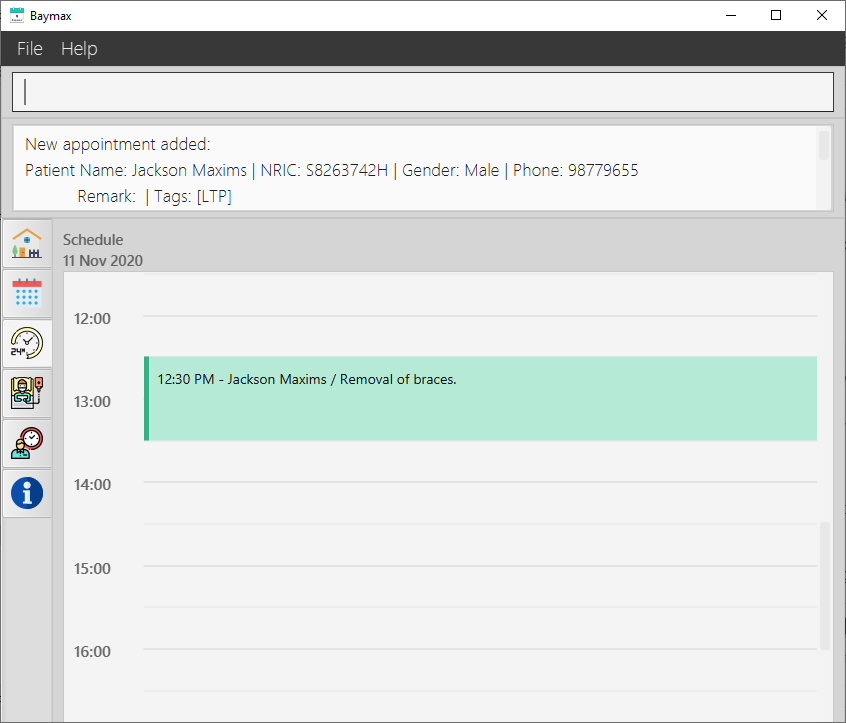 
    *Figure 5.2.1a. Scheduling a new appointment for a patient*

**Note:** 

1. Either `INDEX` or `NRIC` should be provided. If both are provided, the `INDEX` will be taken.
2. Either `DATETIME` or `TIME` should be provided. If both are provided, the `DATETIME` will be taken.
3. For your convenience, newly added appointments with `DATETIME` before the current date and time will be automatically marked as `done`. 

#### 5.2.2. List all appointments of a patient: `listapptsof`
You can use this command to list all the appointments belonging to a certain patient.
One quick way is to find patients by name using the `findpatient` command to 
get the patient’s `INDEX`, and then execute this command with the index found to list out all appointments of that patient.

**Format:** 
`listapptsof INDEX` 
`listapptsof nric/NRIC` 
`listapptsof name/NAME` 

**Parameters:**

Parameter Name | Description
---------------|------------
INDEX     | The index of the patient in the most recently displayed list. It must be a <ins>positive</ins> integer.
NRIC           | The nric of the patient.
NAME           | The name by which to search for the patient. It must be the patient's full name. E.g. Alex Yeoh

**Example:** 
1. Type `listapptsof 1` into the command box.
2. Press `Enter` on your keyboard.

**Outcome:**

1. All appointments associated with the patient will be displayed as shown below.

    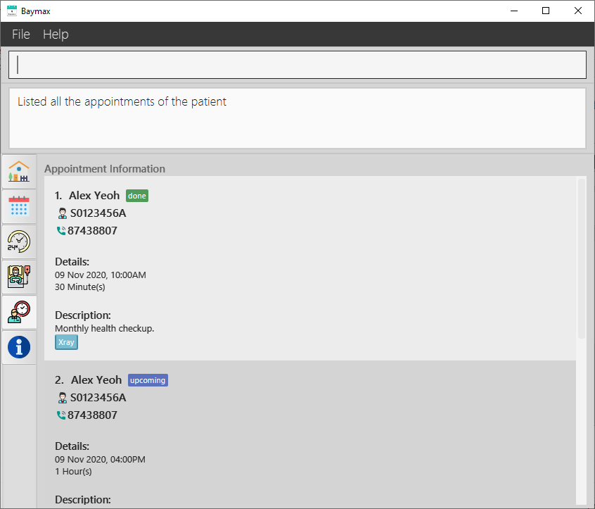 
    *Figure 5.2.2a. Listing the appointments of a patient*

#### 5.2.3. List all appointments: `listappts`

You can use this command to list all the appointments in the system, which belong to any patient.

**Format:** 
`listappts`

**Example:** 
1. Type `listappts` into the command box.
2. Press `Enter` on your keyboard.

**Outcome:**

1. All the appointments in the system will be listed as shown below.

     
    *Figure 5.2.3a. Listing all appointments*

#### 5.2.4. Edit an appointment: `editappt`
You can use this command to edit an appointment. You can edit any field of an appointment in any order. 
However, you will first need to use the `listappts` command to find out the appointment index `INDEX` first. 
This extra step helps you to confirm the appointment to be edited, and prevents accidental edits.

**Format:** 
`editappt INDEX <at least 1 appointment information parameter>`

Listed below are some examples of valid `editappt` commands:
* `editappt INDEX on/DATETIME`
* `editappt INDEX desc/DESC`
* `editappt INDEX tag/TAG`
* `editappt INDEX dur/DURATION`
* You can also supply multiple parameters, e.g. `editappt INDEX tag/TAG desc/DESC on/DATETIME`
* The parameter(s) supplied will directly replace the original one(s)

**Parameters:**

Parameter Name | Description
---------------|------------
INDEX          | The index of the target appointment in the most recently displayed list. It must be a <ins>positive</ins> integer.
DATETIME       | The date followed by the time of the appointment. It must be in <ins>DD-MM-YYYY HH:MM</ins> format. E.g. 20-01-2020 15:00
DESCRIPTION    | The description of the appointment. It can be <ins>any text</ins> -- alphanumerical, special characters etc. are allowed. E.g. Wrist fracture check-up #3
TAG            | The tag related to the appointment. It must only be <ins>alphanumerical</ins> and must not contain spaces or special characters. Can have multiple tags. E.g. Xray
DURATION       | The <ins>integer</ins> duration of the appointment in minutes, not spanning more than <ins>one</ins> day and must <ins>not</ins> extend to the next day.   E.g.   1. A new appointment at 23:58 can have maximum duration of 1 minute.   2. An appointment at 00:00 can have a maximum duration of 1439 minutes.

**Example:** 
1. Type `editappt 10 on/12-11-2020 12:00` into the command box.
2. Press `Enter` on your keyboard.

**Outcome:**

If the INDEX (i.e 10) is valid:
1. A success message will be displayed as shown below.
2. The `DATETIME` of the appointment at index 10 in the displayed list will be edited.
    
    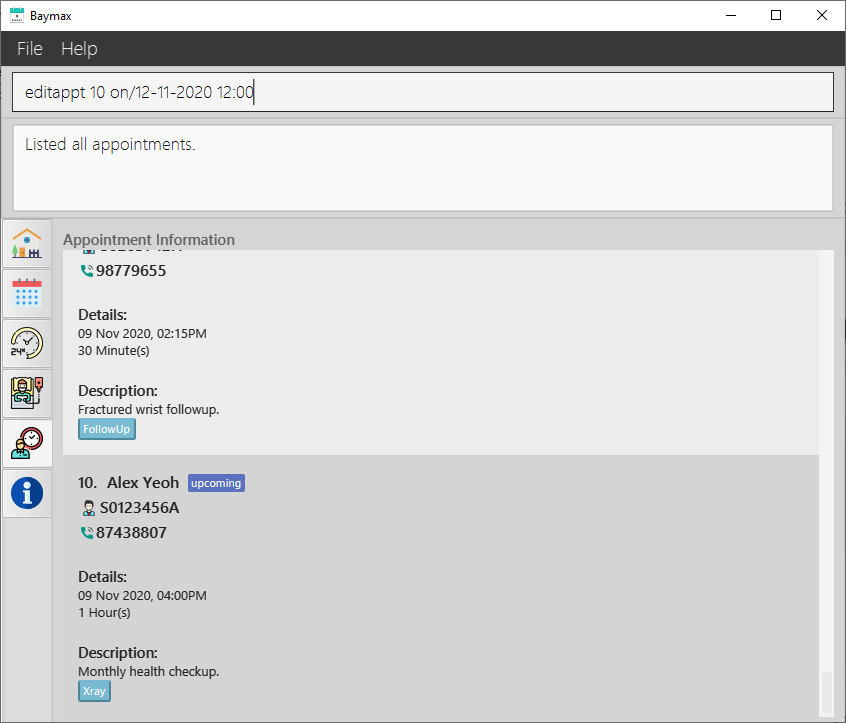 
    *Figure 5.2.4a. Before editing an appointment*
    
    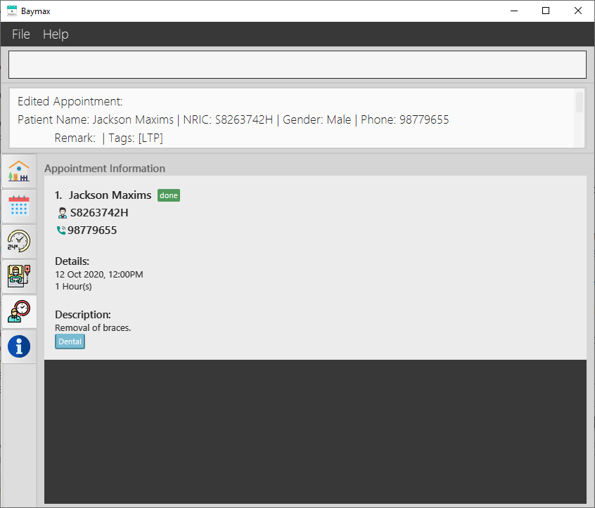 
    *Figure 5.2.4b. After editing an appointment*

**Note:**

When an appointment is edited successfully, the main display only shows the recently edited appointment so that
you do not need to scroll through the appointment list to ensure that the appointment is edited. 
If you wish to view the whole appointment list again, you can use the `listappts` command from [section 5.2.3](#523-list-all-appointments-listappts).

#### 5.2.5. Cancel an appointment: `cancel`
You can use this command to cancel an appointment within the system either by specifying the `INDEX` of the appointment 
or the `DATETIME` of the appointment with the `NAME` of the patient.

**Format:** 
`cancel INDEX`  
`cancel on/DATETIME name/NAME`

**Parameters:**

Parameter Name | Description
---------------|------------
INDEX          | The index of the target appointment in the most recently displayed list. It must be a <ins>positive</ins> integer.
NAME           | The name by which to search for the patient. It must be the patient's full name. E.g. Alex Yeoh
DATETIME       | The date followed by the time of the appointment. It must be in <ins>DD-MM-YYYY HH:MM</ins> format. E.g. 20-01-2020 15:00

**Example:** 
1. Type `cancel 1` into the command box.
2. Press `Enter` on your keyboard.

**Warning:**
 
For your convenience, we allow you to cancel an appointment using the datetime of the appointment and name of the patient. Use this method only if you are sure that there is only one patient with the name that you are going to enter, in order to prevent accidental deletes.

**Outcome:**

If the command is valid (i.e. the specified appointment exists):
1. A similar success message or outcome will be displayed depending on the first appointment in the list.
2. The appointment specified will be removed.
    
    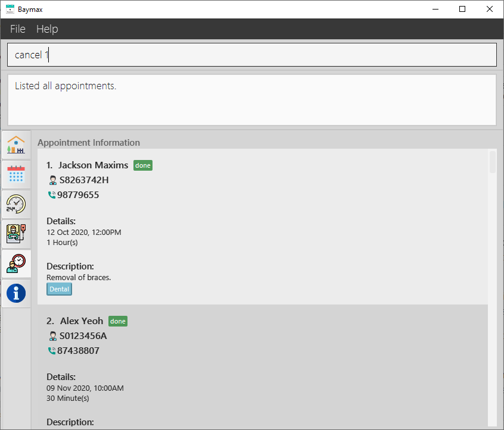 
    *Figure 5.2.5a. Before cancelling an appointment*
    
    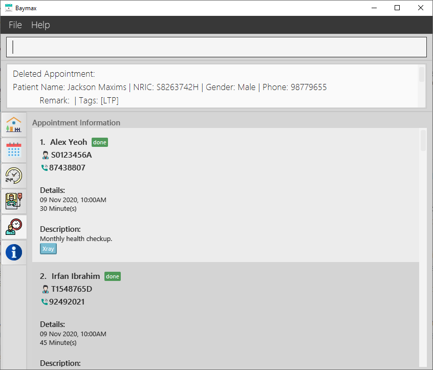 
    *Figure 5.2.5b. After cancelling an appointment*

#### 5.2.6. Mark an appointment as done: `done`
You can use this command to mark an appointment within the system as done either by specifying `INDEX` of the appointment, or the `DATETIME` of the appointment with the `NAME` of the patient.

**Format:** 
`done INDEX` 
`done on/DATETIME name/NAME`

**Parameters:**

Parameter Name | Description
---------------|------------
INDEX          | The index of the target appointment in the most recently displayed list. It must be a <ins>positive integer</ins>.
NAME           | The name by which to search for the patient. It can be an incomplete part of the patient's name. E.g. Alice
DATETIME       | The date followed by the time of the appointment. It must be in <ins>DD-MM-YYYY HH:MM</ins> format. E.g. 20-01-2020 15:00

**Example:** 
1. Type `done 7` into the command box.
2. Press `Enter` on your keyboard.

**Warning:**
 
For your convenience, we allow you to mark appointment as done using the datetime of appointment and name of patient. Use this method only if you are sure there is only one patient with the name that you are going to enter, in order to prevent accidental edits.

**Outcome:**

If the command is valid (i.e. the specified appointment exists):
1. A similar success message or outcome will be displayed depending on the first appointment in the list.
2. The appointment specified will be marked as done.
    
    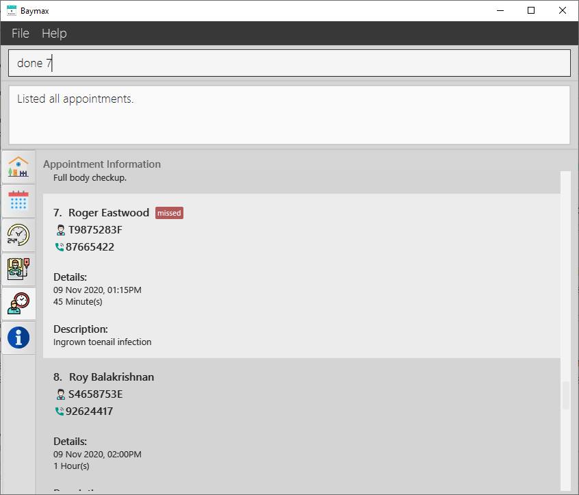 
    Figure 5.2.6a. Before marking an appointment as done*
    
    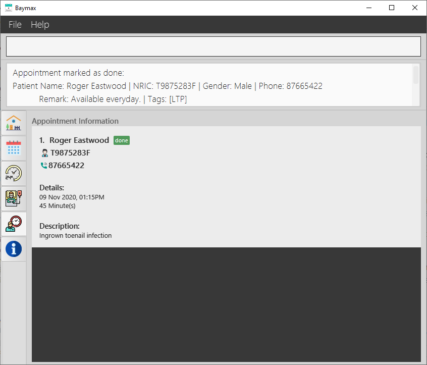 
    *Figure 5.2.6b. Marking an appointment as done*
   
**Note:**

When an appointment is marked as `done` successfully, the main display only shows that appointment so that you do not need to scroll through the appointment list to ensure that the appointment is marked as `done`.    
If you wish to view the whole appointment list again, you can use the `listappts` command from section 5.2.3.   
    
#### 5.2.7. Mark an appointment as missed: `missed`
You can use this command to mark an appointment within the system as missed by specifying the patient it belongs to 
and the `DATETIME` of the appointment.

**Format:** 
`missed INDEX`  
`missed on/DATETIME name/NAME`

**Parameters:**

Parameter Name | Description
---------------|------------
INDEX          | The index of the target appointment in the most recently displayed list. It must be a <ins>positive</ins> integer.
NAME           | The name by which to search for the patient. It can be an incomplete part of the patient's name. E.g. Alice
DATETIME       | The date followed by the time of the appointment. It must be in <ins>DD-MM-YYYY HH:MM</ins> format. E.g. 20-01-2020 15:00

**Example:** 
Method 1:
1. Type `missed 7` into the command box.
2. Press `Enter` on your keyboard.

**Warning:**
 
For your convenience, we allow you to mark appointment as missed using the datetime of the appointment and the name of patient. Use this method only if you are sure that there is only one patient with the name that you are going to enter, in order to prevent accidental edits.

**Outcome:**

If the command is valid (i.e. the specified appointment exists):
1. A similar success message or outcome will be displayed depending on your list of appointments.
2. The appointment specified will be marked as missed.
    
    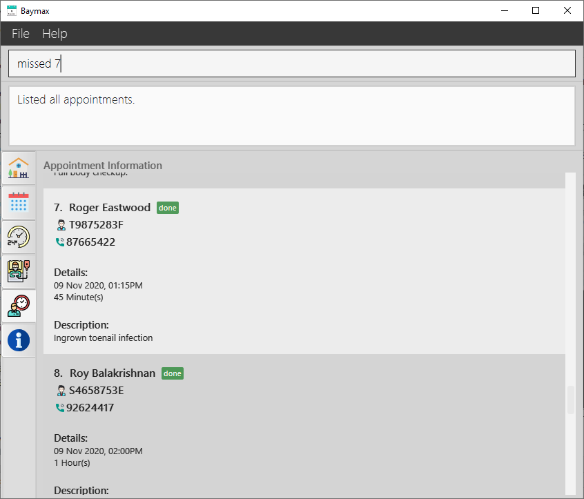 
    *Figure 5.2.7a. Before marking an appointment as missed*
    
    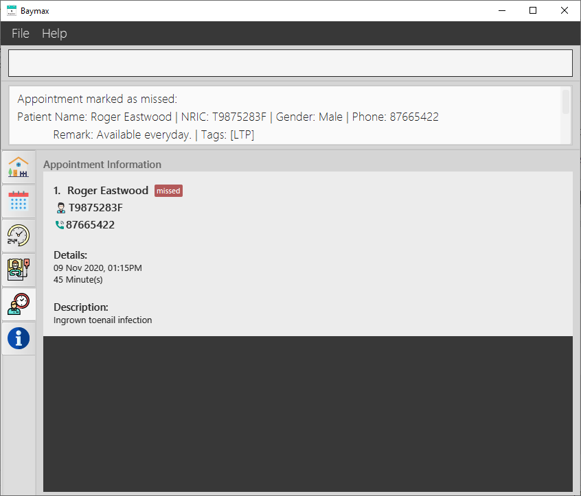 
    *Figure 5.2.7b. Marking an appointment as missed*

**Note:**

When an appointment is marked as `missed` successfully, the main display only shows that appointment so that you do not need to scroll through the appointment list to ensure that the appointment is marked as `missed`.    
If you wish to view the whole appointment list again, you can use the `listappts` command from section 5.2.3.   

#### 5.2.8. Find appointment by keyword: `findappt`
You can use this command to find an appointment or appointments by entering a part of the appointment description, or a part of the tag name. 
The search string for the keyword entered is case-insensitive.

**Format:** 
`findappt DESCRIPTION_KEYWORD`  
`findappt TAG_KEYWORD`

**Parameters:**

Parameter Name | Description
---------------|------------
DESCRIPTION_KEYWORD   | The keyword by which to search for the appointment. It can be an incomplete part of the <ins>description</ins> of the appointment you are searching for. E.g. Removal
TAG_KEYWORD           | The keyword by which to search for the appointment. It can be an incomplete part of the <ins>tag</ins> of the appointment you are searching for. E.g DrG, Dr

**Example:** 
1. Type `findappt check` into the command box.
2. Press `Enter` on your keyboard.

**Outcome:**

1. If the appointment is found, a success message will be displayed as shown below.

    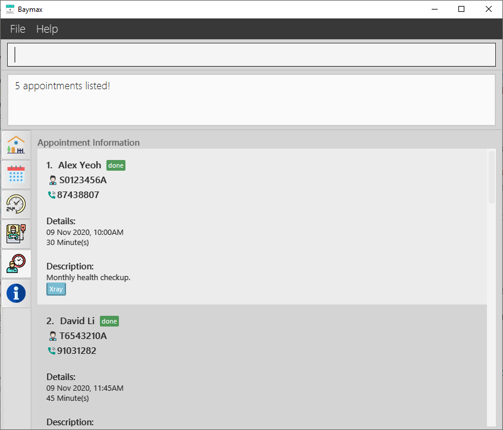 
    *Figure 5.2.8a. Finding an appointment by description*

**Example:** 
1. Type `findappt follow` into the command box.
2. Press `Enter` on your keyboard. 

**Outcome:**
   
1. If appointment is found, a succcess message will be displayed as shown below.
    
    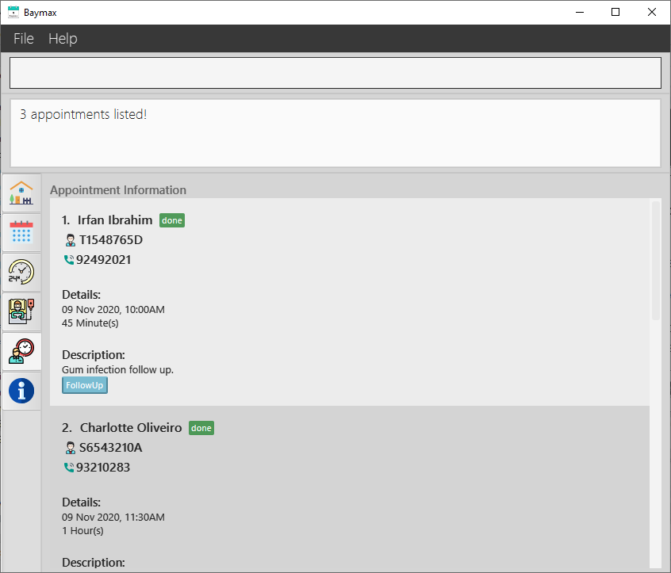 
    *Figure 5.2.8b. Finding an appointment by tag*

**Note:**

1. If the `TAG_KEYWORD` is present in the **description** of another appointment, that appointment will be listed as well.
2. If the `DESCRIPTION_KEYWORD` is present in the **tag** of another appointment, that appointment will be listed as well.
    
-------------------------------------------------------------------------------

### 5.3. Calendar 
Baymax Calendar allows you to see how many days are available in a month. Coupled with the schedule view, the Calendar allows you to see a list of appointments laid down on a timeline in chronological order.
The following subsections will guide you through how to use the Calendar.

**Note:**

The dates in the calendar view are **not** clickable.

#### 5.3.1. Switch to a particular year: `year`
You can use this command to switch to a particular year. The default is the current year. Suppose there are appointments
scheduled one year in advance, you can use this function to switch to the following year.

**Format:** 
`year YEAR`

**Parameters:**

Parameter Name | Description
---------------|------------
YEAR          | The year you want to switch to. It must be a <ins>4-digit positive</ins> number from 1900 to 2100, inclusive.

**Example:** 
1. Type `year 2019` into the command box.
2. Press enter on your keyboard.

**Outcome:** 

1. Baymax will switch to the Calendar tab.
2. The year 2019 will be displayed on the top of the Calendar page together with the currently selected month.

    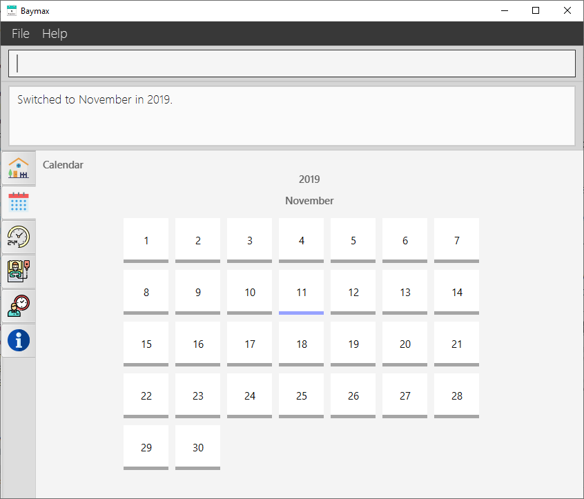 
    *Figure 5.3.1a Changing the year to 2019*

#### 5.3.2. Switch to a particular month: `month`
You can use this command to switch to a particular month. The default is the current month. 
For example, if today is 3rd January 2020, then the calendar will display the year 2020 and the month
January by default.

**Format:** 
`month MONTH`

**Parameters:**

Parameter Name | Description
---------------|------------
MONTH          | The month you want to switch to. It must be a <ins>positive</ins> number from 1 (January) to 12 (December), or the name of the month (full or short, i.e. Jan, Feb, Mar)

**Example:** 

1. Type `year 2019` into the command box and press Enter to switch to the year 2020.
2. Type `month 9` or `month september` or `month sep` into the command box.
3. Press Enter on your keyboard.

**Outcome:** 

1. The month will be set to September.

     
    *Figure 5.3.2a. Changing the month to September*

#### 5.3.3. Switch to a particular day: `day`
You can use this command to select a particular day, and display its schedule (with all appointments within the day).

Parameter Name | Description
---------------|------------
DAY            | The day of the month you want to switch to. It must be a <ins>positive</ins> number from 1 to the last day of the month. E.g. if the month is January (which has 31 days), the range of numbers you can enter is 1 to 31 (inclusive).

**Format:** 
`day DAY`

**Example:** 
1. Type `year 2020` into the command box and press Enter to switch to the year 2020.
2. Type `month 11` into the command box and press enter to switch to the month October.
3. Type `day 9` into the command box.
4. Press Enter on your keyboard.

**Outcome:** 
1. The day 09-11-2020 will be selected.

    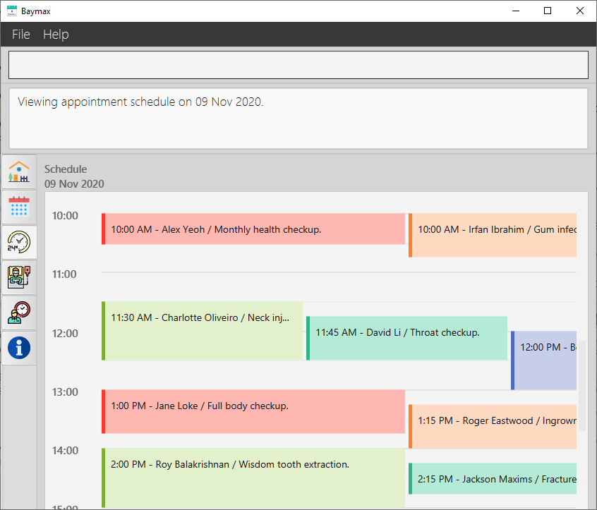 
    *Figure 5.3.3a. Viewing the schedule on the 9th November 2020*
    
----------------------------------------------------------------------------------

### 5.4. Utilities

#### 5.4.1. View help: `help`

You can use this command to view the URL link to the full *User Guide* (this document) for more details about the commands.

**Format:** 
`help`

**Example:** 
1. Type `help` into the command box.
2. Press `Enter` on your keyboard.

**Outcome:** 
1. A link directing the user to the help page will be displayed as shown below, together with a summarised list of commands.

    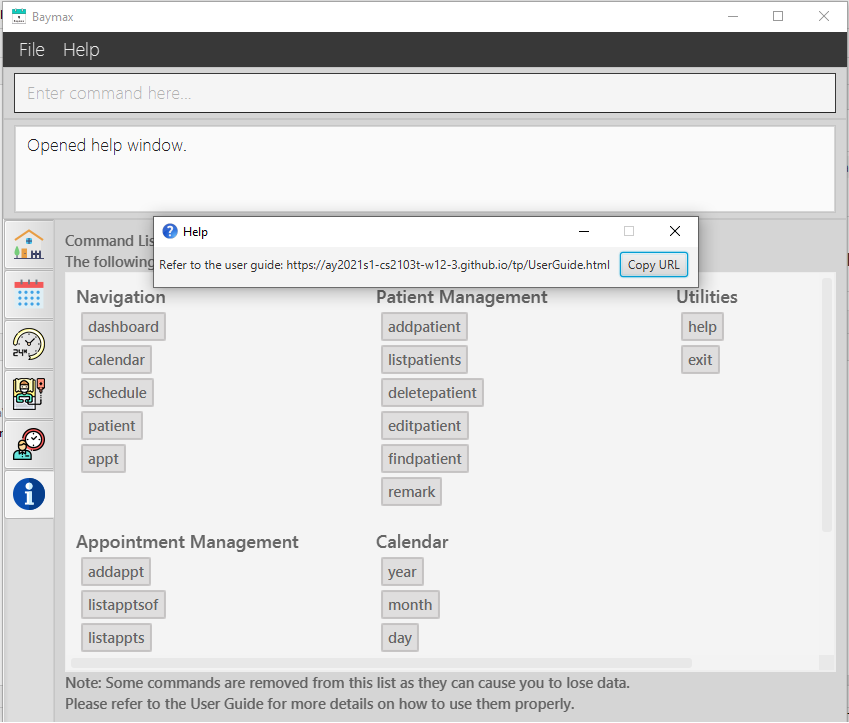 
    *Figure 5.4.1a. Executing `help` command*

#### 5.4.2. Exit the program : `exit`

You can use this command to exit the program.

**Format:** `exit`

**Example:** 
1. Type `exit` into the command box.
2. Press `Enter` on your keyboard.

**Outcome:** 
1. The application window will close,and it will stop running. 

#### 5.4.3. Clear all data in Baymax: `clear`

**Warning**: 
This is a command to be used with **caution** as it cannot be undone. 

You can use this command to clear all the patient and appointment information. Once cleared, it cannot be undone.

**Format:** `clear`

**Example:** 
1. Type `clear` into the command box.
2. Press `Enter` on your keyboard.

**Outcome:** 
1. The patients and appointments in the system will be cleared as shown below.
    
    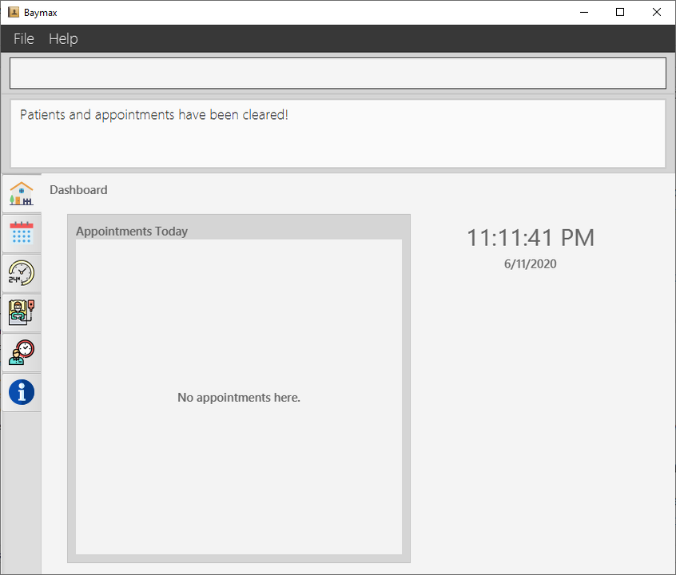 
    *Figure 5.4.3a. Executing `clear` command*
    
    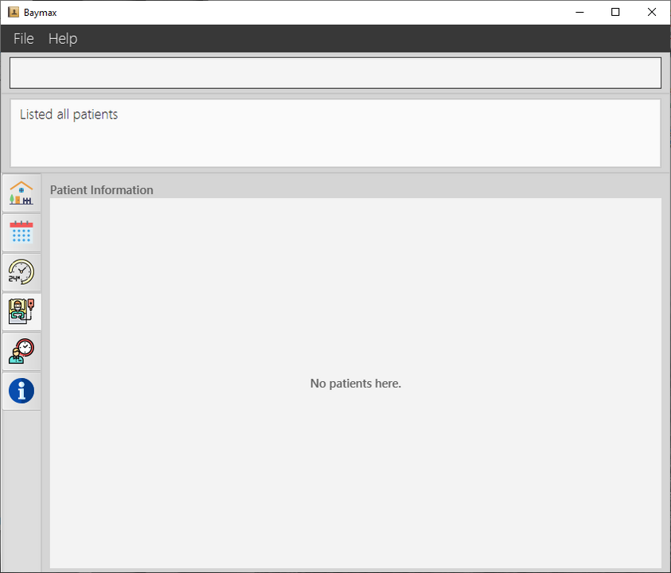 
    *Figure 5.4.3b. Patient List when `listpatients` is entered*
    
    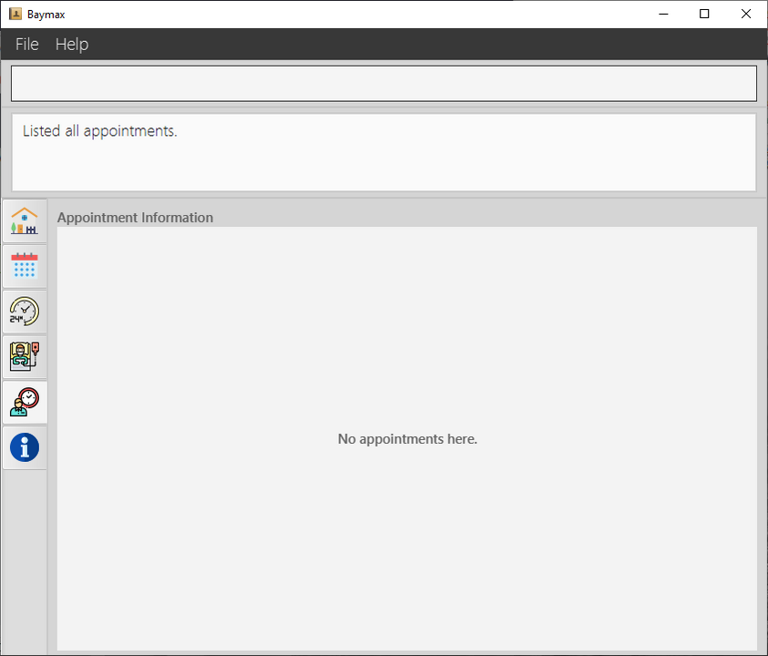 
    *Figure 5.4.3c. Appointment List when `listappts` is entered*
    
---------------------------------------------------------------------------------

### 5.5. Features coming in Version 2.0

#### 5.5.1. Undo/Redo `v2.0`

This feature will allow you to undo/redo certain commands.

#### 5.5.2. Display appointments within a period `v2.0`

This feature will allow you to view all the appointments within a specified period, defined by a start `day` and an end
`day`. 

---------------------------------------------------------------------------------
## 6. FAQ
(Contributed by Hui Ling)

**Q:** Do I have to manually save any data? 

**A:** No. Baymax saves your data to the hard disk automatically after any command that changes data. 

**Q:** How do I transfer my data to another computer?

**A:** Baymax automatically saves all your data in a folder named `data` in the same directory as the application.
 You can copy and transfer the `data` folder into the same directory as Baymax on your other computer and Baymax 
 will automatically load your data upon launching Baymax.

**Q:** What do I do if I marked an appointment as `done`/`missed` wrongly?

**A:** Unfortunately, the current version of Baymax does not have the `undo` features yet to help you change it back to `upcoming`. You will need to delete that appointment and add it back again.
However, if you wish to change `done` to `missed` and vice versa, you can use the `missed` command and `done` command respectively.

---------------------------------------------------------------------------------
## 7. Command Summary
(Contributed by Hui Ling and Reuben)

### 7.1. Patient Information Management Commands

**Command**             | **Example**
------------------------|--------------------
Add a Patient: `addpatient nric/NRIC name/NAME phone/PHONE gender/GENDER [r/REMARK] [tag/TAG]` | `addpatient nric/S9772234F name/Jason Tan phone/98765432 gender/M` 
List All Patients: `listpatients` | `listpatients`
Delete a Patient: `deletepatient INDEX` | `deletepatient 4`
Edit a Patient's Information: `editpatient INDEX <at least 1 patient information parameter>` | `editpatient INDEX phone/82345678`
Find a Patient: `findpatient NAME_KEYWORD` | `findpatient Alex`
Add a Remark: `remark INDEX r/REMARK` | `remark 2 r/Not free on Fridays`

### 7.2. Appointment Management Commands

**Command**             | **Example**
------------------------|--------------------
Add an Appointment: `addappt INDEX on/DATETIME dur/DURATION desc/DESCRIPTION [tag/TAG]` OR `addappt nric/NRIC on/DATETIME dur/DURATION desc/DESCRIPTION [tag/TAG]` | `addappt nric/S1234567C on/11-10-2020 12:30 dur/60 desc/Removal of braces. tag/DrGoh tag/1HR`
List Appointments of a Patient: `listapptsof INDEX` | `listapptsof 1`
List all Appointments: `listappts` | `listappts`
Edit an Appointment: `editappt INDEX <at least 1 appointment information parameter>` | `editappt 1 on/12-10-2020 12:00`
Cancel an Appointment: `cancel INDEX` OR `cancel on/DATETIME name/NAME` | `cancel on/20-01-2020 15:00 name/Alex `
Mark an Appointment as done: `done INDEX` OR `done on/DATETIME name/NAME` | `done on/20-01-2020 15:00 name/Charlotte`
Mark an Appointment as missed: `missed INDEX` OR `missed on/DATETIME name/NAME` | `missed 1`
Find an Appointment: `findappt DESCRIPTION_KEYWORD` OR `findappt TAG_KEYWORD` | `findappt eye`

### 7.3. Calendar Commands

**Command**             | **Example**
------------------------|--------------------
Switch to a particular year: `year YEAR` | `year 2021`
Switch to a particular month: `month MONTH` | `month 11`
Switch to a particular day: `day DAY` | `day 15`

### 7.4. Utility Commands

**Command**             | **Example**
------------------------|--------------------
View help: `help` | `help`
Switch between tabs: `TAB_NAME` | `calendar`
Exit the program : `exit` | `exit`
Clear all data: `clear`   | `clear`
