# Baymax - User Guide

## Table of Contents
1. [Introduction](#1-introduction)
2. [Quick Start](#2-quick-start)
3. [About](#3-about) 
    3.1. [Structure of this Document](#31-structure-of-this-document) 
    3.1. [Reading this Document](#32-reading-this-document) 
    &nbsp;&nbsp;&nbsp;&nbsp;&nbsp;&nbsp;3.2.1. [GUI Terminology](#321-gui-terminology) 
    &nbsp;&nbsp;&nbsp;&nbsp;&nbsp;&nbsp;3.2.2. [General Symbols](#322-general-symbols) 
    &nbsp;&nbsp;&nbsp;&nbsp;&nbsp;&nbsp;3.3.3. [Command Format & Syntax](#323-command-format--syntax) 
4. [Features](#4-features) 
    4.1. [Patient Information Management](#41-patient-information-management) 
    &nbsp;&nbsp;&nbsp;&nbsp;&nbsp;&nbsp;4.1.1. [Add a new patient: `addpatient`](#411-add-a-new-patient-addpatient) 
    &nbsp;&nbsp;&nbsp;&nbsp;&nbsp;&nbsp;4.1.2. [List all patients: `listpatient`](#412-list-all-patients-listpatient) 
    &nbsp;&nbsp;&nbsp;&nbsp;&nbsp;&nbsp;4.1.3. [Delete a patient profile: `deletepatient`](#413-delete-a-patient-profile-deletepatient) 
    &nbsp;&nbsp;&nbsp;&nbsp;&nbsp;&nbsp;4.1.4. [Edit a patient profile: `editpatient`](#414-edit-a-patient-profile-editpatient) 
    &nbsp;&nbsp;&nbsp;&nbsp;&nbsp;&nbsp;4.1.5. [Find a patient: `findpatient`](#415-find-a-patient-find) 
    &nbsp;&nbsp;&nbsp;&nbsp;&nbsp;&nbsp;4.1.6. [Add a remark to a patient: `remark`](#416-add-a-remark-to-a-patient-remark) 
    4.2. [Appointment Management](#42-appointment-management) 
    &nbsp;&nbsp;&nbsp;&nbsp;&nbsp;&nbsp;4.2.1. [Add a new appointment: `addappt`](#421-add-a-new-appointment-addappt) 
    &nbsp;&nbsp;&nbsp;&nbsp;&nbsp;&nbsp;4.2.2. [List all appointments of a patient: `listapptof`](#422-list-all-appointments-of-a-patient-listapptof) 
    &nbsp;&nbsp;&nbsp;&nbsp;&nbsp;&nbsp;4.2.3. [List all appointments: `listappt`](#423-list-all-appointments-listappt) 
    &nbsp;&nbsp;&nbsp;&nbsp;&nbsp;&nbsp;4.2.4. [Edit an appointment: `editappt`](#424-edit-an-appointment-editappt) 
    &nbsp;&nbsp;&nbsp;&nbsp;&nbsp;&nbsp;4.2.5. [Cancel an appointment: `cancel`](#425-cancel-an-appointment-cancel) 
    &nbsp;&nbsp;&nbsp;&nbsp;&nbsp;&nbsp;4.2.6. [Mark an appointment as done: `done`](#426-mark-an-appointment-as-done-done) 
    &nbsp;&nbsp;&nbsp;&nbsp;&nbsp;&nbsp;4.2.7. [Mark an appointment as missed: `missed`](#427-mark-an-appointment-as-missed-missed) 
    4.3. [Calendar](#43-calendar) 
    &nbsp;&nbsp;&nbsp;&nbsp;&nbsp;&nbsp;4.3.1. [Switch to a particular year: `year`](#431-switch-to-a-particular-year-year) 
    &nbsp;&nbsp;&nbsp;&nbsp;&nbsp;&nbsp;4.3.2. [Switch to a particular month: `month`](#432-switch-to-a-particular-month-month) 
    &nbsp;&nbsp;&nbsp;&nbsp;&nbsp;&nbsp;4.3.3. [Switch to a particular day: `day`](#433-switch-to-a-particular-day-day) 
    &nbsp;&nbsp;&nbsp;&nbsp;&nbsp;&nbsp;4.3.4. [Display appointments within a period: `period`](#435-display-appointments-within-a-period-coming-soon-period) 
    4.4. [Utilities](#44-utilities) 
    &nbsp;&nbsp;&nbsp;&nbsp;&nbsp;&nbsp;4.4.1. [View help : `help`](#441-view-help--help) 
    &nbsp;&nbsp;&nbsp;&nbsp;&nbsp;&nbsp;4.4.2. [Switch between tabs:](#442-switch-between-tabs) 
    &nbsp;&nbsp;&nbsp;&nbsp;&nbsp;&nbsp;4.4.3. [Exit the program: `exit`](#443-exit-the-program--exit) 
5. [FAQ](#5-faq) 
6. [Command Summary](#6-command-summary) 
    6.1. [Patient Information Management Commands](#61-patient-information-management-commands) 
    6.2. [Appointment Management Commands](#62-appointment-management-commands) 
    6.3. [Calendar Commands](#63-calendar-commands) 
    6.4. [Utilities Commands](#64-utilities-commands) 

--------------------------------------------------------------------------------------------------------------------

## 1. Introduction
(Contributed by Li Jianhan & Shi Hui Ling)

Welcome to Baymax! Are you a healthcare professional looking for a reliable app to keep track of patients and
appointments? You have come to the right place!

Baymax is a Command Line Interface (CLI) focused desktop application that helps you to manage patient appointments using just
the keyboard itself, no fiddling with the mouse needed! The main features include:

1. Managing appointments -- scheduling new appointments, changing appointments, cancelling appointments,
   marking appointments as done etc.
2. Managing patient information -- phone number, special remarks etc. 
3. Viewing appointments in a calendar format

And all this can be done easily with just a few keystrokes! Baymax's distinguishing feature is our special built-in
calendar view -- it shows you how busy a particular day or week is at a glance, so that you can help patients make 
quick decisions on the ground! What are you waiting for? Head on to Section 2, “Quick Start”!

--------------------------------------------------------------------------------

## 2. Quick Start

1. Ensure you have Java `11` or above installed in your Computer.

1. Download the latest version of Baymax from [here](https://github.com/se-edu/addressbook-level3/releases).

1. Copy the file to the folder you want to use as the _home folder_ for your Baymax application.

1. Double-click the file to start the app. The GUI similar to the below should appear in a few seconds.
   Note how the app contains some sample data.
   
   
   *Figure 2.1. Baymax Graphical User Interface*

1. At the top of the screen, type in your commands in the command box and press Enter to execute it.
   e.g. typing **`help`** and pressing Enter will open the help window. 

1. Refer to the [Features](#features) below for details of each command.

--------------------------------------------------------------------------------------------------------------------

## 3. About
(Contributed by Li Jianhan, Thuta Htun Wai, Kaitlyn Ng, Reuben & Shi Hui Ling)

### 3.1. Structure of this Document
To give you the most amount of flexibility over what you can do with Baymax, we have provided a large set of features.
We have structured this User Guide in such a way that you can easily find what you need. In the next subsection,
*Section 3.2 Reading this Document*, you will find useful tips on using this document. All of Baymax's features and 
commands are documented in the following section, *Section 4 Features*. You can sift through these features
and commands easily by referring to the Table of Contents at the top of this User Guide, or to 
*Section 6 Summary of Commands*.

### 3.2. Reading this Document
This subsection familiarises you with all the technical terms, symbols and syntax that are used throughout this 
document, so as to make it easier for you to read the rest of the document. 

#### 3.2.1 GUI Terminology
 
*Figure 3.2.1 GUI Components*

GUI Component | Description
--------------|--------------
Command Box   | Commands are entered here
Command Result Box | Success and error messages of command executions are displayed here
Tabs | Dashboard, Calendar, Patient, Appointment, and Additional Information tabs can be accessed here
Main Display | Calendar views, Patient lists and Appointment lists are displayed here in their respective tabs

#### 3.2.2. General Symbols

#### 3.2.3. Command Format & Syntax

You enter specific commands into the *Command box* of the GUI to use Baymax's features and perform tasks.

Commands all take the following format: 

`command_word prefix/PARAMETER`, e.g. `addpatient name/Alex Yeoh nric/S1234567A`
* **Command_word:** word that specifies the task being performed, e.g. `addpatient`
* **Prefix:** word that specifies the parameter type being supplied, e.g. `name`, `nric`
* **PARAMETER:** information and details about various patients and appointments specified by you

**:information_source: Notes about the command format:** 

* Words in `UPPER_CASE` are the parameters to be **supplied** by you.

  E.g. `addpatient name/NAME`: can be used as `addpatient name/Alice Tan`.

* Items in square brackets are **optional**.

  E.g `name/NAME [remark/REMARK]`: can be used as `name/Alice Tan remark/No drug allergy` or as `name/Alice Tan`.

* Items with `…`​ after them can be used **multiple** times including zero times. 
  
  E.g. `[tag/TAG]…​`: can be used as ` ` (i.e. 0 times), `tag/braces`, `tag/braces tag/cleaning` etc.

* Parameters can be supplied in **any order**.

  E.g. `name/NAME phone/PHONE_NUMBER`: can also be used as `phone/PHONE_NUMBER name/NAME`.

-----------------------------------------------------------------------------------
## 4. Features
(Contributed by Thuta and Reuben)

### 4.1. Patient Information Management

This feature allows you to manage patient information. You can add a new patient, delete an existing patient and edit a
patient's details.

This section will also feature a range of methods for finding patients depending on your needs. For example,
1. If you know a patient's NRIC, you can directly find his profile using the `findByNric` command.
2. However, if you only remember a patient's first name, you can narrow down to a list of patients with that first name using
the `findByName` command. 
3. Lastly, you can find patients by the tags assigned to them.

#### 4.1.1. Add a new patient: `addpatient`
You can use this command to add a new patient who has not yet been registered.

**Format:** 
`addpatient nric/NRIC name/NAME phone/PHONE gender/GENDER [r/REMARK] [t/TAG]`

**Parameters:** 

Parameter Name | Description
---------------|------------
NRIC          | The nric of the patient. It must <ins>start and end</ins> with a capital letter and contain 7 numbers in between them. E.g. S1234567A
NAME          | The name of the patient. It must consist <ins>solely</ins> of alphabets, and should be a combination of the first and last name in that order. E.g. Alice Tan
PHONE         | The hand phone number that the patient wishes to be contacted by. It must consist <ins>solely</ins> of numbers. E.g. 91234567
GENDER        | The gender of the patient. In short, female is indicated by the letter ‘F’ and male is indicated by the letter ‘M’.
REMARK        | Any remarks about the patient. It can be any text -- alphanumerical, special characters etc. are allowed. E.g. Only available on Mon / Tues
TAG           | The tag for the patient. It must only be alphanumerical and must not contain spaces or special characters. Can have multiple tags. E.g. Diabetic

**Example:** 
1. Type `addpatient nric/S9772234F name/Jason Tan phone/98765432 gender/M` into the command box.
2. Press `Enter` on your keyboard.

**Outcome:**

If the command is valid (i.e. the user keyed in the valid fields):
1. A success message will be displayed in the *Command Result* box.  

     
    *Figure 4.1.1a Adding a patient*
2. The patient with the information supplied by the parameters will be created and added to the system.

#### 4.1.2. List all patients: `listpatient`
You can use this command to list all the patients in the system. The *Main Display* of the GUI will show
the list of patients with all their information: name, nric, contact number, gender, remark, tags, and appointments.

**Format:** 
`listpatient`

**Example:** 
1. Type `listpatient` into the command box.
2. Press `Enter` on your keyboard.

**Outcome:**

1. All the patients in the system will be listed as shown below.

    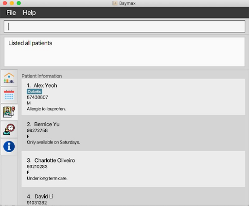 
    *Figure 4.1.2a Listing all patients*

#### 4.1.3 Delete a patient: `deletepatient`
You can use this command to delete a patient’s profile by his or her ID. However, you will first need to use the `listpatient` command
or the `findpatient` command to find out the patient’s ID `PATIENT_ID`. 
This extra step helps you to confirm the profile to be deleted, and prevents accidental deletes.

**Format:** 
`deletepatient PATIENT_ID`

**Parameters:**

Parameter Name | Description
---------------|------------
PATIENT_ID     | The index of the patient in the most recently displayed list. It must be a positive integer.

**Example:** 
1. Type `deletepatient 4` into the command box.
2. Press `Enter` on your keyboard.

**Outcome:**

If the `PATIENT_ID` (i.e 4) is valid:
1. A success message will be displayed as shown below.
2. The patient at index 4 in the previously displayed list will be deleted.

     
    *Figure 4.1.3a Deleting a patient*

#### 4.1.4 Edit a patient's information: `editpatient`
You can use this command to edit a patient’s profile information. You can edit any field of a patient in any order. 
However, you will first need to use the `listpatient` command or the `findpatient` command to find out the 
patient’s `PATIENT_ID`, i.e. index within the displayed list. This extra step helps you to confirm the profile 
to be edited, and prevents accidental edits. 

**Format:** 
`editpatient PATIENT_ID <at least 1 patient information parameter>`

Listed below are some examples of valid `editpatient` commands:
* `editpatient PATIENT_ID t/TAG`
* `editpatient PATIENT_ID name/NAME`
* `editpatient PATIENT_ID nric/NRIC`
* `editpatient PATIENT_ID gender/GENDER`
* `editpatient PATIENT_ID phone/PHONE`
* `editpatient PATIENT_ID r/REMARK`
* You can also supply multiple parameters, e.g. `editpatient PATIENT_ID gender/GENDER name/NAME phone/PHONE`
* The parameter(s) supplied will directly replace the original one(s)

**Parameters:**

Parameter Name | Description
---------------|------------
PATIENT_ID     | The index of the patient in the most recently displayed list. It must be a positive integer.
NRIC    | The nric of the patient. It must start and end with a capital letter and contain 7 numbers in between them. E.g. S1234567A
NAME    | The name of the patient. It must consist solely of alphabets, and should be a combination of the first and last name in that order. E.g. Alice Tan
PHONE   | The hand phone number which the patient wishes to be contacted by. It must consist solely of numbers. E.g. 91710012
GENDER  | The gender of the patient. In short, female is indicated by the letter ‘F’ and male is indicated by the letter ‘M’.
REMARK  | Any remarks about the patient. It can be any text -- alphanumerical, special characters etc. are allowed. E.g. Only available on Mon / Tues
TAG     | The tag for the patient. It must only be alphanumerical and must not contain spaces or special characters. Can have multiple tags. E.g. Diabetic

**Example:** 
1. Type `editpatient 2 t/Asthmatic` into the command box.
2. Press `Enter` on your keyboard.

**Outcome:**

If the `PATIENT_ID` (i.e 2) is valid:
1. A success message will be displayed as shown below.
2. The tag of the patient at index 2 in the recent list will be edited.

    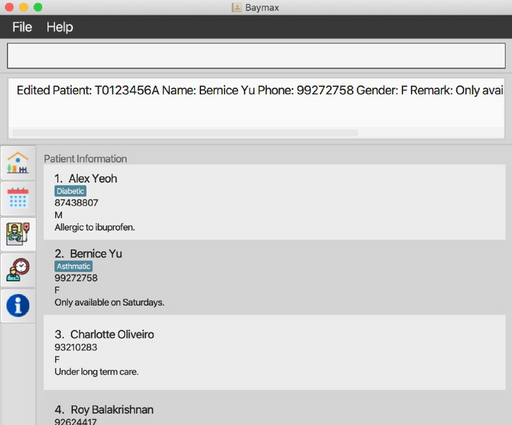 
    *Figure 4.1.4a Editing a patient's information*

#### 4.1.5 Find a patient: `findpatient`
You can use this command to find a patient by entering a part of his name (or his full name). 
The search string for the name is case-insensitive.

**Format:** 
`findpatient name/NAME`

**Parameters:**

Parameter Name | Description
---------------|------------
NAME           | The name or keyword by which to search for the patient. It can be an incomplete part of the patient's name you are searching for. E.g. Alice

**Example:** 
1. Type `findpatient Alex` into the command box.
2. Press `Enter` on your keyboard.

**Outcome:**

1. If the patient is found, a success message will be displayed as shown below.

    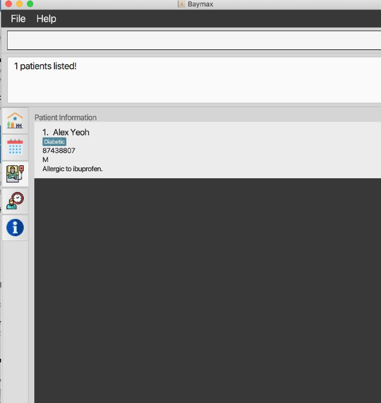 
    *Figure 4.1.5a Finding a patient by name - success*
    
2. If patient is not found, then none will be displayed as shown below.
    
    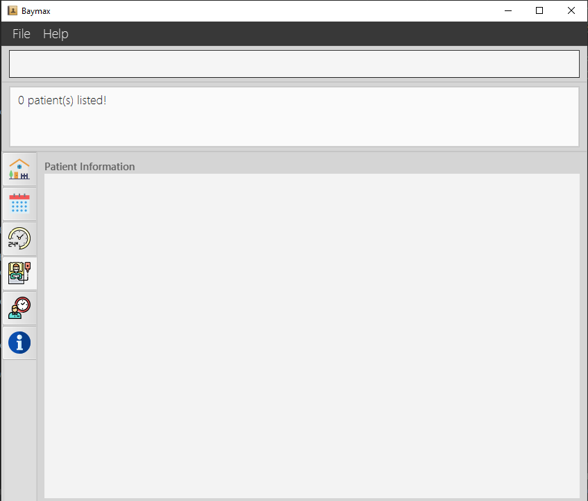 
    *Figure 4.1.5b Finding a patient by name - failure*
    
#### 4.1.6 Add a remark to a patient: `remark`
You can use this command to add a remark to a patient by entering their index in the most recently displayed list.

**Format:** 
`remark PATIENT_ID r/REMARK`

**Parameters:**

Parameter Name | Description
---------------|------------
PATIENT_ID     | The index of the patient in the most recently displayed list. It must be a positive integer.
REMARK         | The remark to be added to the patient.

**Example:** 
1. Type `remark 2 r/Allergic to penicillin` into the command box.
2. Press `Enter` on your keyboard.

**Outcome:**

1. If the PATIENT_ID entered is valid, a success message will be displayed as shown below.

    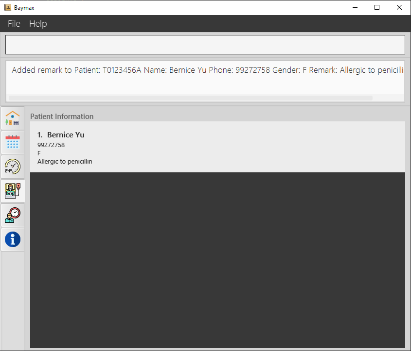 
    *Figure 4.1.6a Adding a remark to a patient - success*
    
2. If the PATIENT_ID entered is invalid (either beyond the list or negative), an error message will be displayed as shown below.
    
    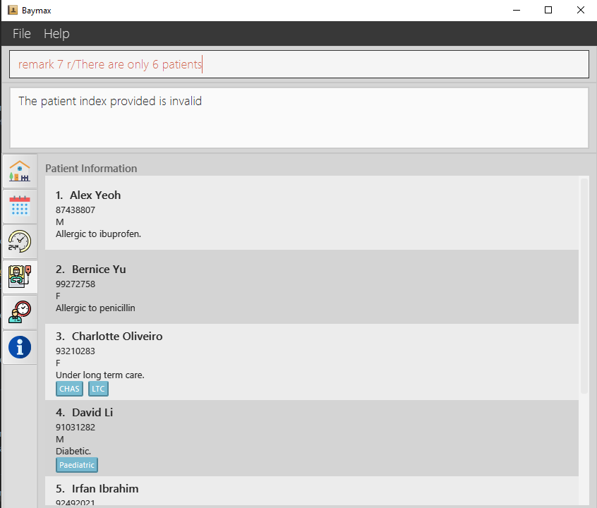 
    *Figure 4.1.6b Adding a remark to a patient - failure*

----------------------------------------------------------------------------------

### 4.2. Appointment Management
This feature allows you to manage the appointments of every patient. You can
add, edit, cancel and find an appointment, and list all the appointments in the system.

#### 4.2.1. Add a new appointment: `addappt`
You can use this command to add a new appointment for a patient.

**Parameters:**

Parameter Name | Description
---------------|------------
PATIENT_ID     | The index of the patient in the most recently displayed list. It must be a positive integer.
DATETIME       | The date followed by the time of the appointment. It must be in <ins>DD-MM-YYYY HH:MM</ins> format. E.g. 20-01-2020 15:00
DESCRIPTION    | The description of the appointment. It can be <ins>any text</ins> -- alphanumerical, special characters etc. are allowed. E.g. Wrist fracture check-up #3
TAG            | The tag related to the appointment. It must only be <ins>alphanumerical</ins> and must not contain spaces or special characters. Can have multiple tags. E.g. Xray
NRIC           | The nric of the patient. It must start and end with a capital letter and contain 7 numbers in between them. E.g. S1234567A
DURATION       | The duration of the appointment.

**Format:** 
`addappt id/ID on/DATETIME dur/DURATION desc/DESCRIPTION [t/TAG]`
`addappt nric/NRIC on/DATETIME dur/DURATION desc/DESCRIPTION [t/TAG]`

**Example:** 
1. Type `addappt id/1 on/11-10-2020 12:30 desc/Removal of braces. t/DrGoh t/1HR` into the command box.
2. Press `Enter` on your keyboard.

**Outcome:**

If the command is valid (i.e. the user keyed in the valid fields):
1. A success message will be displayed as shown below.  

    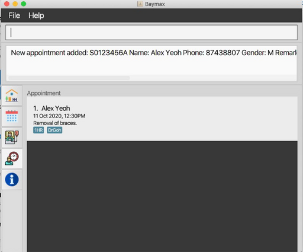 
    *Figure 4.2.1a Scheduling a new appointment for a patient*

#### 4.2.2. List all appointments of a patient: `listapptof`
You can use this command to list all the appointments belonging to a certain patient.
However, you will first need to use the `listpatient` command or the `findpatient` command to 
find out the patient’s `PATIENT_ID`. 

**Format:** 
`listapptof id/PATIENT_ID`
`listapptof nric/NRIC`
`listapptof name/NAME`

**Parameters:**

Parameter Name | Description
---------------|------------
PATIENT_ID     | The index of the patient in the most recently displayed list. It must be a positive integer.
NRIC           | The nric of the patient. It must start and end with a capital letter and contain 7 numbers in between them. E.g. S1234567A
NAME           | The name by which to search for the patient. It can be an incomplete part of the patient's name. E.g. Alice

**Example:** 
1. Type `listapptof id/ 1` into the command box.
2. Press `Enter` on your keyboard.

**Outcome:**

1. All appointments associated with the patient will be displayed as shown below.

    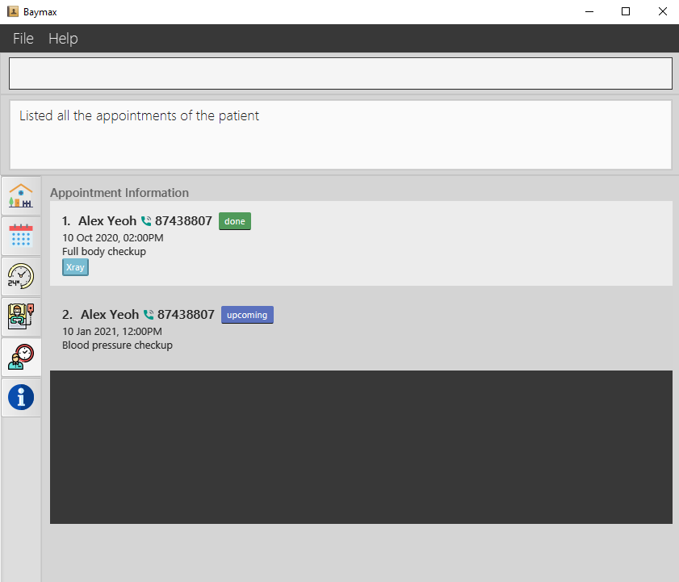 
    *Figure 4.2.2a Listing the appointments of a patient*

#### 4.2.3. List all appointments: `listappt`
You can use this command to list all the appointments in the system, which belong to any patient.

**Format:** 
`listappt`

**Example:** 
1. Type `listappt` into the command box.
2. Press `Enter` on your keyboard.

**Outcome:**

1. All the appointments in the system will be listed as shown below.

    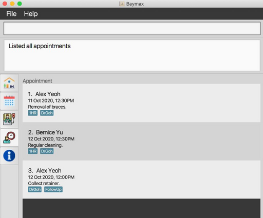 
    *Figure 4.2.3a Listing all appointments*

#### 4.2.4. Edit an appointment: `editappt`
You can use this command to edit an appointment. You can edit any field of an appointment in any order. 
However, you will first need to use the `listappt` command to find out the appointment index `INDEX` first. 
This extra step helps you to confirm the appointment to be edited, and prevents accidental edits.

**Format:** 
`editappt INDEX <at least 1 appointment information parameter>`

Listed below are some examples of valid `editappt` commands:
* `editappt INDEX on/DATETIME`
* `editappt INDEX desc/DESC`
* `editappt INDEX t/TAG`
* You can also supply multiple parameters, e.g. `editappt INDEX t/TAG desc/DESC on/DATETIME`
* The parameter(s) supplied will directly replace the original one(s)

**Parameters:**

Parameter Name | Description
---------------|------------
INDEX          | The index of the target appointment in the most recently displayed list. It must be a positive integer.
DATETIME       | The date followed by the time of the appointment. It must be in <ins>DD-MM-YYYY HH:MM</ins> format. E.g. 20-01-2020 15:00
DESCRIPTION    | The description of the appointment. It can be <ins>any text</ins> -- alphanumerical, special characters etc. are allowed. E.g. Wrist fracture check-up #3
TAG            | The tag related to the appointment. It must only be <ins>alphanumerical</ins> and must not contain spaces or special characters. Can have multiple tags. E.g. Xray

**Example:** 
1. Type `editappt 1 on/12-10-2020 12:00` into the command box.
2. Press `Enter` on your keyboard.

**Outcome:**

If the INDEX (i.e 1) is valid:
1. A success message will be displayed as shown below.
2. The `DATETIME` of the appointment at index 1 in the recent list will be edited.

    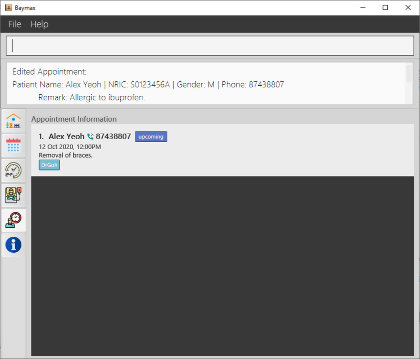 
    *Figure 4.2.4a Editing an appointment*

#### 4.2.5 Cancel an appointment: `cancel`
You can use this command to cancel an appointment within the system by specifying the patient it belongs to 
and the `DATETIME` of the appointment.

**Format:** 
`cancel INDEX (OR on/DATETIME name/NAME)`

**Parameters:**

Parameter Name | Description
---------------|------------
INDEX          | The index of the target appointment in the most recently displayed list. It must be a positive integer.
NAME           | The name by which to search for the patient. It can be an incomplete part of the patient's name. E.g. Alice
DATETIME       | The date followed by the time of the appointment. It must be in <ins>DD-MM-YYYY HH:MM</ins> format. E.g. 20-01-2020 15:00

**Example:** 
1. Type `cancel 1` into the command box.
2. Press `Enter` on your keyboard.

**Outcome:**

If the command is valid (i.e. the specified appointment exists):
1. A success message will be displayed as shown below.
2. The appointment specified will be removed.

    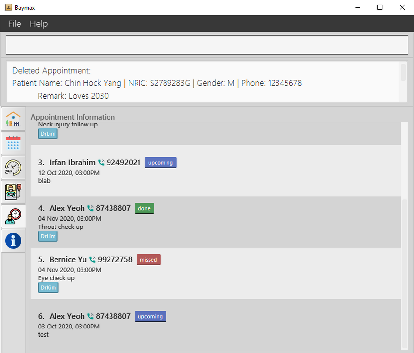 
    *Figure 4.2.5a Cancelling an appointment*

#### 4.2.6 Mark an appointment as done: `done`
You can use this command to mark an appointment within the system as done by specifying the patient it belongs to 
and the `DATETIME` of the appointment.

**Format:** 
`done INDEX (OR on/DATETIME name/NAME)`

**Parameters:**

Parameter Name | Description
---------------|------------
INDEX          | The index of the target appointment in the most recently displayed list. It must be a positive integer.
NAME           | The name by which to search for the patient. It can be an incomplete part of the patient's name. E.g. Alice
DATETIME       | The date followed by the time of the appointment. It must be in <ins>DD-MM-YYYY HH:MM</ins> format. E.g. 20-01-2020 15:00

**Example:** 
1. Type `done on/20-01-2020 15:00 name/Charlotte` into the command box.
2. Press `Enter` on your keyboard.

**Outcome:**

If the command is valid (i.e. the specified appointment exists):
1. A success message will be displayed as shown below.
2. The appointment specified will be marked as done.

    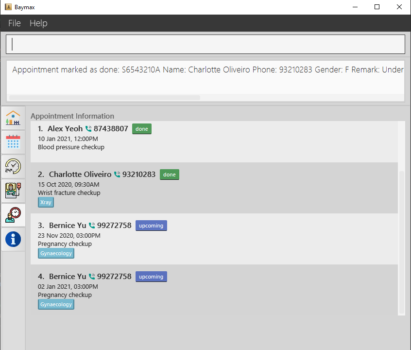 
    *Figure 4.2.6a Marking an appointment as done*
    
#### 4.2.7 Mark an appointment as missed: `missed`
You can use this command to mark an appointment within the system as missed by specifying the patient it belongs to 
and the `DATETIME` of the appointment.

**Format:** 
`missed INDEX (OR on/DATETIME name/NAME)`

**Parameters:**

Parameter Name | Description
---------------|------------
INDEX          | The index of the target appointment in the most recently displayed list. It must be a positive integer.
NAME           | The name by which to search for the patient. It can be an incomplete part of the patient's name. E.g. Alice
DATETIME       | The date followed by the time of the appointment. It must be in <ins>DD-MM-YYYY HH:MM</ins> format. E.g. 20-01-2020 15:00

**Example:** 
1. Type `missed on/20-01-2020 15:00 name/Charlotte` into the command box.
2. Press `Enter` on your keyboard.

    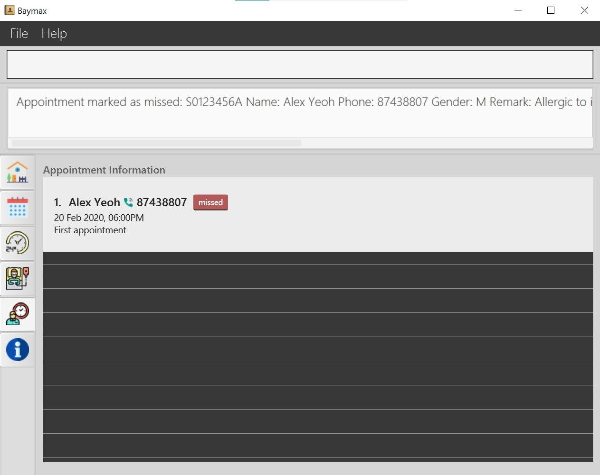 
    *Figure 4.2.7a Marking an appointment as done*

**Outcome:**

If the command is valid (i.e. the specified appointment exists):
1. A success message will be displayed as shown below.
2. The appointment specified will be marked as done.

    Coming soon 
    *Figure 4.2.7a Marking an appointment as missed*
-------------------------------------------------------------------------------

### 4.3. Calendar 
This feature allows you to view the availability status of each day in a month, as well as the appointment schedule
for a period of time or within a particular day / week. The following subsections will guide you through the commands to
set the calendar view to a particular year and month.

#### 4.3.1. Switch to a particular year: `year`
You can use this command to switch to a particular year. The default is the current year. Suppose there are appointments
scheduled one year in advance, you can use this function to switch to the following year. The year set by this command
will affect the command we will discuss in Section 3.3.2 (Switching to a particular month).

**Format:** 
`year YEAR`

**Parameters:**

Parameter Name | Description
---------------|------------
YEAR          | The year you want to switch to. It must be a 4-digit positive number. E.g. 2020

**Example:** 
1. Type `year 2019` into the command box.
2. Press enter on your keyboard.

**Outcome:** 
1. Baymax will switch to the calendar tab.
2. The year 2019 will be displayed on the top of the window together with the currently selected month.

    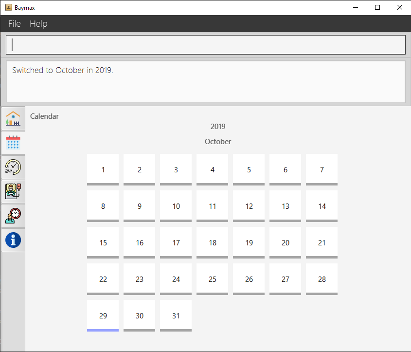 
    *Figure 4.3.1a Changing the year to 2019*

#### 4.3.2. Switch to a particular month: `month`
You can use this command to switch to a particular month based on the year you set in Section 3.3.1. The default is the
current month. For example, if today is 3rd January 2020, then the calendar will display the year 2020 and the month
January by default.

**Format:** 
`month MONTH`

**Parameters:**

Parameter Name | Description
---------------|------------
MONTH          | The month you want to switch to. It must be a positive number from 1 (January) to 12 (December).

**Example:** 
1. Type `year 2020` into the command box and press Enter to switch to the year 2020.
2. Type `month 9` into the command box.
3. Press Enter on your keyboard.

**Outcome:** 
1. The month will be set to September and that month's appointments will be displayed as a calendar view.

    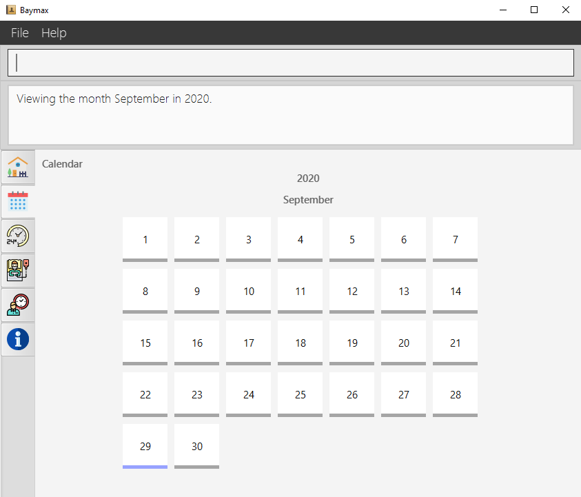 
    *Figure 4.3.2a Changing the month to September*

#### 4.3.3. Switch to a particular day: `day`
You can use this command to select a particular day, and display its schedule (with all appointments within the day).

Parameter Name | Description
---------------|------------
DAY            | The day of the month you want to switch to. It must be a positive number from 1 to the last day of the month. E.g. if the month is February (which only has 28 days), the range of numbers you can enter is 1 to 28.

**Format:** 
`day DAY`

**Example:** 
1. Type `year 2020` into the command box and press Enter to switch to the year 2020.
2. Type `month 10` into the command box and press enter to switch to the month October.
3. Type `day 19` into the command box.
4. Press Enter on your keyboard.

**Outcome:** 
1. The day 2020-10-15 will be selected.

    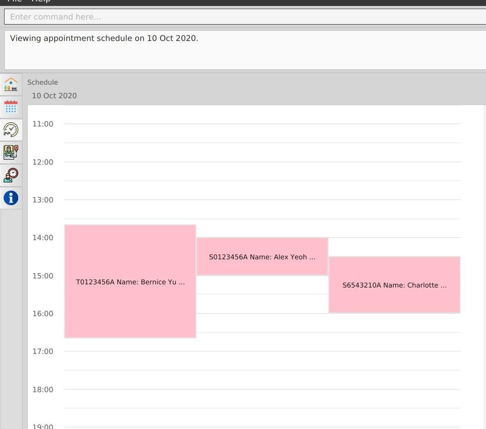 
    *Figure 4.3.3a Viewing the schedule on the 19th*
    

#### 4.3.4. Display appointments within a period (coming soon): `period`
You can use this command to display all appointments within a specified period, defined by a start `day` and an end 
`day`. The `year` and `month` are assumed to be the current `year` and `month`.

**Format:** 
`period from/START to/END`

**Parameters:**

Parameter Name | Description
---------------|------------
FROM           | The day of the month you want to start viewing from. It must be a positive number between 1 and `TO`. E.g. if `TO` is 10, the range of numbers you can enter is 1 to 10.
TO             | The day of the month you want to end viewing with. It must be a positive number between `FROM` and the last day of the month. E.g. if the month is February (which only has 28 days) and `FROM` is 5, the range of numbers you can enter is 5 to 28.

**Example:** 
1. Type `year 2020` into the command box and press Enter to switch to the year 2020.
2. Type `month 3` into the command box and press Enter to switch to March.
3. Type `period from/1 to/7` into the command box.
4. Press Enter on your keyboard.

**Outcome:**
1. All appointments from 2020-03-01 to 2020-03-07 will be displayed in the calendar view.

[App Screenshot (Still in Progress)]
----------------------------------------------------------------------------------

### 4.4. Utilities

#### 4.4.1. View help: `help`

You can use this command to view a list of available commands in order to jog your memory and quickly get started. 
A URL link to the full *User Guide* (this document) is also provided for you to find more details about the commands.

**Format:** 
`help`

**Example:** 
1. Type `help` into the command box.
2. Press `Enter` on your keyboard.

**Outcome:** 
1. A link directing the user to the help page will be displayed as shown below, together with a summarised list of commands.

    
    *Figure 4.4.1a Executing `help` command*

#### 4.4.2. Switch between tabs:

You can use this command to switch between tabs by specifying the tab name.

**Format:** 
`TAB_NAME`

**Parameters:**

Parameter Name | Description
---------------|------------
TAB_NAME     | The name of the tab you want to switch to. 

TAB_NAME   | Tab that Baymax will switch to
-----------|----------------------------
dashboard  | Dashboard
calendar   | Calendar
schedule   | Schedule
patient    | Patients
appt       | Appointments
help       | Help/Additional Information

**Example:** 
1. Type `calendar` into the command box.
2. Press `Enter` on your keyboard

**Outcome:** 
1. The second tab, featuring the calendar page, will be displayed as shown in the image below. 

     
    *Figure 4.4.2a Changing to calendar tab*

#### 4.4.3 Exit the program : `exit`

You can use this command to exit the program.

**Format:** `exit`

**Example:** 
1. Type `exit` into the command box.
2. Press `Enter` on your keyboard.

**Outcome:** 
1. The application window will close and it will stop running. 

---------------------------------------------------------------------------------
## 5. FAQ
(Contributed by Hui Ling)

**Q:** Do I have to manually save any data? 

**A:** No. Baymax saves your data to the hard disk automatically after any command that changes data. 

---------------------------------------------------------------------------------
## 6. Command Summary
(Contributed by Hui Ling and Reuben)

### 6.1 Patient Information Management Commands

**Command**             | **Example**
------------------------|--------------------
Add a Patient: `addpatient nric/NRIC name/NAME phone/PHONE gender/GENDER [r/REMARK] [t/TAG]` | `addpatient nric/S9772234F name/Jason Tan phone/98765432 gender/M` 
List All Patients: `listpatient` | `listpatient`
Delete a Patient: `deletepatient PATIENT_ID` | `deletepatient 4`
Edit a Patient's Information: `editpatient PATIENT_ID <at least 1 patient information parameter>` | `editpatient PATIENT_ID phone/82345678`
Find a Patient: `findpatient name/NAME` | `findpatient Alex`
Add a remark: `remark PATIENT_ID r/REMARK` | `remark 2 r/Not free on Fridays`

### 6.2 Appointment Management Commands

**Command**             | **Example**
------------------------|--------------------
Add an Appointment: `addappt id/ID on/DATETIME dur/DURATION desc/DESCRIPTION [t/TAG] OR nric/NRIC on/DATETIME dur/DURATION desc/DESCRIPTION [t/TAG]` | `addappt nric/S1234567C on/11-10-2020 12:30 desc/Removal of braces. t/DrGoh t/1HR`
List Appointments of a Patient: `listapptof PATIENT_ID` | `listapptof 1`
List All Appointments: `listappt` | `listappt`
Edit an Appointment: `editappt INDEX <at least 1 appointment information parameter>` | `editappt 1 on/12-10-2020 12:00`
Cancel an Appointment: `cancel INDEX OR cancel on/DATETIME name/NAME` | `cancel on/20-01-2020 15:00 name/Alex `
Mark an Appointment as done: `done INDEX OR on/DATETIME name/NAME` | `done on/20-01-2020 15:00 name/Charlotte`
Mark an Appointment as missed: `missed INDEX OR on/DATETIME name/NAME` | `missed 1`

### 6.3 Calendar Commands

**Command**             | **Example**
------------------------|--------------------
Switch to a particular year: `year YEAR` | `year 2021`
Switch to a particular month: `month MONTH` | `month 11`
Switch to a particular day: `day DAY` | `day 15`

### 6.4 Utilities Commands

**Command**             | **Example**
------------------------|--------------------
View help: `help` | `help`
Switch between tabs: `TAB_NAME` | `calendar`
Exit the program : `exit` | `exit`
